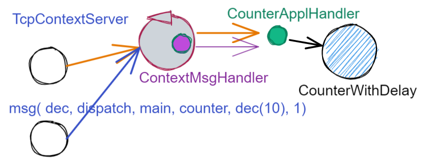

.. role:: red 
.. role:: blue 
.. role:: remark
  
.. _tuProlog: https://apice.unibo.it/xwiki/bin/view/Tuprolog/

==================================================
Il concetto di contesto
==================================================

Nella versione attuale, ogni enabler *tipo server* attiva un ``TCPServer`` su una propria porta.

.. image::  ./_static/img/Radar/EnablersLedSonar.PNG
  :align: center 
  :width: 20%

Una ottimizzazione delle risorse può essere ottenuta introducendo :blue:`un solo TCPServer` per ogni nodo
computazionale. Questo server (che denominiamo ``TcpContextServer``) 
verrebbe a costituire una sorta di ``Facade`` comune a tutti gli :ref:`ApplMsgHandler<IApplMsgHandler>` 
disponibili su quel nodo.

.. *enabler-server* attivati nello stesso :blue:`contesto` rappresentato da quel  nodo.

.. image::  ./_static/img/Radar/TcpContextServerSonarLed.PNG
  :align: center 
  :width: 50%

 
Per realizzare questa ottimizzazione, il ``TcpContextServer`` deve essere capace di sapere per quale
componente è destinato un messaggio, per poi invocarne l'appropriato :ref:`IApplMsgHandler<IApplMsgHandler>`
(come :ref:`LedApplHandler` e :ref:`SonarApplHandler`).

  
-------------------------------------------------------
Struttura dei messaggi applicativi
-------------------------------------------------------

Introduciamo dunque una  estensione sulla struttura dei messaggi, che ci darà d'ora in poi anche uno 
:blue:`standard interno` sulla struttura delle informazioni scambiate via rete:

 .. code:: java

    msg( MSGID, MSGTYPE, SENDER, RECEIVER, CONTENT, SEQNUM )

  - MSGID:    identificativo del messaggio
  - MSGTYPE:  tipo del message (Dispatch, Invitation,Request,Reply,Event)  
  - SENDER:   nome del componente che invia il messaggio
  - CONTENT:  contenuto applicativo del messaggio (detto anche payload)
  - RECEIVER: nome del componente chi riceve il messaggio 
  - SEQNUM:   numero di sequenza del messaggio

I messaggi scambiati sono logicamente suddivisi in diverse categorie:

.. list-table:: 
  :widths: 70,30
  :width: 100%

  * - - :blue:`dispatch`: un messaggio inviato a un preciso destinatario senza attesa  di una risposta 
        (in modo detto anche  `fire-and-forget`);
      - :blue:`invitation`: un messaggio inviato a un preciso destinatario aspettandosi un 'ack' da parte di questi;
      - :blue:`request`: un messaggio inviato a un preciso destinatario aspettandosi da parte di questi una 
        :blue:`response/reply` logicamente correlata alla richiesta;
      - :blue:`event`: un messaggio inviato a chiunque sia in grado di elaborarlo.

    - .. image:: ./_static/img/Architectures/legendMessages.PNG
        :align: center
        :width: 80%

.. code:: java

  enum ApplMessageType{
      event, dispatch, request, reply, invitation
  }   
   

.. _ApplMessage:

++++++++++++++++++++++++++++++++++++++++++++++++
La classe ApplMessage
++++++++++++++++++++++++++++++++++++++++++++++++

La classe ``ApplMessage`` fornisce metodi per la costruzione e la gestione di messaggi organizzati
nel modo descritto. La classe si avvale del supporto del tuProlog_.

 .. code:: java

   public class ApplMessage {
    protected String msgId       = "";
    protected String msgType     = null;
    protected String msgSender   = "";
    protected String msgReceiver = "";
    protected String msgContent  = "";
    protected int msgNum         = 0;

    public ApplMessage( String MSGID, String MSGTYPE,  
          String SENDER, String RECEIVER, String CONTENT, String SEQNUM ) {
      ...
    }

    public ApplMessage( String msg ) {
      Struct msgStruct = (Struct) Term.createTerm(msg);
      setFields(msgStruct);
    }  

    public String msgId() {   return msgId; }
    public String msgType() { return msgType; }
    public String msgSender() { return msgSender; }
    public String msgReceiver() { return msgReceiver;  }
    public String msgContent() { return msgContent;  }
    public String msgNum() { return "" + msgNum; }

    public boolean isEvent(){ 
      return msgType == ApplMessageType.event.toString(); }
    ...
    public String toString() { ... }
  }

.. _TcpContextServer:

-------------------------------------------------------
Il TcpContextServer
-------------------------------------------------------

Il ``TcpContextServer`` è una specializzazione del :ref:`TcpServer<TcpServer>` che lega il campo ``userDefHandler`` 
a un gestore di messaggi (il `ContextMsgHandler`_ ) che ha il compito
di reindirizzare il messaggio ricevuto di forma ``msg( MSGID, MSGTYPE, SENDER, RECEIVER, CONTENT, SEQNUM )``
al gestore applicativo, sulla base dell'attributo  ``RECEIVER``.

.. image:: ./_static/img/Architectures/MessageHandlers.PNG
   :align: center 
   :width: 50%

Per ottenere questo scopo, il ``TcpContextServer``
definisce metodi per aggiungere al  (ed eliminare dal)  `ContextMsgHandler`_  oggetti di tipo :ref:`IApplMsgHandler<IApplMsgHandler>` 
che realizzano la gestione di livello applicativo dei messaggi di tipo `ApplMessage`_.

 
.. code:: java

  public class TcpContextServer extends TcpServer{
  private static boolean activated = false;
  private ContextMsgHandler ctxMsgHandler;

    public TcpContextServer(String name, int port ) {
      super(name, port, new ContextMsgHandler("ctxH"));
      this.ctxMsgHandler = (ContextMsgHandler) userDefHandler;
    } 

    public void addComponent( String name, IApplMsgHandler h) {
      ctxMsgHandler.addComponent(name,h);
    }
    public void removeComponent( String name ) {
      ctxMsgHandler.removeComponent(name );
    }
  }
 
.. _ContextMsgHandler:

-------------------------------------------------------
Il gestore di sistema dei messaggi
-------------------------------------------------------

Il gestore dei sistema dei messaggi attua il reindirizzamento (dispatching) consultando una mappa
interna che associa un :blue:`identificativo univoco` (il nome del destinatario) a un handler.

 .. code:: java

  public class ContextMsgHandler extends IApplMsgHandler{
  //MAPPA
  private HashMap<String,IApplMsgHandler> handlerMap = 
                           new HashMap<String,IApplMsgHandler>();

    public ContextMsgHandler(String name) { super(name); }

    @Override
    public void elaborate(String message) {
      //msg( MSGID, MSGTYPE, SENDER, RECEIVER, CONTENT, SEQNUM )
      ApplMessage msg   = new ApplMessage(message);
      String dest       = msg.msgReceiver();
      IApplMsgHandler h = handlerMap.get( dest );
      if( dest != null ) h.elaborate(msg.msgContent(), conn);
    }
    public void addComponent( String name, IApplMsgHandler h) {
      handlerMap.put(name, h);
    }
    public void removeComponent( String name ) {
      handlerMap.remove( name );
    }
  }

.. image:: ./_static/img/Architectures/ContextServer.PNG
   :align: center 
   :width: 80%

:remark:`I componenti IApplMsgHandler sono semplici gestori di messaggi`

:remark:`I componenti IApplMsgHandler acquisiscono dal contesto la capacità di interazione`

-------------------------------------------------------
Ridefinizione dei client Proxy
-------------------------------------------------------

Introduciamo un nuovo parametro di configurazione per indicare l'uso del  `TcpContextServer`_:

.. code:: java
  
  RadarSystemConfig.withContext = true;

Ridefiniamo i client definiti in precedenza (come ad esempio :ref:`SonarProxyAsClient<SonarProxyAsClientNoContext>`)
in modo  da inviare messaggi di tipo `ApplMessage`_, quando la configurazione 
*RadarSystemConfig.withContext* specifica che usiamo il  `TcpContextServer`_:

Ad esempio, ridefiniamo il Proxy del Led (il caso del Sonar è analogo) tenendo anche conto 
dei protocolli CoAP e MQTT :

.. _LedProxyAsClient:

.. code::   java

  public class LedProxyAsClient extends ProxyAsClient implements ILed {
    public LedProxyAsClient( String name, String host, String entry,
                       ProtocolType protocol  ) {
      super(name,host,entry, protocol);
    }

    @Override
    public void turnOn() { 
        if( RadarSystemConfig.protcolType == ProtocolType.tcp 
            && RadarSystemConfig.withContext ) {
        sendCommandOnConnection(Utils.turnOnLed.toString());
      }
      else if( RadarSystemConfig.protcolType == ProtocolType.mqtt) {
        sendCommandOnConnection(Utils.turnOnLed.toString());
      }
      else if( RadarSystemConfig.protcolType == ProtocolType.coap) {
        sendCommandOnConnection( "on" );
      }else //CASO DI DEFAULT
        sendCommandOnConnection( "on" );
    }

    @Override
    public void turnOff() {   
      if( RadarSystemConfig.protcolType == ProtocolType.tcp 
          && RadarSystemConfig.withContext ) {
        sendCommandOnConnection(Utils.turnOffLed.toString());
      }
      else if( RadarSystemConfig.protcolType == ProtocolType.mqtt) {
        sendCommandOnConnection(Utils.turnOffLed.toString());
      }
      else if( RadarSystemConfig.protcolType == ProtocolType.coap) {
        sendCommandOnConnection( "off" );
      } else  //CASO DI DEFAULT
        sendCommandOnConnection( "off" );
    }

    @Override
    public boolean getState() {   
      String answer="";
      if( RadarSystemConfig.protcolType == ProtocolType.tcp 
          && RadarSystemConfig.withContext ) {
        answer = sendRequestOnConnection(
          Utils.buildRequest(name, "query", "getState", "led").toString()) ;
      }
        else if( RadarSystemConfig.protcolType == ProtocolType.mqtt)  
          answer = sendRequestOnConnection(
            Utils.buildRequest(name, "query", "getState", "led").toString());
      else { //CASO DI DEFAULT
        answer = sendRequestOnConnection( "getState" );
      }
      return answer.equals("true");
    }
  }

I metodi ``sendCommandOnConnection`` e ``sendRequestOnConnection`` sono definiti in :ref:`ProxyAsClient`.
 
+++++++++++++++++++++++++++++++++++++++++++++
Definizione dei messaggi come ``ApplMessage``
+++++++++++++++++++++++++++++++++++++++++++++
 

La classe ``Utils`` fornisce metodi per la creazione dei messaggi usati dagli handler del Led e dal Sonar
usando un ``dispatch`` per i comandi e un  ``request`` per le richieste
di informazione.

 .. code:: java

  //Definizione dei Messaggi
  ApplMessage turnOnLed    = 
    new ApplMessage("msg( turn, dispatch, system, led, on, 2 )");
  ApplMessage turnOffLed   = 
    new ApplMessage("msg( turn, dispatch, system, led, off, 3 )");
  ApplMessage sonarActivate =  
    new ApplMessage("msg( sonarcmd, dispatch,system,sonar, activate,4)");
  ApplMessage getDistance  = 
    new ApplMessage("msg(sonarcmd,request,system,sonar, getDistance,5)");
  ApplMessage getLedState  = 
    new ApplMessage("msg(ledcmd,request,system,led,getState, 6)");
  //For simulation:
  ApplMessage fardistance  =
    new ApplMessage("msg( distance, dispatch, system, sonar, 36, 0 )");
  ApplMessage neardistance =
    new ApplMessage("msg( distance, dispatch, system, sonar, 10, 1 )");

-------------------------------------------------------
Un esempio
-------------------------------------------------------

Avvaledoci dei componenti introdotti in precedenza, costruiamo un sistema su PC che abbia tre componenti:

- un Sonar di classe ``SonarAdapterEnablerAsServer`` che riceve valori di distanza inviati via rete
- un Led  di classe ``LedEnablerAsServer`` che riceve comandi di accensione-spegnimento inviati via rete
- un ``TcpContextServer`` che riceve messaggi da client remoti e invoca (usando un `ContextMsgHandler`_) 
  il metodo ``elaborate`` del Sonar e del Led.

Ricordiamo che gli enabler *tipo-server* sono tutti specializzazioni della classe :ref:`IApplMsgHandler`
che definisce il metodo ``elaborate`` per l'elaborazione dei messaggi a livello applicativo. 
Inoltre essi non attivano alcun server se il tipo di protocollo
specificato nel costruttore è ``null``.

 
++++++++++++++++++++++++++++++++++++++++++
Struttura del programma 
++++++++++++++++++++++++++++++++++++++++++

La struttura del programma di esempio comprende un metodo di configurazione del sistema e un
metodo di esecuzione.

 .. code:: java

    public class TcpContextServerExampleMain {
      private TcpContextServer contextServer;
      private ISonar sonar;
      private Interaction2021 conn; 
      //Definizione dei Messaggi
      ...
      //Definizione di un metodo di configurazione
      public void configureTheSystem() { ... }
      
      //Definizione di un metodo di esecuzione
      public void execute() throws Exception{ ... }

      public static void main( String[] args) throws Exception {
        TcpContextServerExampleMain sys = new TcpContextServerExampleMain();
        sys.configureTheSystem();
        sys.execute();
      }
    }

++++++++++++++++++++++++++++++++++++++++++
Definizione del configuratore
++++++++++++++++++++++++++++++++++++++++++

Il metodo di configurazione definisce i parametri e crea i componenti:

 .. code:: java

  public void configureTheSystem() {
    RadarSystemConfig.simulation        = true;    
    RadarSystemConfig.testing           = true;    		
    RadarSystemConfig.pcHostAddr        = "localhost";
    RadarSystemConfig.ctxServerPort     = 8048;
    RadarSystemConfig.sonarDelay        = 1500;
    RadarSystemConfig.withContext       = true; 
 
    //Creazione del server di contesto
    contextServer  = 
      new TcpContextServer("TcpApplServer",RadarSystemConfig.ctxServerPort);
		
    //Creazione del Sonar e del Led
 		sonar = DeviceFactory.createSonar();
		led   = DeviceFactory.createLed();

    //Registrazione dei componenti presso il contesto	
    IApplMsgHandler sonarHandler = new SonarApplHandler("sonarH",sonar);
    IApplMsgHandler ledHandler   = new LedApplHandler("ledH",led);
    IApplMsgHandler radarHandler = new RadarApplHandler("radarH");
    contextServer.addComponent("sonar", sonarHandler);
    contextServer.addComponent("led",   ledHandler);	
    contextServer.addComponent("radar", radarHandler);	
  }//configureTheSystem

 
++++++++++++++++++++++++++++++++++++++++++
Esecuzione
++++++++++++++++++++++++++++++++++++++++++
Il metodo di esecuzione utilizza il client per trasmettere al ``TcpContextServer`` 
dapprima messaggi che riguardano il Sonar e successivamente messaggi che riguardano il Led.

.. invia prima un valore ``d>DLIMIT`` e poi un valore ``d<DLIMIT``

.. code:: java
 
  public void execute() throws Exception{
    sonar.activate();
    contextServer.activate();
    simulateController();
  }

%%%%%%%%%%%%%%%%%%%%%%%%%%%%%%%%%%%%%
simulateController
%%%%%%%%%%%%%%%%%%%%%%%%%%%%%%%%%%%%%

L'operazione ``simulateController`` effettua un numero prefissato di  letture del Sonar e di 
update del Led:

.. code:: java
 
  protected void simulateController(    )  {
  RadarSystemConfig.sonarDelay = 50;
  RadarSystemConfig.DLIMIT     = 60;
  IRadarDisplay radar          = RadarDisplay.getRadarDisplay();
   	
  ProxyAsClient ledCaller     = new ProxyAsClient("ledCaller","localhost",
            ""+RadarSystemConfig.ctxServerPort, ProtocolType.tcp);
		
    //Activate the sonar
    sonarCaller.sendCommandOnConnection(sonarActivate.toString());

    for( int i=1; i<=40; i++) {
      String answer = 
        sonarCaller.sendRequestOnConnection(Utils.getDistance.toString());
      int v = Integer.parseInt(answer);
      radar.update(answer, "90");
      if( v < RadarSystemConfig.DLIMIT ) 
          ledCaller.sendCommandOnConnection(Utils.turnOnLed.toString());
      else ledCaller.sendCommandOnConnection((Utils.turnOffLed.toString());  
      String ledState = 
          ledCaller.sendRequestOnConnection((Utils.getLedState.toString());
      Colors.outappl("simulateController ledState=" + ledState +
        " for distance=" + v + " i="+i, Colors.ANSI_PURPLE);
    }
  }

++++++++++++++++++++++++++++++++++++++++
Problemi ancora aperti  
++++++++++++++++++++++++++++++++++++++++

- Un handler lento o che si blocca, rallenta o blocca la gestione dei messaggi da parte del
  ``ContextMsgHandler`` e quindi del ``TcpContextServer``
- Nel caso di componenti con stato utlizzabili da più clients, vi possono essere problemi
  di concorrenza.

  L'esempio:

  - ``SharedCounterExampleMain`` 
  - ``CounterWithDelay``
  - ``EnablerCounter``
  - ``CounterClient``
  - ``msg( dec, dispatch, main, counter, dec(10), 1 )``

 