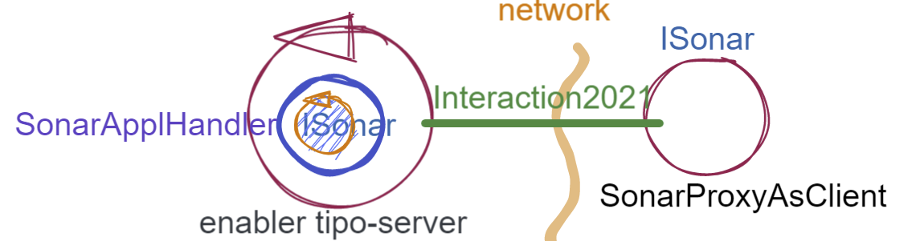

.. role:: red 
.. role:: blue 
.. role:: remark

.. _pattern-proxy: https://it.wikipedia.org/wiki/Proxy_pattern

.. _port-adapter: https://en.wikipedia.org/wiki/Hexagonal_architecture_(software)

.. _CoAP: https://coap.technology/

=====================================================
Enablers (SPRINT2)
=====================================================

L'analisi del problema ha posto in evidenza la opportunità/necessità,
di introdurre nel sistema degli :blue:`enabler`, che hanno lo scopo di fornire funzionalità
di ricezione/trasmissione di informazione su rete a un nucleo di 
*core-code* incapsulato al proprio interno.

Nell'ambito di un processo di sviluppo bottom-up in cui il procollo TCP è
la tecnologia di riferimento per le comunicazioni, risulta naturale pensare subito a 
un enabler *tipo-server* capace di ricevere richieste  da parte di client remoti (normalmente
dei Proxy).

.. due tipi di enabler: uno per ricevere (diciamo un enabler *tipo-server*) e uno per trasmettere (diciamo un enabler *tipo-client*).
 
Come suggerito nell'analisi, ponendo il ``Controller`` su PC, 
possiamo  (senza modificare il codice introdotto in :ref:`Controller<controller>`)
impostare una architettura come quella rappresentata in figura:

.. image:: ./_static/img/Radar/ArchLogicaOOPEnablersBetter.PNG 
   :align: center
   :width: 50%

Ricordando la proposta delle architetture  `port-adapter`_,  decidiamo, come progettisti,
di proseguire lo sviluppo del software del sistema con riferimento ad una architettura a livelli
rappresentata come segue:

.. image:: ./_static/img/Architectures/cleanArchCone.jpg 
   :align: center
   :width: 50%

------------------------------------------------
Enabler tipo-server
------------------------------------------------

Iniziamo con il definire un enabler *tipo-server* che demanda la gestione dei messaggi ricevuti 
ad oggetti di una classe che implementa :ref:`IApplMsgHandler`.

.. image:: ./_static/img/Radar/EnablerAsServer.PNG
   :align: center 
   :width: 60%
 
.. code:: java

  public class EnablerAsServer{
    private static int count=1;
    protected String name;
    protected ProtocolType protocol; 
    protected TcpServer serverTcp;

    public EnablerAsServer(String name, int port,  
                       ProtocolType protocol, IApplMsgHandler handler ) {
    try {
      this.name     			= name;
      this.protocol 			= protocol;
      if( protocol != null ) setServerSupport( port, protocol, handler );
      }catch (Exception e) { ... }
    }	
    protected void setServerSupport(int port,ProtocolType protocol,
                      IApplMsgHandler handler) throws Exception{
      if( protocol == ProtocolType.tcp ) {
          serverTcp = new TcpServer( "EnabSrvTcp_"+count++, port, handler );        
      }else if( protocol == ProtocolType.coap ) { 
          CoapApplServer.getServer(); 
      }
      ...
    }	 
    public void activate() {
      if( protocol == ProtocolType.tcp ) {
        serverTcp.activate();
      }else  ...	
    }   
  public void deactivate() {
      if( protocol == ProtocolType.tcp ) {
        serverTcp.deactivate();
      }else ...
    }   
  }

Notiamo che:

- nel caso ``protocol==null``, non viene creato alcun supporto. 
  Questo caso sarà applicato più avanti, nella sezione  :doc:`ContextServer`.
- si prevede anche un supporto per il protocollo CoAP (:doc:`RadarSystemCoap`), di cui parleremo nella sezione :doc:`RadarGuiCoap`.

------------------------------------------
Enabler e proxy per il Sonar
------------------------------------------

++++++++++++++++++++++++++++++++++++++++
Enabler per il Sonar
++++++++++++++++++++++++++++++++++++++++
.. list-table::
  :widths: 30,70
  :width: 100%

  * - .. image::  ./_static/img/Radar/EnablerAsServerSonar.PNG
         :align: center 
         :width: 80%
    - L'*enabler tipo server* per il Sonar è un ``EnablerAsServer`` connesso un gestore 
      applicativo  di tipo ``IApplMsgHandler`` che elabora:

      - i comandi: ridirigendoli al sonar locale 
      - le richieste:  ridirigendole al sonar locale e inviando la risposta al client 

 

+++++++++++++++++++++++++++++++++++
SonarApplHandler
+++++++++++++++++++++++++++++++++++

.. code:: java

  public class SonarApplHandler extends ApplMsgHandler  {
  ISonar sonar;
    public SonarApplHandler(String name, ISonar sonar) {
      super(name);
      this.sonar=sonar;
    }
    @Override
    public void elaborate(String message, Interaction2021 conn) {
      if( message.equals("getDistance")) {
        String vs = ""+sonar.getDistance().getVal();
        sendMsgToClient(vs, conn);
      }else if( message.equals("activate")) {
        sonar.activate();
      }else if( message.equals("activate")) {
        sonar.deactivate();
      }else if( message.equals("isActive")) {
        String sonarState = ""+sonar.isActive();
        sendMsgToClient(sonarState, conn);
      }
    }
  }

.. _SonarProxyAsClientNoContext:

++++++++++++++++++++++++++++++++++++++++
Proxy per il Sonar
++++++++++++++++++++++++++++++++++++++++

.. list-table::
  :widths: 30,70
  :width: 100%

  * - .. image::  ./_static/img/Radar/SonarProxyAsClient.PNG
         :align: center 
         :width: 70%
    - Il '*proxy tipo client* per il Sonar è una specializzazione di  ``ProxyAsClient`` che implementa i 
      metodi di ``ISonar`` inviando dispatch o request all'*enabler tipo server* sulla connessione:

.. code:: java

  public class SonarProxyAsClient extends ProxyAsClient implements ISonar{
    public SonarProxyAsClient( 
         String name, String host, String entry, ProtocolType protocol ) {
    super( name,  host,  entry, protocol );
    }
    @Override
    public void activate() { sendCommandOnConnection("activate"); }
    @Override
    public void deactivate() { sendCommandOnConnection("deactivate"); }
    @Override
    public IDistance getDistance() {
      String answer = sendRequestOnConnection("getDistance");
      return new Distance( Integer.parseInt(answer) );
    }
    @Override
    public boolean isActive() {
      String answer = sendRequestOnConnection("isActive");
      return answer.equals( "true" );
    }
  }

 

-----------------------------------------
Enabler e proxy per il Led
-----------------------------------------

.. image::  ./_static/img/Radar/EnablerProxyLed.PNG
         :align: center 
         :width: 60%

L'enabler server per il Led usa un gestore di messaggi ``LedApplHandler`` che riceve comandi
e richieste da un ``LedProxyAsClient``. 
Entrambe queste classi sono simili a quanto visto per il Sonar. 
Riportimao qui solo la struttura dell'handler che realizza la logica applicativa.

 

+++++++++++++++++++++++++++++++++++
LedApplHandler
+++++++++++++++++++++++++++++++++++

.. code:: Java

  public class LedApplHandler extends ApplMsgHandler {
  ILed led;

    public LedApplHandler(String name ) {
      super( name );
    }
    public LedApplHandler(String name, ILed led) {
      super(name);
      this.led = led;
    }
    
    @Override
    public void elaborate(String message, Interaction2021 conn) {
      if( message.equals("on")) led.turnOn();
      else if( message.equals("off") ) led.turnOff();	
      else if( message.equals("getState") ) sendMsgToClient(""+led.getState(), conn );
    }

    @Override
    public void elaborate( ApplMessage message, Interaction2021 conn ) { ...	}

  }

 
-----------------------------------------
Testing degli enabler
-----------------------------------------

La configurazione crea gli elementi della architettura di figura:

.. image::  ./_static/img/Radar/TestEnablers.PNG
         :align: center 
         :width: 50%

.. code::  java

  public class TestEnablersTcp {
	@Before
	public void setup() {
		RadarSystemConfig.withContext= false; 
		RadarSystemConfig.simulation = true;
		RadarSystemConfig.ledGui     = true;
		RadarSystemConfig.ledPort    = 8015;
		RadarSystemConfig.sonarPort  = 8011;
		RadarSystemConfig.sonarDelay = 100;
 		RadarSystemConfig.testing    = false;
 		RadarSystemConfig.tracing    = false;
 
 		//I devices
   		sonar 	= DeviceFactory.createSonar();
		led     = DeviceFactory.createLed();
		
 		//I server
  	 	sonarServer = new EnablerAsServer("sonarSrv",RadarSystemConfig.sonarPort,
              protocol, new SonarApplHandler("sonarH", sonar) );
	 	ledServer   = new EnablerAsServer("ledSrv",  RadarSystemConfig.ledPort, 
              protocol, new LedApplHandler("ledH", led)  );
 
 		//I client
   		sonarPxy = new SonarProxyAsClient(
         "sonarPxy", "localhost", ""+RadarSystemConfig.sonarPort, protocol );		
 		ledPxy   = new LedProxyAsClient( 
       "ledPxy",   "localhost", ""+RadarSystemConfig.ledPort,   protocol );	

	}

	@After
	public void down() {
		System.out.println("down");		
		ledServer.stop();
		sonarServer.stop();
	}	
	
 	

Il test simula il comportamento del Controller, senza RadarDisplay:

.. code::  java

	@Test 
	public void testEnablers() {
		sonarServer.start();
		ledServer.start();
		System.out.println(" ==================== testEnablers "  );
 		
		//Simulo il Controller
 		Utils.delay(500);		
		
		//Attivo il sonar
		sonarPxy.activate();
		System.out.println("testEnablers " + sonarPxy.isActive());
		
		while( sonarPxy.isActive() ) {
			int v = sonarPxy.getDistance().getVal();
			ColorsOut.out("testEnablers getVal="+v, ColorsOut.GREEN);
			//Utils.delay(500);
			if( v < RadarSystemConfig.DLIMIT ) {
				ledPxy.turnOn();
				boolean ledState = ledPxy.getState();
				assertTrue( ledState );	
			}
			else {
				ledPxy.turnOff();
				boolean ledState = ledPxy.getState();
				assertTrue( ! ledState );	
			}
		}		
	}
 