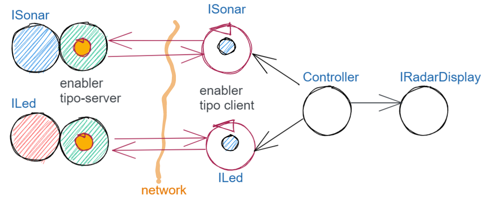

.. role:: red 
.. role:: blue 
.. role:: remark

.. _pattern-proxy: https://it.wikipedia.org/wiki/Proxy_pattern

=====================================================
Enablers per TCP (SPRINT2)
=====================================================

L'analisi del problema ha posto in evidenza la opportunità/necessità,
di introdurre nel sistema degli :blue:`enabler`, che hanno lo scopo di fornire funzionalità
di ricezione/trasmissione di informazione su rete a un nucleo di 
*core-code* incapsulato al proprio interno.

Nell'ambito di un processo di sviluppo bottom-up, in cui abbiamo selezionato il procollo TCP come
tecnologia di riferimento per le comunicazioni, risulta naturale pensare subito a 
un enabler *tipo-server* capace di ricevere richieste  da parte di client remoti (normalmente
dei proxy).

.. due tipi di enabler: uno per ricevere (diciamo un enabler *tipo-server*) e uno per trasmettere (diciamo un enabler *tipo-client*).
 
Come suggerito nell'analisi, ponendo il ``Controller`` su PC, 
potremo procedere senza modificare il codice introdotto in :ref:`Controller<controller>`
impostando una architettura come quella rappresentata in figura:

Ricordando la proposta delle architetture port-adapter_,  decidiamo, come progettisti,
di impostare lo sviluppo del software del sistema con riferimento ad una architettura a livelli
rappresentata come segue:

.. image:: ./_static/img/Architectures/cleanArchCone.jpg 
   :align: center
   :width: 50%

 

------------------------------------------------
Enabler tipo-server
------------------------------------------------

Iniziamo con il definire un enabler *tipo-server* che demanda la gestione dei messaggi ricevuti 
ad oggetti di una classe definita dall'Application-designer.

.. image:: ./_static/img/Radar/EnablerAsServer.PNG
   :align: center 
   :width: 60%
 
.. code:: java

  public class EnablerAsServer{
    private static int count=1;
    protected String name;
    protected ProtocolType protocol; 
    protected TcpServer serverTcp;

    public EnablerAsServer(String name, int port,  
                       ProtocolType protocol, IApplMsgHandler handler ) {
    try {
      this.name     			= name;
      this.protocol 			= protocol;
      if( protocol != null ) setServerSupport( port, protocol, handler );
      }catch (Exception e) { ... }
    }	
    protected void setServerSupport(int port,ProtocolType protocol,
                      IApplMsgHandler handler) throws Exception{
      if( protocol == ProtocolType.tcp ) {
          serverTcp = new TcpServer( "EnabSrvTcp_"+count++, port, handler );        
      }else if( protocol == ProtocolType.udp ) { ... 
      }else if( protocol == ProtocolType.coap ) { 
          CoapApplServer.getServer(); 
      }
    }	 
    public void activate() {
      if( protocol == ProtocolType.tcp ) {
        serverTcp.activate();
      }else  ...	
    }   
  public void deactivate() {
      if( protocol == ProtocolType.tcp ) {
        serverTcp.deactivate();
      }else ...
    }   
  }

Notiamo che:

- nel caso ``protocol==null``, non viene creato alcun supporto. 
  Questo caso sarà applicato più avanti, nella sezione  :doc:`ContextServer`.
- si fornisce anche un supporto per il protocollo CoAP_, di cui parleremo nella sezione :doc:`RadarGuiCoap`.

------------------------------------------------
Proxy tipo-client 
------------------------------------------------

Per realizzare interazioni con un  *enabler tipo-server* che opera su certo **host** e su 
una certa porta, introduciamo la classe ``ProxyAsClient``
che riceve nel costruttore l'host a cui connettersi e la porta espressa da una *String* denominata ``entry``:

.. image:: ./_static/img/Radar/ProxyAsClient.PNG
   :align: center 
   :width: 40%

    
.. code:: java

  public class ProxyAsClient {
    private Interaction2021 conn; 
    protected String name ;		//could be a uri
    protected ProtocolType protocol ;

    public ProxyAsClient( 
          String name, String host, String entry, ProtocolType protocol ) {
      try {
        this.name     = name;
        this.protocol = protocol;        
        setConnection(host, entry, protocol);
      } catch (Exception e) {...}
    }

Il fatto di denotare la porta del server con una *String* invece che con un *int* ci darà
la possibilità di gestire comunicazioni basate sia  su TCP/UDP sia su CoAP; in questo secondo
, il parametro ``entry`` denoterà un :blue:`Uniform Resource Identifier (URI)`.

.. code:: java

    protected void setConnection(
          String host,String entry,ProtocolType protocol) throws Exception{
      if( protocol == ProtocolType.tcp) {
        conn = TcpClient.connect(host,  Integer.parseInt(entry), 10);
      }else if( protocol == ProtocolType.coap ) {
        conn = new CoapSupport(host, entry );	
      }
    }

    public Interaction2021 getConn() { return conn; }

Notiamo che, nel caso di CoAP, il metodo ``setConnection`` che stabilisce la connessione 
con l' *enabler tipo-server*, si avvale di un supporto (che definiremo più avanti) ``CoapSupport`` 
che restituisce un oggetto di tipo ``Interaction2021`` come nel caso di TCP/UDP.

Il *proxy tipo-client* definisce anche un metodo per inviare *dispatch* un metodo per inviare *request*
con attesa di response/ack:

.. code:: java    

  protected void sendCommandOnConnection( String cmd ) {
    try {
      conn.forward(cmd);
    } catch (Exception e) {...}
  }  
  public String sendRequestOnConnection( String request )  {
    try {
      String answer = conn.request(request);
      return answer;
    }catch (Exception e) { ...; return null;}
  }

:remark:`Il ProxyAsClient così definito realizza request-response sincrone`
