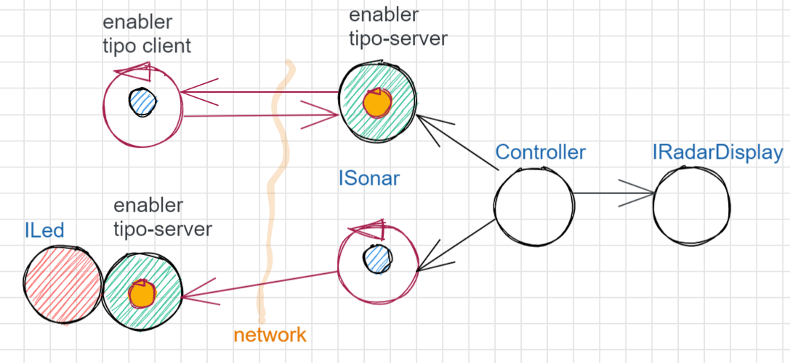
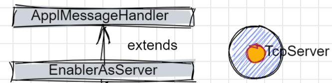

.. contents:: Overview
   :depth: 5
.. role:: red 
.. role:: blue 
.. role:: remark
 

.. ``  https://bashtage.github.io/sphinx-material/rst-cheatsheet/rst-cheatsheet.html

======================================
RadarSystem
======================================
Tetendo conto dal nostro motto: 

:remark:`non c’è codice senza progetto, progetto senza analisi del problema, problema senza requisiti`

impostiamo un processo di produzione del software partendo da un insieme di requisiti.

--------------------------------------
Requisiti
--------------------------------------

Si desidera costruire un'applicazione software capace di: 

- (requisito :blue:`radarGui`) mostrare le distanze rilevate da un sensore ``HC-SR04`` connesso a un RaspberryPi 
  su un display (``RadarDisplay``) a forma di radar connesso a un PC
  
.. image:: ./_static/img/Radar/radarDisplay.png 
   :align: center
   :width: 20%
   
- (requisito :blue:`ledAlarm`) accendere un LED se la distanza rilevata è inferiore a un valore limite prefissato
  denominato ``DLIMIT``.

--------------------------------------
Analisi dei Requisiti
--------------------------------------
Iniziamo anallizzando il testo, cercando di chiarire con il committente il signifcato dei termini in esso presenti.
Questa comunicazione a livello umano è fondamentale per formulare requisiti che siano:

- Chiari, Corretti, Completi, Concisi
- Non ambigui, consistenti
- Tracciabili, Realizzabili, Collaudabili

+++++++++++++++++++++++++++++++++++++
Tracciabilità
+++++++++++++++++++++++++++++++++++++
Poichè il testo dei requisiti fornisce già un nome per ciascun requisito, si ha già un solido punto
di partenza per la :blue:`forward traceability`.

+++++++++++++++++++++++++++++++++++++
User stories
+++++++++++++++++++++++++++++++++++++

Una user-story che esprime il funzionamento atteso del sistema, catturando tutti i requisiti può essere
così espressa:

.. epigraph:: 
  
   :blue:`User-story US1`: come utente mi aspetto che il Led si accenda se pongo un ostacolo a distanza ``d<DILIMT`` 
   dal Sonar e che il Led si spenga non appena porto l'ostacolo ad una  distanza ``d>DILIMT``.
   In ogni caso posso vedere illuminarsi un punto sul ``RadarDisplay`` a distanza ``d`` 
   dal centro lungo   una  retta che forma un angolo :math:`\theta` 
   rispetto all'asse orizzontale del display.

   

+++++++++++++++++++++++++++++++++++++
Piano di testing (funzionale)
+++++++++++++++++++++++++++++++++++++  

La user-story precedente suggerisce anche un possibile test funzionale per la verifica del 
comportamento del software da sviluppare.

.. Un possibile test funzionale consiste nel porre un ostacolo davanti al Sonar
   prima a una distanza ``D>DLIMIT`` e poi a una distanza ``D<DLIMIT`` e osservare il valore
   visualizzato sulla GUI e lo stato del Led.

Tuttavia questo modo di procedere non è automatizzabile, in quanto richiede 
la presenza di un operatore umano. Nel seguito cercheremo di organizzare le cose in modo
da permettere :blue:`Test automatizzati`.

+++++++++++++++++++++++++++++++++++++
Glossario
+++++++++++++++++++++++++++++++++++++
La redazione di un glossario è utile per pervenire alla definizione di *Costumer requirements* 
(:blue:`C-requirements`) chiari e possibilmente non ambigui. 
Il nostro glossario, la cui redazione lasciamo al lettore, dovrà includere i termini 
*Sensore, Led, RadarDisplay* che corrispondono ad altrettanti :blue:`componenti` del sistema.

In questa sede però, la nostra attenzione si rivolge alla possibilità/necessità di esprimere
i requisiti ponendoci dal punto di vista dell'elaboratore, che (fortunatamente?!) non comprende
il linguaggio naturale.

Dal punto di vista della 'macchina', l'unico modo per relazionarsi con un ente menzionato nel glossario 
è avere del software che lo rappresenta.

Poniamo dunque al committente anche domande da questo punto di vista, e altre domande volte 
a chiarire bene la natura del sistema da realizzare.

+++++++++++++++++++++++++++++++++++++
Domande al committente
+++++++++++++++++++++++++++++++++++++

.. list-table:: 
  :widths: 50,50
  :width: 100%

  * - Il committente fornisce software relativo al Led ?
    - Si, ``led25GpioTurnOn.sh`` e ``led25GpioTurnOff.sh`` (progetto *it.unibo.rasp2021*)
  * - Il committente fornisce software per il Sonar ?
    - Si, ``SonarAlone.c`` (progetto *it.unibo.rasp2021*)
  * - Il committente fornisce qualche libreria per la costruzione del RadarDisplay ?
    - Si, viene reso disponibile (progetto *it.unibo.java.radar*)  il supporto  ``radarPojo.jar`` 
      che fornisce un singleton JAVA ``radarSupport`` capace di creare una GUI in 'stile radar' 
      e di visualizzare dati su di essa:

      .. code:: java

        public class radarSupport {
        private static RadarControl rc;
        public static void setUpRadarGui( ){
          rc=...
        }
        public static void update(String d,
              String dir){rc.update(d,dir);
        }
        }    
  * - Il LED può/deve essere connesso allo stesso RaspberryPi del sonar? 
    - Al momento si. In futuro però il LED potrebbe essere connesso a un diverso nodo di elaborazione.
  * - Il valore ``DLIMIT`` deve essere cablato nel sistema o è bene sia 
      definibile in modo configurabile dall'utente finale?
    - L'utente finale deve essere in grado di specificare in un 'file di configurazione' 
      il valore di questa distanza.
 
Dai requisiti possiamo asserire che:

- si tratta di realizzare il software per un **sistema distribuito** costituito da due nodi di elaborazione:
  un RaspberryPi e un PC convenzionale;
- i due nodi di elaborazione devono potersi  `scambiare informazione via rete`, usando supporti WIFI;
- i due nodi di elaborazione devono essere 'programmati' usando **tecnologie software diverse**.

In sintesi:

:remark:`Si tratta di realizzare un sistema software distribuito ed eterogeneo`

--------------------------------------
Analisi del problema
--------------------------------------

Per analizzare le problematiche implicite nei requisiti, dobbiamo porre molta attenzione a non confondere 
l'analisi **del problema** con l'analisi **di come pensiamo di risolvere** il problema.

Due sono gli approcci principali possibili:

- approccio :blue:`bottom-up`: partiamo da quello che abbiamo a disposizione e analizziamo i problemi che
  sorgono per 'assemblare le parti disponibili' in modo da costruire un sistema che soddisfi i requisiti funzionali;
- approccio :blue:`top-down`: partiamo analizzando le proprietà che il sistema deve 'logicamente' avere,
  senza legarci a priori ad alcun specifico componente e/o tecnologia. Successivamente, evidenziamo le
  problematiche che sorgono sia per soddisfare i requisiti funzionali sia per utilizzare (se si pone il caso) 
  componenti forniti dal committente o dalla nostra azienda, considerndo anche framework e infrastrutture 
  disponibili sul mercato (con una evidente propensione  all'open-source e al free software).

E' molto probabile che la maggior marte delle persone sia propensa a seguire (almeno inizialmente) un
approccio bottom-up, essendo l'approccio top-down meno legato a enti subito concretamente usabili come 
'building blocks'. 

Osserviamo però che il compito della analisi del problema non è quello di trovare una soluzione, 
ma quello di porre in luce le problematiche in gioco (il :blue:`cosa` si deve fare) e capire con quali risorse 
(tempo, persone, denaro, etc. )  queste problematiche debbano/possano essere affrontate e risolte.
Sarà compito dei progettisti quello di trovare il modo (il :blue:`come`) pervenire ad una soluzione 'ottimale'
date le premesse dell'analisi e le risorse a disposizione.

Anticipiamo subito che il nostro approccio di riferimento sarà di tipo top-down, per motivi che si dovrebbero
risultare chiari durante il percorso che ora iniziamo seguendo, al momento, un tipico modo di procedere bottom-up.

Sarà proprio rendendoci conto dei limiti di approcci bottom-up che acquisiremo (se non l'abbiamo già)
il convincimento che conviene chiarire bene il :blue:`cosa` prima di affrontare il :blue:`come` e che anche
il :blue:`come` può essere convenientemente affrontato ritardando o incapsulando il più possibile dettagli legati 
alle tecnologie utilizzate.

++++++++++++++++++++++++++++++++++++++
Un approccio bottom-up
++++++++++++++++++++++++++++++++++++++

La costruzione del sistema pone le seguenti :blue:`problematiche`:

.. list-table::
   :widths: 40,60
   :width: 100%

   * - Gestione del sensore ``HC-SR04``.
     - Il software fornito dal committente (``SonarAlone.c``) rende disponibile un generatore di dati
       sul dispositivo standard di output.  
   * - Realizzazione del ``RadarDisplay``.
     - A questo fine è disponibile il POJO realizzato da  ``radarPojo.jar`` 
   * - Gestione del Led.
     - Il software fornito dal committente (``led25GpioTurnOn.sh`` e ``led25GpioTurnOff.sh``) fornisce codice
       di basso livello per accendere e spegnere il Led.
   * - Quale assemblaggio?
     - .. image:: ./_static/img/Radar/RobotSonarStarting.png
            :width: 100%

       Occorre capire come i dati del sonar generati sul Raspberry possano raggiungere il PC ed essere usati per
       aggiornare il ``RadarDisplay`` e per accendere/spegnere il ``Led``.

La necessità di integrare i componenti disponibili *fa sorgere altre problematiche*:

   #. è opportuno incapsulare i componenti disponibli entro altri componenti capaci di interagire via rete?
   #. dove è più opportuno inserire la 'businenss logic'? In un oggetto che estende il sonar o il ``radarSupport``?
      Oppure è meglio introdurre un terzo componente?
   #. quale forma di interazione è più opportuna? diretta/mediata, sincrona/asincrona?.

%%%%%%%%%%%%%%%%%%%%%%%%%%%%%%%%%%%%%%%
Dispositivi di input e di output 
%%%%%%%%%%%%%%%%%%%%%%%%%%%%%%%%%%%%%%%

Concettualmente, il Sonar è un dispositivo di input e il Led e il RadarDisplay sono dispositivi di output.

In generale, nella programmazione ad oggetti, 
per utilizzare un dispositivo di output è sufficiente invocare un metodo, mentre
l'uso di un dispositivo di input presenta due modalità principali:

- il componente interessato ai dati prodotti dal dispostivo di input, ne invoca un metodo
- *'bloccante'* (ad esempio ``read()``) che fornisce un dato non appena disponibile.
  Questo modo di procedere prende anche il nome di :blue:`interazione a polling`;
- il componente consumatore dei dati si relaziona con dispostivo di input seccondo 
  il  :blue:`pattern observer`.  

%%%%%%%%%%%%%%%%%%%%%%%%%%%%%%%%%%%%%%%
Il pattern observer
%%%%%%%%%%%%%%%%%%%%%%%%%%%%%%%%%%%%%%%

Nella programmazione ad oggetti, un componente  :blue:`osservabile` invoca un metodo di
invio di dati (quando disponibili) a tutti i componenti che sono stati in precedenza registrati 
presso di lui  come *osservatori*. Un componente può essere registarto come osservatore solo
se implementa il metodo di invio dati (di solito denominato ``update``).

La registrazione di un *observer* presso un *observable*
può essere fatta dall'*observer* stesso o, preferibilmente, da un configuratore di sistema.
In questo secondo caso nessuno dei due componenti ha alcun riferimento staticamente definito all'altro.
  
Una 'variante' del pattern observer è costituita dalla possibilità che un dispositivo di input
possa 'pubblicare' i propri dati su una risorsa esterna osservabile. 
Torneremo su questa variante più avanti.

Notiamo che software disponibile per il Sonar opera come produttore di dati, ma non offre operazioni
per la registrazione di osservatori; un componente interessato ai dati del Sonar deve fare in modo 
che il proprio dispositivo di input
sia il dispositivo di output del Sonar e poi utilizzare una operazione come la ``read()``.

%%%%%%%%%%%%%%%%%%%%%%%%%%%%%%%%%%%%%%%
Dai dispositivi al sistema
%%%%%%%%%%%%%%%%%%%%%%%%%%%%%%%%%%%%%%%

Per costruire un sistema partendo dai dispositivi, occorre capire come l'informazione fornita
dal dispositivo di input Sonar possa essere elaborata in modo da fluire nel modo voluto
ai dispositivi di output.

Focalizzando l'attenzione sul requisito :blue:`RadarGui` e quindi sulla interazione *sonar-radar* 
(per il Led valgono considerazioni analoghe) possiamo rappresentare la situazione come segue:

.. list-table::
   :widths: 50,50
   :width: 100%

   *  - :blue:`Comunicazione diretta`
        
        Le 'nuvolette' in figura rappresentano gli strati di software che permettono ai dati generati dal Sonar 
        di eseere ricevuti dal ``RadarDisplay``.

      -   .. image:: ./_static/img/Radar/srrIntegrate1.png
            :width: 100%
   *  - :blue:`Comunicazione mediata`

        Richiede la presenza di un :blue:`componente mediatore (broker)`, di solito realizzato da terze parti 
        come servizio disponibile in rete. Un generatore di dati (come il Sonar) pubblica informazione  
        su una :blue:`topic` del broker; tale informazione
        che potrebbe essere ricevuta ('osservata') da uno o più ricevitori (come il RadarDisplay) che si iscrivono 
        a quella *topic*.  

      -   .. image:: ./_static/img/Radar/srrIntegrate2.png
            :width: 100%
          
          TODO: Modificare la figura

%%%%%%%%%%%%%%%%%%%%%%%%%%%%%%%%%%%%%%%
Chi realizza la logica applicativa?
%%%%%%%%%%%%%%%%%%%%%%%%%%%%%%%%%%%%%%%

Seguendo il :blue:`principio di singola responsabilità` (e un pò di buon senso) la realizzazione degli use-cases 
applicativi non deve essere attribuita al software di gestione dei dispositivi di I/O.

Dunque, la nostra analisi ci induce a sostenere
l'opportunità di introdurre un nuovo componente, che possiamo denominare ``Controller``), che abbia la
:blue:`responabilità di realizzare la logica applicativa`.

Il ``Controller`` deve ricevere in ingresso i dati del sensore ``HC-SR04``, elaborarli e  
inviare comandi al Led e dati al  ``RadarDisplay``.

Ma ecco sorgere un'altra problematica legata alla distribuzione:
       
- Il ``Controller`` può risiedere su RaspberryPi, sul PC o su un terzo nodo. 
  Tuttavia, un colloquio con il committente ha escluso (per motivi di costo) la possibilità di introdurre un altro
  nodo di elaborazione. 

- La presenza di un broker in forme di comunicazione mediata  potrebbe indurci ad attribuire responsabiliotà
  applicative al mediatore. Ma è giusto/opportuno procedere i questo modo?

Dunque si tratta di analizzare dove sia meglio allocare il ``Controller`` :

.. list-table::
   :widths: 30,70
   :width: 100%

   * - ``Controller`` sul RaspberryPi.
     - Si avrebbe una maggior reattività nella accensione del Led in caso di allarme. Inoltre ...
       
   * - ``Controller`` sul PC.
     - Si avrebbe più facilità nel modificare la logica applicativa,
       lasciando al Raspberry solo la responsabilità di gestire dispositivi. Inoltre ...
   * - ``Controller`` sul broker.
     - Al momento escludiamo questa possibilità, riservandoci di riprendere il problema quando esamineremo
       architetture distribuite 'space-based'.

%%%%%%%%%%%%%%%%%%%%%%%%%%%%%%%%%%%%%%%%%%%%%%%%%%%%%%%%%%
Quale 'collante'? I protocolli di comunicazione
%%%%%%%%%%%%%%%%%%%%%%%%%%%%%%%%%%%%%%%%%%%%%%%%%%%%%%%%%%

Dovendo realizzare un sistema distribuito (ed eterogeno), i componenti del sistema devono poter scambiare 
informazione (in modo che possano capirsi).

Per ottenere questo scopo, sono stati sviluppati numerosi protocolli che,
avvalendosi di una appropriata infrastruttura di rete,  permettono lo scambio di informazione
tra componenti che diventano la parti costituenti di un sistema proprio grazie al 'collante' 
offerto dal protocollo.

Poichè protcolli diversi inducono a concepire sistemi organizzati in modo diverso, è opportuno
riflettere sul :blue:`tipo di protocollo` che è possibile scegliere 
e sul :blue:`tipo di architettura` che  scaturisce da questa scelta.

In questa fase, possiamo diviedere i protocolli di comunicazioni più diffusi in due macro-categorie:

- protocolli :blue:`punto-a-punto` che stabiliscono un *canale bidirezionale* tra compoenenti di solito
  denominati client e  server. Esempi di questo tipo sono ``UDP, TCP, HTTP, CoAP, Bluetooth``.
- protocolli :blue:`publish-subscribe` che si avvalgono di un mediatore (broker) tra client e server. Esempio
  di questo tipo di protocollo è ``MQTT`` che viene supportato da broker come ``Mosquitto, RabbitMQ, HiveMq``, etc. 

Al momento dovremmo avere conoscenze su come usare protocolli quali TCP/UDP e HTTP
ma siamo forse meno esperti nell'uso di supporti per la comunicazione mediata tramite broker.

Seguiamo dunque l'idea delle **comunicazioni dirette** facendo riferimento al protocollo TCP
(più affidabile di UDP e supporto di base per HTTP)  che assume quindi al monento il ruolo di 'collante' 
principale tra le parti.

+++++++++++++++++++++++++++++++++++++++++++++++++
Considerazioni architetturali
+++++++++++++++++++++++++++++++++++++++++++++++++
Per approfondire l'analisi delle problematiche che si pongono quando si voglia 
far comunicare due componenti software con TCP, non ci interessano tanto i dettagli tecnici di come opera 
il protocollo, quanto le ripercussioni sulla architettura del sistema.

A questo riguardo possiamo dire che nel sistema dovremo avere componenti capaci
di operare come un `client-TCP` e componenti capacai di operare come un `server-TCP`.

.. list-table::
  :widths: 15,85
  :width: 100%

  * - Server
    - Il server opera su un nodo con indirizzo IP noto (diciamo ``IPS``) , apre una ``ServerSocket`` su una  porta 
      (diciamo ``P``) ed attende messaggi  di connessione su ``P``.

  * - Client
    - Il client deve dapprima aprire una ``Socket`` sulla coppia ``IPS,P`` e poi inviare o ricevere messaggi su tale socket.
      Si stabilisce così una *connessione punto-a-punto bidirezionale* tra il nodo del client e quello del server.

Inizialmente il server opera come ricevitore di messaggi e il client come emettitore. Ma su una connessione TCP,
il server può anche dover inviare messaggi ai client, ad esempio quando  si richiede una interazione di tipo
:blue:`request-response`. In tal caso, il client deve essere anche capace di agire come ricevitore di messaggi.

%%%%%%%%%%%%%%%%%%%%%%%%%%%%%%%%%%%%%%%%%%%%%%%%%%%%%%%%%%%%%%%%%%%
L'idea di connessione: l'interfaccia ``Interaction2021``
%%%%%%%%%%%%%%%%%%%%%%%%%%%%%%%%%%%%%%%%%%%%%%%%%%%%%%%%%%%%%%%%%%%
La necessità di  inviare e ricevere messaggi via rete segnala un :blue:`gap`  tra il livello tecnologico 
dei componenti software resi disponibili dal committente e le necessità del problema.

Coma analisti, osserviamo che un *gap* relativo alle comunicazioni di rete **si può presentare in modo sistematico
in tutte le applicazioni distribuite**. Sarebbe dunque opportuno cercare di colmare questo *gap* in modo non episodico,
introducendo :blue:`componenti riusabili` che possano 'sopravvivere' all'applicazione che stiamo costruendo
per poter essere impiegati in futuro in altre applicazioni distribuite.

Astraendo dallo specifico protocollo, osserviamo che tutti i principali protocolli punto-a-punto 
sono in grado di stabilire una :blue:`connessione` stabile sulla quale inviare e ricevere messaggi.

Questo concetto può essere realizzato da un oggetto che rende disponibile opportuni metodi, come quelli definiti
nella seguente interfaccia:

.. _conn2021: 

.. code:: Java

  interface Interaction2021  {	 
    public void forward(  String msg ) throws Exception;
    public String receiveMsg(  )  throws Exception;
    public void close( )  throws Exception;
  }

Il metodo di trasmissione è denominato ``forward`` per rendere più evidente il fatto che pensiamo ad un modo di operare 
:blue:`'fire-and-forget'`. 

L'informazione scambiata è rappresenta da una ``String`` che è un tipo di dato presente in tutti
i linguaggi di programmazione.
Non viene introdotto un tipo  diverso (ad esempio ``Message``) perchè non si vuole stabilire 
il vincolo che gli end-points della connessione siano componenti codificati nello medesimo linguaggio di programmazione

La ``String`` restituita dal metodo ``receiveMsg`` può rappresentare una risposta a un messaggio
inviato in precedenza con ``forward``.

Ovviamente la definizione di questa interfaccia potrà essere estesa e modificata in futuro, 
a partire dall fase di progettazione, ma rappresenta una forte indicazione dell'analista di 
pensare alla costruzione di componenti software che possano ridurre il costo delle applicazioni future.

+++++++++++++++++++++++++++++++++++++++++++++
Prodotti della analisi
+++++++++++++++++++++++++++++++++++++++++++++

Importanti prodotti, al termine della fase di analisi dei requisiti e del problema sono:

-  la definizione di una :blue:`architettura logica` di riferimento che tiene conto dei vincoli posti 
   dai requisiti e dal problema che ne consegue;
-  la proposta di un :blue:`piano di lavoro` per lo sviluppo del sistema.

%%%%%%%%%%%%%%%%%%%%%%%%%%%%%%%%%%%%%%%%%%%%%%%%%%%%%%%%
Architettura logica come modello di riferimento
%%%%%%%%%%%%%%%%%%%%%%%%%%%%%%%%%%%%%%%%%%%%%%%%%%%%%%%%

L'architettura logica di un sistema costituisce un :blue:`modello del sistema` ispirato dai requisiti funzionali 
e dalle forze in gioco nel dominio applicativo o nella specifica applicazione e mira ad identificare 
i macro-sottosistemi in cui il **problema stesso** suggerisce di articolare il sistema risolvente. 

L'architettura logica è il più possibile **indipendente da ogni ipotesi sull'ambiente di implementazione**.

Un modo per *valutare la qualità* di una architettura logica e la *coerenza con i requisiti* 
è dare risposta a opportune domande, come le seguenti:

- E' possibile addentrarsi nei dettagli dell'architettura procedendo :blue:`incrementalmente` 
  a livelli di astrazione via via descrescenti (con tecniche di raffinamento e :blue:`zooming`) 
  o siamo di fornte a un ammasso non organizzato di parti?
- Le dipendenze tra le parti sono state impostate a livello logico o riflettono (erroneamente) 
  una *visione implementativa*?
- Se nel modello compaiono entità denotate da **termini non definiti** nel glossario costruito 
  dall'analista dei requisiti, quale è la motivazione della loro presenza? 
  Sono elementi realmente necessari o siamo di fronte ad una prematura anticipazione di elementi di progettazione?
- Se nel modello **non compaiono** entità corrispondenti a termini definiti nel glossario, 
  quale è la motivazione della loro mancanza? Siamo di fronte a una dimenticanza 
  o vi sono ragioni reali per non includere questi elementi?

&&&&&&&&&&&&&&&&&&&&&&&&&&&&&&&&&&&&&&&&&&&&&&
Architettura logica ad oggetti
&&&&&&&&&&&&&&&&&&&&&&&&&&&&&&&&&&&&&&&&&&&&&&

Se astraiamo dalla distribuzione (supponendo ad esempio che tutto il sistema possa
essere supportato sul RaspberryPi), l'architettura logica del sistema risulta
riconducibile a un classico schema :blue:`read-eval-print` in cui:  

.. epigraph:: 

  Il componente ``Controller`` deve leggere dati dal Sonar 
  come dispositivo di input e inviare comandi al Led e al RadarDisplay 
  come dispositvi di output.

Per rendere comprensibile questa architettura anche alla 'macchina' senza entrare in dettagli
implementativi, possiamo introdurre opportuni :blue:`modelli` dei componenti utlizzando qualche linguaggio
di programmazione.

Nel caso di Java, il costrutto interface può essere usato per denotare un componente catturandone
come aspetto essenziale le funzionalità che esso deve offrire e una sorta di :blue:`contratto` 
sull’uso del componente.

Introduciamo dunque i nostri primi modelli di componenti definendo interfacce Java per il *Led,
il Sonar e il RadarDisplay*.

%%%%%%%%%%%%%%%%%%%%%%%%%%%%%%%%%%%%%%%%%%
Le interfacce ILed, ISonar e IRadarDisplay
%%%%%%%%%%%%%%%%%%%%%%%%%%%%%%%%%%%%%%%%%%

.. list-table::
  :widths: 32, 32, 36
  :width: 100%

  * -  Sonar
    -  Led
    -  RadarDisplay
  * -        
      .. code:: java

       interface ISonar {
         void activate();		 
         void deactivate();
         int getVal();	
         boolean isActive();
       }
    -        
      .. code:: java

        interface ILed {
          void turnOn();
          void turnOff();
          boolean getState();
        }
    -        
      .. code:: java     

        interface IRadarDisplay{
          void update(
           String d, String a);
        }  

La :blue:`architettura logica` suggerita dal problema è rappresentabile con la figura che segue:

 
.. image:: ./_static/img/Radar/ArchLogicaOOP.PNG
   :align: center
   :width: 50%

 

%%%%%%%%%%%%%%%%%%%%%%%%%%%%%%%%%%%%%%%%%%
La logica del Controller
%%%%%%%%%%%%%%%%%%%%%%%%%%%%%%%%%%%%%%%%%%

.. Poichè l'analisi ha evidenziato l'opportunità di incapsulare la logica applicativa entro un componente
  ad-hoc (il ``Controller``), 

A questo punto possiamo anche esprimere il funzionamento del ``Controller`` come segue:

.. code:: java

  ISonar        sonar;
  ILed          led;
  IRadarDisplay radar;
  ...
  while( sonar.isactive() ){
    int v = sonar.getVal(); //Acquisizione di un dato dal sonar
    if( v < DLIMIT )        //Elaborazione del dato
      Led.turnOn() else Led.turnOff  //Gestione del Led
    radar.update( v, "90")    //Visualizzazione su RadarDisplay
  }

.. Questa impostazione astrae completamente dal fatto che il sistema sia distribuito, in quanto vuole 
   solo porre in luce la relazione logica tra i componenti individuati dall'analisi del problema.

Il :blue:`come` avviene l'interazione tra le parti relativa alla acqusizione dei dati e all'invio dei comandi
non è specificato al momento. 
Come analisti del problema possiamo però evidenziare quanto segue:

#. l'uso della memoria comune come strumento di comunicazione va evitato, per  
   ottenere la flessibità di poter eseguire ciascun componente su un diverso nodo di elaborazione; 
#. il ``Controller`` può acquisire i dati in due modi diversi:
  #. inviando una richieste al Sonar, che gli fornisce un dato come risposta
  #. il Sonar non lavora come 'produttore a richiesta' ma pubblica dati su un broker 
     accessibile al ``Controller``.

Poichè abbiamo in precedenza escluso forme di interazione *publish-subscribe*, abbiamo al momento
ipotizzato il caso 2.1. 

Questo modello sembra portare intrinsecamente in sè l'idea di una classica applicazione   
ad oggetti che deve essere eseguita su un singolo elaboratore (o una singola Java virtual machine).
Ma forse non è proprio così.

.. Dunque sappiamo :blue:`cosa` fare e non fare: 
    in particolare, l'interazione Controller-Sonar sarà basata su una interazione punto-a-punto utilizzando
    il protocollo TCP.  Il :blue:`come` realizzare questa interazione sarà compito del progettista.

%%%%%%%%%%%%%%%%%%%%%%%%%%%%%%%%%%%%%%%%%%%%%%%%%%%%%%
Dagli oggetti alla distribuzione: gli enablers
%%%%%%%%%%%%%%%%%%%%%%%%%%%%%%%%%%%%%%%%%%%%%%%%%%%%%%

Il fatto di avere espresso il ``Controller`` con riferimento a interfacce e non ad oggetti concreti, 
significa che il progettista si può avvalere di appropriati :blue:`design pattern` per 
implememtare i componenti in modo che possano scambiare informazione via rete.

A questo fine possiamo introdurre, come analisti, l'idea di un nuovo tipo di ente,
denominato :blue:`enabler`, che ha come scopo quello di incapsulare software 'convenzionale' utile e 
testato ma non adatto alla distribuzione (che possiamo denominare :blue:`core-code`) 
all'interno di un involucro che funga da una sorta di  'membrana' capace di ricevere e 
trasmettere informazione.

Ad esempio, il ``Controller`` su PC utilizzerà un TCP-server con interfaccia ``ISonar`` che riceverà i dati 
dal Sonar posto sul Raspberry, rendendoli disponibili con il metodo ``getVal``.
Inoltre utilizzerà un TCP-client con interfaccia ``ILed`` che trasmetterà i comandi al Led 
sul Raspberry.

Questa idea di :blue:`enabler` sembra dunque promettente come strumento per un passaggio graduale
e sistematico dalla programmazione tradizionale ad oggetti alla programmazione distribuita.

Di fatto stiamo delienando la nascita di un :blue:`nuovo paradigma di programmazione` che troverà
più avanti un suo pieno sviluppo con i concetti di :blue:`attore` di :blue:`microservizio`. 

 

%%%%%%%%%%%%%%%%%%%%%%%%%%%%%%%%%%%%%%%%%%
Piano di lavoro
%%%%%%%%%%%%%%%%%%%%%%%%%%%%%%%%%%%%%%%%%%

Trattandosi di uno sviluppo di tipo bottm-up, il piano di lavoro parte dallo sviluppo dei componenti,
seguito da un opportuno 'assemblaggio' degli stessi in modo da formare il sistema che soddisfa i requisiti.

Poichè il nostro obiettivo è anche quello di riusare :blue:`core-code` fornito dal committente, possiamo pensare di procedere come segue:

#. definizione dei componenti software di base legati ai dispositivi di I/O (Sonar, RadarDisplay e Led);
#. definizione di alcuni supporti TCP per componenti lato client a lato server, con l'obiettivo di
   formare un insieme riusabile anche in applicazioni future; 
#. definizione componenti (denominati genericamente :blue:`enabler`)  capaci di abilitare  
   alle comunicazioni TCP i componenti-base;
#. assemblaggio dei componenti `enabler` per formare il sistema distribuito.

Il punto 2 relativo ai supporti non è indispensabile, ma, come detto, può costituire un elemento strategico 
a livello aziendale.

.. Il punto 3 sugli :blue:`enabler` nasce dall'idea di incapsulare software 'convenzionale' utile e 
   testato (che possiamo denominare :blue:`core-code`) all'interno di un involucro capace di ricevere e inviare 
    informazione, che funga da una sorta di 'membrana cellulare'.

..  Ad esempio, il software capace di accendere un Led fornito dal committente è un file bash che
    un opportuno :blue:`enabler` può porre in esecuzione ricevendo un comando dal ``Controller``.

--------------------------------------
Progettazione e sviluppo incrementale
--------------------------------------

Iniziamo il nostro progetto affrontando il primo punto del piano di lavoro proposto dall'analisi.

Usando la terminologia :blue:`SCRUM`, impostiamo il primo :blue:`SPRINT` dello sviluppo, al termine del  quale
la prevista :blue:`Srint Review` farà il punto della situazione con il committente e getterà le basi per
il passo successivo, che potrà coincidere o meno con quello pianificato nell'analisi.

+++++++++++++++++++++++++++++++++++++++++++++
Componenti per i dispositivi di I/O
+++++++++++++++++++++++++++++++++++++++++++++

Il primo :blue:`SPRINT` di questo nostro sviluppo bottom-up consiste nel realizzare componenti-base 
per i dispositivi di I/O, partendo dalle interfacce introdotte nella analisi. 

%%%%%%%%%%%%%%%%%%%%%%%%%%%%%%%%%%%%%%%%%%%%%%%%%%%%%%%%%%%%%%%%%%%%%%%%%%%%%%%%%%%%%%%
Dispositivi reali e Mock, DeviceFactory e file di configurazione
%%%%%%%%%%%%%%%%%%%%%%%%%%%%%%%%%%%%%%%%%%%%%%%%%%%%%%%%%%%%%%%%%%%%%%%%%%%%%%%%%%%%%%%

Per agevolare la messa a punto di una applicazione, conviene spesso introdurre Mock-objects, cioè
dispositivi simulati che riproducono il comportamento dei dispositivi reali in modo controllato.

Inoltre, per facilitare la costruzione di dispositivi senza dover denotare in modo esplicito le classi
di implementazione, conviene introdurre una Factory:

.. code:: java

  public class DeviceFactory {
    public static ILed createLed() { ... }
    public static ISonar createSonar() { ... }
    public static IRadarGui createRadarGui() {
  }

Ciasun metodo di ``DeviceFactory`` restitusce una istanza di dispositivo reale o Mock in accordo alle specifiche
contenute in un file di Configurazione (``RadarSystemConfig.json``) scritto in JSon:

.. code:: java

  {
  "simulation"       : "true",
   ...
  "DLIMIT"           : "15"
  }

Si noti che questo file contiene anche la specifica di ``DLIMIT`` come richiesto in fase di analisi dei requisiti.

Questo file di configurazione viene letto dal metodo *setTheConfiguration* di un singleton Java ``RadarSystemConfig``
che inizializza variabili ``static`` accessibili all'applicazione:

.. code::  java

  public class RadarSystemConfig {
    public static boolean simulation = true;  //overridden by setTheConfiguration
    ...
    public static void setTheConfiguration( String resourceName ) { 
      ... 
      fis = new FileInputStream(new File(resourceName));
	    JSONTokener tokener = new JSONTokener(fis);
	    JSONObject object   = new JSONObject(tokener);

      simulation = object.getBoolean("simulation");
      ...
    }
  }

Per essere certi che un dispositivo Mock possa essere un sostituto efficace di un dispositivo reale,
introduciamo per ogni dispositivo una **classe astratta** comune alle due tipologie, 
che funga anche da factory.

%%%%%%%%%%%%%%%%%%%%%%%%%%%%%%%%%%%%%%%%%%%%%%%%%
Il Led
%%%%%%%%%%%%%%%%%%%%%%%%%%%%%%%%%%%%%%%%%%%%%%%%% 

Un Led è un dispositivo di output che può essere modellato e gestito in modo semplice.

&&&&&&&&&&&&&&&&&&&&&&&&&&&&&&&&&&&&&&&&&&&&&&&&&
La classe astratta LedModel
&&&&&&&&&&&&&&&&&&&&&&&&&&&&&&&&&&&&&&&&&&&&&&&&&

La classe astratta relativa al Led introduce un metodo :blue:`abstract` denominato ``ledActivate``
cui è demandata la responsabilità di accendere/spegnare il Led.

.. code:: java

  public abstract class LedModel implements ILed{
    private boolean state = false;	

    //Factory methods    
    public static ILed create() {
      ILed led;
      if( RadarSystemConfig.simulation ) led = createLedMock();
      else led = createLedConcrete();
      led.turnOff();      //Il led iniziale è spento
    }
    public static ILed createLedMock(){return new LedMock();  }
    public static ILed createLedConcrete(){return new LedConcrete();}	
    
    //Abstract methods
    protected abstract void ledActivate( boolean val);
    
    protected void setState( boolean val ) { 
      state = val; ledActivate( val ); 
    }
    @Override
    public void turnOn(){ setState( true ); }
    @Override
    public void turnOff() { setState( false ); }
    @Override
    public boolean getState(){  return state;  }
  }

La variabile locale booleana ``state`` viene posta a ``true`` quando il Led è acceso.

&&&&&&&&&&&&&&&&&&&&&&&&&&&&&&&&&&&&&&&&&&&&&&&&&
Il LedMock
&&&&&&&&&&&&&&&&&&&&&&&&&&&&&&&&&&&&&&&&&&&&&&&&&

In pratica il LedModel è già un LedMock, in quanto tiene traccia dello stato corrente nella variabile
``state``. 

Tuttavia può essere opportuno ridefinire ``ledActivate`` in modo da rendere visibile 
sullo standard output lo stato del Led . 

.. code:: java

  public class LedMock extends LedModel implements ILed{
    @Override
    protected void ledActivate(boolean val) {	 showState(); }

    protected void showState(){ 
      System.out.println("LedMock state=" + getState() ); 
    }
  }

Una implementazione più user-friendly potrebbe 
introdurre una GUI che cambia di colore e/o dimensione a seconda che il Led sia acceso o spento.

&&&&&&&&&&&&&&&&&&&&&&&&&&&&&&&&&&&&&&&&&&&&&&&&&
Il LedConcrete
&&&&&&&&&&&&&&&&&&&&&&&&&&&&&&&&&&&&&&&&&&&&&&&&&

Il componente che realizza la gestione di un Led concreto, conesso a un RaspberryPi, si può avvalere
del software reso disponibile dal committente:

.. code:: java

  public class LedConcrete extends LedModel implements ILed{
  private Runtime rt  = Runtime.getRuntime();    
    @Override
    protected void ledActivate(boolean val) {
      try {
        if( val ) rt.exec( "sudo bash led25GpioTurnOn.sh" );
        else rt.exec( "sudo bash led25GpioTurnOff.sh" );
      } catch (IOException e) { ... }
    }
  }

&&&&&&&&&&&&&&&&&&&&&&&&&&&&&&&&&&&&&&&&&&&&&&&&&
Testing del dispositivo Led
&&&&&&&&&&&&&&&&&&&&&&&&&&&&&&&&&&&&&&&&&&&&&&&&&

Un test automatizzato di tipo unit-testing sul Led può essere espresso usando JUnit come segue:

.. code-block:: java

  public class TestLed {
    @Before
    public void up(){ System.out.println("up");	}
    @After
    public void down(){ System.out.println("down"); }	
    @Test 
    public void testLedMock() {
      RadarSystemConfig.simulation = true; 
      
      ILed led = DeviceFactory.createLed();
      assertTrue( ! led.getState() );
      
      led.turnOn();
      assertTrue(  led.getState() );
      
      led.turnOff();
      assertTrue(  ! led.getState() );		
    }	
  }

Un test sul LedConcrete ha la stessa struttura del test sul LedMock, ma bisogna avere l'avvertenza
di eseguirlo sul RaspberryPi. Eseguendo il test sul PC non vengono segnalati errori (in quanto
il Led 'funziona' da un punto di vista logico) ma compaiono messaggi del tipo:

.. code-block::

  LedConcrete | ERROR Cannot run program "sudo": ...  

%%%%%%%%%%%%%%%%%%%%%%%%%%%%%%%%%%%%%%%%%%%%%%%%%
Il Sonar 
%%%%%%%%%%%%%%%%%%%%%%%%%%%%%%%%%%%%%%%%%%%%%%%%% 

Un Sonar è un dispositivo di input che deve fornire dati quando richiesto dalla applicazione.

Il software fornito dal committente per l'uso di un Sonar reale ``HC-SR04`` introduce
logicamente un componente attivo, che produce in modo autonomo sul dispositivo standard di output,
con una certa frequenza, una sequenza di valori interi di distanza.

La modellazione di un componente produttore di dati è più complicata di quella di un dispositivo passivo
(come un dispositivo di output) in quanto occorre affrontare un tipico problema produttore-consumatore.
Al momento seguiremo un approccio tipico della programmazione concorrente, basato su memoria comune

&&&&&&&&&&&&&&&&&&&&&&&&&&&&&&&&&&&&&&&&&&&&&&&&&
La classe astratta SonarModel
&&&&&&&&&&&&&&&&&&&&&&&&&&&&&&&&&&&&&&&&&&&&&&&&&

La classe astratta relativa al Sonar introduce due metodi :blue:`abstract`,  uno per specificare il modo di inizializzare il sonar 
(metodo ``sonarSetUp``) e uno per specificare il modo di produzione dei dati (metodo ``sonarProduce``).
Inoltre, essa definisce due metodi ``create`` che costituiscono factory-methods per un sonar Mock e un sonar reale.

      
.. code:: java

  abstract class SonarModel implements ISonar{
  protected  static int curVal = 0;     //valore corrente prodotto dal sonar
  protected boolean stopped = false;    //quando true, il sonar si ferma

    //Factory methods
    public static ISonar create() {
      if( RadarSystemConfig.simulation )  return createSonarMock(); 
      else  return createSonarConcrete();		
    }
    public static ISonar createSonarMock() { return new SonarMock(); }
    public static ISonar createSonarConcrete() { return new SonarConcrete(); }

Il Sonar viene modellato come un processo produttore di dati sulla variabile locale ``curVal``.
Il processo risulta attivo quando la variabile locale ``stopped`` è ``true``. 
Di qui le seguenti definizioni:

.. code:: java

    @Override
    public void deactivate() { stopped = true; }
    @Override
    public boolean isActive() { return ! stopped; }

Il codice realativo alla produzione dei dati viene incapsulato in un metodo abstract ``sonarProduce``
che dovrà essere definito in modo diverso da un ``SonarMock`` e un ``SonarConcrete``, così come il
metodo di inizializzazione ``sonarSetUp``:

.. code:: java

    //Abstract methods
    protected abstract void sonarSetUp() ;		 
    protected abstract void sonarProduce() ;

Con queste premesse, il metodo ``activate`` può essere impostato in modo da inizializzare il Sonar
e attivare un Thread interno di produzione di dati:

.. code:: java

    @Override
    public void activate() {
      sonarSetUp();
      stopped = false;
      new Thread() {
        public void run() {
          while( ! stopped  ) { sonarProduce(); }
        }
      }.start();
    }

La parte applicativa che funge da consumatore dei dati prodotti dal Sonar dovrà invocare il metodo
``getVal`` che viene definito in modo da bloccare il chiamante se il Sonar è in 'fase di produzione',
riattivandolo non appena il dato è stato prodotto:  

.. code:: java

    protected boolean produced = false;   //synch var

    @Override
    public int getVal() {   //non synchronized perchè violerebbe l'interfaccia
      waitForUpdatedVal();
      return curVal;
    }       
    private synchronized void waitForUpdatedVal() {
      while( ! produced ) wait();
      produced = false;
    }
    protected synchronized void setVal( ){
      produced = true;
      notify();   //riattiva il Thread in attesa su getVal
    }
  }

&&&&&&&&&&&&&&&&&&&&&&&&&&&&&&&&&&&&&&&&&&&&&&&&&
Il SonarMock
&&&&&&&&&&&&&&&&&&&&&&&&&&&&&&&&&&&&&&&&&&&&&&&&&
Un Mock-sonar che produce valori di distanza da ``90`` a ``0`` può quindi ora essere definito come segue:

.. code:: java

  public class SonarMock extends SonarModel implements ISonar{
    @Override
    protected void sonarSetUp(){  curVal = 90;  }
    @Override
    protected void sonarProduce() {
      if( RadarSystemConfig.testing ) {
        curVal = RadarSystemConfig.testingDistance;
        stopped = true;  //one shot
      }else {
        curVal--;
        stopped = ( curVal == 0 );
        setVal(   );    //produce
        delay(RadarSystemConfig.sonarDelay);  //rallenta il rate di generazione 
    }
  }  

Si noti che: 

- viene definito un nuovo parametro di configurazioe ``testing`` che, quando ``true`` denota che
  il sonar sta lavorando in una fase di testing, per cui produce un solo valore dato fal
  parametro ``testingDistance``;
- viene definito un nuovo parametro di configurazioe ``sonarDelay`` relativo al rallentamento
  della frequenza di generazione dei dati.
 

.. code:: java

  {
  "simulation"       : "true",
   ...
  "DLIMIT"           : "15",
  "testing"          : "false"
  "testingDistance"  : "10",
  "sonarDelay"       : "100"
  }

 

&&&&&&&&&&&&&&&&&&&&&&&&&&&&&&&&&&&&&&&&&&&&&&&&&
Il SonarConcrete
&&&&&&&&&&&&&&&&&&&&&&&&&&&&&&&&&&&&&&&&&&&&&&&&&

Il componente che realizza la gestione di un Sonar concreto, conesso a un RaspberryPi,
si può avvalere del programma ``SonarAlone.c`` fornito dal committente;
per ridurre la frequenza di produzione, il metodo ereditato ``setVal``, che sblocca un
consumatore di livello  applicativo, viene invocato ogni  ``numData`` 
valori emessi sul dispositivo standard di output.

.. code:: java

  public class SonarConcrete extends SonarModel implements ISonar{
  private int numData           = 5; 
  private int dataCounter       = 1;
  private  BufferedReader reader ;
	
  @Override
  protected void sonarSetUp() {
    curVal = 0;		
    try {
      Process p  = Runtime.getRuntime().exec("sudo ./SonarAlone");
      reader = new BufferedReader( new InputStreamReader(p.getInputStream()));	
    }catch( Exception e) { ... 	}
  }
  protected void sonarProduce() {
    try {
      String data = reader.readLine();
      dataCounter++;
      if( dataCounter % numData == 0 ) { //every numData ...
        curVal = Integer.parseInt(data);
        setVal( );    
      }
    }catch( Exception e) { ...       }
  }
  }

&&&&&&&&&&&&&&&&&&&&&&&&&&&&&&&&&&&&&&&&&&&&&&&&&
Testing del dispositivo Sonar
&&&&&&&&&&&&&&&&&&&&&&&&&&&&&&&&&&&&&&&&&&&&&&&&&

Il testig di un sonar riguarda due aspetti distinti:

#. il test sul corretto funzionamento del dispositivo in quanto tale. Supponendo di porre
   di fronte al Sonar un ostacolo a distanza :math:`D`, il Sonar deve emettere dati di valore
   :math:`D \pm \epsilon`.
#. il test sul corretto funzionamento del componente software responsabile della trasformazione del dispositivo
   in un produttore di dati consumabili da un altro componente.

Ovviamente qui ci dobbiamo occupare della seconda parte, supponendo che la prima sia soddisfatta. A tal fine
possiamo procedere come segue:

- per il *LedMock*, noi controlliamo la sequenza di valori emeessi e quindi possiamo
  verificare che  un consumatore riceva dal metodo ``getVal`` i valori nella giusta sequenza;
- per il *LedConcrete*, poniamo uno schermo a distanza prefissata :math:`D`  e verifichiamo che
  un consumatore riceva dal  metodo ``getVal`` valori :math:`D \pm \epsilon`.

Una TestUnit automatizzata per il ``SonarMock`` può essere quindi definita in JUnit come segue:

.. code:: java

  @Test 
  public void testSonarMock() {
    RadarSystemConfig.simulation = true;
    RadarSystemConfig.sonarDelay = 10; //quite fast generation...
		int delta = 1;

    ISonar sonar = DeviceFactory.createSonar();
    sonar.activate();
    int v0 = sonar.getVal();    //first val consumed
    while( sonar.isActive() ) {
      int d = sonar.getVal();   //blocking!
      int vexpected = v0-delta; //each val is the previous-delta
      assertTrue( d == vexpected );
      v0 = d; 
    }
  }

Una TestUnit per il ``SonarConcrete`` è simile, una volta fissato il valore :math:`delta=\epsilon` 
di varianza sulla distanza-base.

&&&&&&&&&&&&&&&&&&&&&&&&&&&&&&&&&&&&&&&&&&&&&&&&&
Il Sonar come dispositivo observable
&&&&&&&&&&&&&&&&&&&&&&&&&&&&&&&&&&&&&&&&&&&&&&&&&

Volendo impostare il Sonar come un dispositivo osservabile 
ntroduciamo un nuovo contratto, che elimina il metodo `getVal`:

.. code:: java

  interface ISonarObservable  {
    void register( IObserver obs );		 
    void unregister( IObserver obs );
    public void activate();		 
    public void deactivate();
    public boolean isActive();
  }

  interface IObserver{
    public void update( int value );
  }

Nel quadro di un programma ad
oggetti convenzionale, avvalerci del :blue:`pattern decorator` e 

.. code:: java

  public abstract class SonarModelObservable extends Observable implements ISonarObservable{

  public class SonarMockObservable extends SonarModelObservable {

.. _controller: 

%%%%%%%%%%%%%%%%%%%%%%%%%%%%%%%%%%%%%%%%%%%%%%%%%
Il Controller
%%%%%%%%%%%%%%%%%%%%%%%%%%%%%%%%%%%%%%%%%%%%%%%%% 
Il componente che realizza la logica applicativa può essere definito partendo dal modello introdotto
nella fase di analisi, attivando un Thread che realizza lo schema *read-eval-print*.
Nel codice che segue realizzeremo ciascun requisito con un componente specifico:

.. code:: java

  public class Controller {
    public static void activate( ILed led, ISonar sonar,IRadarDisplay radar) {
      System.out.println("Controller | activate"  );
      new Thread() {
        public void run() { 
          try {
            while( sonar.isActive() ) {
              int d = sonar.getVal();  
              LedAlarmUsecase.doUseCase( led,  d  );   
              RadarGuiUsecase.doUseCase( radar,d  );	 
            }
          } catch (Exception e) { ...  }					
        }
      }.start();
    }
  } 

&&&&&&&&&&&&&&&&&&&&&&&&&&&&&&&&&
LedAlarmUsecase
&&&&&&&&&&&&&&&&&&&&&&&&&&&&&&&&&
.. code:: java

  public class LedAlarmUsecase {
    public static void doUseCase(ILed led, int d) {
      try {
        if( d <  RadarSystemConfig.DLIMIT ) led.turnOn(); else  led.turnOff();
      } catch (Exception e) { ... }					
    }
  } 

&&&&&&&&&&&&&&&&&&&&&&&&&&&&&&&&&
RadarGuiUsecase
&&&&&&&&&&&&&&&&&&&&&&&&&&&&&&&&&
.. code:: java

  public class RadarGuiUsecase {
    public static void doUseCase( IRadarDisplay radar, int d ) {
      radar.update(""+d, "90");
    }	 
  }

%%%%%%%%%%%%%%%%%%%%%%%%%%%%%%%%%%%%%%%%%%%
Il sistema simulato su PC
%%%%%%%%%%%%%%%%%%%%%%%%%%%%%%%%%%%%%%%%%%%

Il sistema viene dapprima costruito secondo le specifiche contenuto nel file di configurazione e 
successivamente attivato facendo partire il Sonar.

&&&&&&&&&&&&&&&&&&&&&&&&&&&&&&&&&
Fase di setup
&&&&&&&&&&&&&&&&&&&&&&&&&&&&&&&&&
.. code:: java

  public class RadarSystemMainOnPc {
  private ISonar sonar        = null;
  private ILed led            = null;
  private IRadarDisplay radar = null;

    ...
    public static void main( String[] args) throws Exception {
      RadarSystemMainOnPc sys = new RadarSystemMainOnPc();
      sys.setup( "RadarSystemConfigPcControllerAndGui.json" );
      sys.build();
      sys.activateSonar();
    }  
  }

&&&&&&&&&&&&&&&&&&&&&&&&&&&&&&&&&
Il file di configurazione
&&&&&&&&&&&&&&&&&&&&&&&&&&&&&&&&& 
.. code:: java

  {
  "simulation"       : "true",
  "ControllerRemote" : "false",
  "LedRemote"        : "false",
  "SonareRemote"     : "false",
  "RadarGuieRemote"  : "false",
  "pcHostAddr"       : "localhost",
  "raspHostAddr"     : "192.168.1.12",
  "radarGuiPort"     : "8014",
  "ledPort"          : "8010",
  "sonarPort"        : "8012",
  "controllerPort"   : "8016",
  "serverTimeOut"    : "600000",
  "applStartdelay"   : "3000",
  "sonarDelay"       : "100",
  "DLIMIT"           : "15",
  "testing"          : "false"
  }

&&&&&&&&&&&&&&&&&&&&&&&&&&&&&&&&&
Fase di costruzione del sistema
&&&&&&&&&&&&&&&&&&&&&&&&&&&&&&&&&
  
.. code:: java

  public class RadarSystemMainOnPc {
    ...
    public void build() throws Exception {			
      //Dispositivi di Input
      sonar  = DeviceFactory.createSonar();
      //Dispositivi di Output
      led    = DeviceFactory.createLed();
      radar  = DeviceFactory.createRadarGui();	
      //Controller 
      Controller.activate(led, sonar, radar);
    }    
    public void activateSonar() {
      if( sonar != null ) sonar.activate();
    }
    public static void main( String[] args) throws Exception { ... }
  }

&&&&&&&&&&&&&&&&&&&&&&&&&&&&&&&&&
Utilità per il testing
&&&&&&&&&&&&&&&&&&&&&&&&&&&&&&&&& 

Inseriamo nel main program  metodi che restitusicono un riferimento ai componenti del sistema:

.. code:: java

  public class RadarSystemMainOnPc {
    ... 
    public ILed getLed() {
      return led;
    }
    public ISonar getSonar() {
      return sonar;
    }
    public IRadarDisplay getRadarGui() {
      return radar;
    }
  }

&&&&&&&&&&&&&&&&&&&&&&&&&&&&&&&&&&&&&&&&&&&&&
Testing del sistema simulato su PC
&&&&&&&&&&&&&&&&&&&&&&&&&&&&&&&&&&&&&&&&&&&&&

La testUnit introduce un metodo di setup per definire i parametri di configurazione 
(in modo da non dipendere da files esterni) e per costruire il sistema.

.. code:: java

  public class TestBehaviorAllOnPc {
  private RadarSystemAllOnPc sys;
    @Before
    public void setUp() {
      System.out.println("setUp");
      try {
        sys = new RadarSystemAllOnPc();
        //Set system configuration (we don't use RadarSystemConfig.json)
        RadarSystemConfig.simulation        = true;    
        RadarSystemConfig.testing           = true;    		
        RadarSystemConfig.ControllerRemote  = false;    		
        RadarSystemConfig.LedRemote         = false;    		
        RadarSystemConfig.SonareRemote      = false;    		
        RadarSystemConfig.RadarGuieRemote   = false;    	
        RadarSystemConfig.pcHostAddr        = "localhost";
        sys.build();
      } catch (Exception e) {
        fail("setup ERROR " + e.getMessage() );
      }
    }
  
  @Test 
  public void testFarDistance() {
    //Simaulate obstacle far
    RadarSystemConfig.testingDistance = RadarSystemConfig.DLIMIT +20;
    sys.activateSonar();   //il sonar produce un solo valore
    while( sys.getSonar().isActive() ) delay(10);   //give time the system to work 
    RadarGui radar = (RadarGui) sys.getRadarGui();	//cast just for testing ...
    assertTrue( ! sys.getLed().getState() && radar.getCurDistance() == RadarSystemConfig.testingDistance );
    delay(2000) ; //give time to look at the display
  }	

  @Test 
  public void testNearDistance() {
    //Simaulate obstacle near
    RadarSystemConfig.testingDistance = RadarSystemConfig.DLIMIT - 1;
    sys.activateSonar();   //il sonar produce un solo valore
    while( sys.getSonar().isActive() ) delay(10); 	//give time the system to work 
    RadarGui radar = (RadarGui) sys.getRadarGui();	//cast just for testing ...
    assertTrue(  sys.getLed().getState() && radar.getCurDistance() == RadarSystemConfig.testingDistance);
    delay(2000) ; //give time to look at the display
  }

.. _tcpsupport:

+++++++++++++++++++++++++++++++++++++++++++++
Supporti per TCP
+++++++++++++++++++++++++++++++++++++++++++++

Introduciamo classi di supporto per TCP lato client e lato server.

.. _tcpsupportClient:

%%%%%%%%%%%%%%%%%%%%%%%%%%%%%%%%%%%%%%%%%%
TCPClient
%%%%%%%%%%%%%%%%%%%%%%%%%%%%%%%%%%%%%%%%%%
Mediante la classe ``TcpClient`` possiamo istanziare oggetti che stabilisccono una connessione 
su un data coppia ``IP, Port``. Il metodo  static ``connect`` restiruisce un oggetto 
che implementa l'interfaccia  :ref:`Interaction2021<conn2021>`  
e che potrà essere usato per inviare-ricevere messaggi.

.. code:: Java

  public class TcpClient {

    public static Interaction2021 connect(
              String host,int port,int nattempts) throws Exception{
      for( int i=1; i<=nattempts; i++ ) {
        try {
          Socket socket        =  new Socket( host, port );
          Interaction2021 conn =  new TcpConnection( socket );
          return conn;
        }catch(Exception e) {
          System.out.println("Attempt to connect:" + host + " port=" + port);
          Thread.sleep(500);
        }
      }//for
      throw new Exception("Unable to connect to host:" + host);
    }
  }
Si noti che il client fa un certo numero di tentativi prima di segnalare la impossibilità di connessione.

.. _tcpsupportServer:

%%%%%%%%%%%%%%%%%%%%%%%%%%%%%%%%%%%%%%%%%%
TCP Server
%%%%%%%%%%%%%%%%%%%%%%%%%%%%%%%%%%%%%%%%%%

Alla semplicità del supporto lato client si contrappone una maggior complessità lato server, in quanto
occorre:

- permettere di stabilire (in generale) connenessioni con più client;
- fare in modo che si stabilisca una diversa connessione con ciascun client;
- fare in modo che i messaggi ricevuti su una specifica connessione siano elaborati da opportuno 
  codice applicativo.

Per raggiungere questi obiettivi, introduciamo un insieme di supporti che permettano al server di
porre in esecuzione codice applicativo  rappresentato da oggetti costruiti come specializzazioni
di una classe astratta ``ApplMessageHandler``:

&&&&&&&&&&&&&&&&&&&&&&&&&&&&&&&&&&&&&&&&
ApplMessageHandler
&&&&&&&&&&&&&&&&&&&&&&&&&&&&&&&&&&&&&&&&

.. _msgh: 

.. code:: Java

  public abstract class ApplMessageHandler {  
  protected Interaction2021 conn;		//Injected by setConn
  protected String name;
    public ApplMessageHandler( String name ) { this.name = name; }
    ...
    public abstract void elaborate( String message ) ;
    
    public void setConn( Interaction2021 conn) { ... }
    public Interaction2021 getConn(  ) {  return conn;  }
  }

La classe astratta  ``ApplMessageHandler``  definisce il metodo abstract ``elaborate( String message )``
che le classi applicative devono implementare per realizzare la voluta  gestione dei messaggi.

Questa classe può ricevere per *injection* (metodo ``setConn``) una connessione 
di tipo :ref:`Interaction2021<conn2021>` che il metodo *elaborate* 
può utilizzare per l'invio di messaggi (di risposta) sulla connessione.

Questa connessione sarà fornita ad ``ApplMessageHandler`` dai supporti di più basso livello che ora
introdurremo.

&&&&&&&&&&&&&&&&&&&&&&&&&&&&&&&&&&&&&&&&
TcpConnection
&&&&&&&&&&&&&&&&&&&&&&&&&&&&&&&&&&&&&&&&
La classe ``TcpConnection`` costituisce una implementazione della interfaccia 
:ref:`Interaction2021<conn2021>`
e quindi realizza i metodi di supporto per la ricezione e la trasmissione di
messaggi applicativi sulla connessione fornita da una ``Socket``.

.. code:: Java

  public class TcpConnection implements Interaction2021{
    ...
  public TcpConnection( Socket socket  ) throws Exception { ... }
    @Override
    public void forward(String msg)  throws Exception { ... }
    @Override
    public String receiveMsg()  { ... }
    @Override
    public void close() { ... }

&&&&&&&&&&&&&&&&&&&&&&&&&&&&&&&&&&&&&&&&
TcpMessageHandler
&&&&&&&&&&&&&&&&&&&&&&&&&&&&&&&&&&&&&&&&
Mediante la classe ``TcpMessageHandler`` possiamo creare un
oggetto (dotato di un Thread interno) che si occupa di ricevere messaggi su una data connessione 
:ref:`Interaction2021<conn2021>`, delegandone la gestione a un oggetto dato, 
di tipo  :ref:`ApplMessageHandler<msgh>`.

.. _tcpmsgh: 

.. code:: Java

  public class TcpApplMessageHandler extends Thread{
  public TcpApplMessageHandler( ApplMessageHandler handler ) { 
    @Override
    public void run() {
      Interaction2021 conn = handler.getConn() ;
      ...
      //Attendi messaggio su conn
      String msg = conn.receiveMsg();
      ...
      handler.elaborate( msg );
    }
  }

&&&&&&&&&&&&&&&&&&&&&&&&&&&&&&&&&&&&&&&&
Il server come oggetto attivo
&&&&&&&&&&&&&&&&&&&&&&&&&&&&&&&&&&&&&&&&
 
Mediante la classe ``TcpServer`` possiamo istanziare oggetti che realizzano un server TCP che
apre una ``ServerSocket`` e gestisce la richiesta di connessione da parte dei clienti.

Il ``TcpServer`` viene definito come un Thread che riceve un :ref:`ApplMessageHandler<msgh>` come oggetto di 
'callback' che contiene la logica di gestione dei messaggi applicativi ricevuti dai client che si connetteranno.
Il server defisce anche metodi per essere attivato e deattivato:.

.. code:: Java

  public class TcpServer  extends Thread{
  private boolean stopped = true;
  private ApplMessageHandler applHandler;
  private int port;
  private ServerSocket serversock;

  public TcpServer(String name, int port, ApplMessageHandler applHandler) {
    super(name);
    this.port        = port;
    this.applHandler = applHandler;
    try {
      serversock = new ServerSocket( port );
      serversock.setSoTimeout(RadarSystemConfig.serverTimeOut);
    }catch (Exception e) { 
      Colors.outerr(getName() + " | ERROR: " + e.getMessage());
    }
  }
  public void activate() {
    if( stopped ) {
      stopped = false;
      this.start();
    }
  }
  public void deactivate() {
    try {
      stopped = true;
      serversock.close();
    }catch (IOException e) {
      Colors.outerr(getName() + " | ERROR: " + e.getMessage());	 
    }
  }

&&&&&&&&&&&&&&&&&&&&&&&&&&&&&&&&&&&&&&&&
La classe `Colors`
&&&&&&&&&&&&&&&&&&&&&&&&&&&&&&&&&&&&&&&&

La classe :blue:`Colors` è una utility per scrivere su standard ouput messaggi colorati. 
Il metodo ``Colors.outerr`` visualizza un messaggio in colore rosso, 
mentre ``Colors.out`` lo fa con il colore blu o con un colore specificato come parametro.

Per ottenere messaggi colorati in Eclipse, occorre installare il plugin  *ANSI-Escape in Console*.

  
&&&&&&&&&&&&&&&&&&&&&&&&&&&&&&&&&&&&&&&&
Il funzionamento del server
&&&&&&&&&&&&&&&&&&&&&&&&&&&&&&&&&&&&&&&&
Il metodo che definisce il funzionamento del server è il metodo ``run``
che attende una richiesta di connessione e quando questa arriva creae un oggetto (attivo)
di classe :ref:`TcpMessageHandler<tcpmsgh>` adibito alla ricezione dei messaggi inviati dai client
con l':ref:`ApplMessageHandler<msgh>` ricevuto al momento della costruzione del server.

.. code:: Java

  @Override
  public void run() {
  try {
    while( ! stopped ) {
      //Accept a connection				 
      Colors.out(getName() + " | waits on server port=" + port);	 
      Socket sock  = serversock.accept();	
      Interaction2021 conn = new TcpConnection(sock);
      applHandler.setConn(conn);
      //Create a message handler on the connection
      new TcpApplMessageHandler( applHandler );			 		
    }//while
  }catch (Exception e) {...}
 

%%%%%%%%%%%%%%%%%%%%%%%%%%%%%%%%%%%%%%%%%%
Una TestUnit
%%%%%%%%%%%%%%%%%%%%%%%%%%%%%%%%%%%%%%%%%%
Una TestUnit può essere utile sia come esempio d'uso dei suppporti, sia per chiarire le
interazioni client-server.

Per impostare la TestUnit, seguiamo le seguente user-story:

.. epigraph:: 

  :blue:`User-story TCP`: come TCP-client mi aspetto di poter inviare una richiesta di connessione al TCP-server
  e di usare la connessione per inviare un messaggio e per ricevere una risposta.
  Mi aspetto anche che altri TCP-client possano agire allo stesso modo senza che le
  loro informazioni interferiscano con le mie.

&&&&&&&&&&&&&&&&&&&&&&&&&&&&&&&&&&&&&&&
Metodi before/after
&&&&&&&&&&&&&&&&&&&&&&&&&&&&&&&&&&&&&&&

Il metodo che la JUnit esegue dopo ogni test, disattiva il server (se esiste): 

.. code:: Java

  public class TestTcpSupports {
  private TcpServer server;
  public static final int testPort = 8111; 
 
  @After
  public void down() {
    if( server != null ) server.deactivate();
  }	
  protected void startTheServer(String name) {
    erver = new TcpServer(name,testPort, NaiveHandler.create());
    server.activate();		
	}

Il metodo ``startTheServer`` verrà usato dalle operazioni di test per creare ed attivare il TCPServer.

&&&&&&&&&&&&&&&&&&&&&&&&&&&&&&&&&&&&&&&&&&&&&&&&&&&&&&
L'handler dei messaggi applicativi ``NaiveHandler``
&&&&&&&&&&&&&&&&&&&&&&&&&&&&&&&&&&&&&&&&&&&&&&&&&&&&&&

La classe ``NaiveHandler`` definisce l'handler che useremo nel test per elaborare i messaggi inivati dai clienti. 
Il metodo di elaborazione si avvale della connessione ereditata da ':ref:`ApplMessageHandler<msgh>`
per inviare al cliente una risposta che contiene anche il messaggio ricevuto.

.. code:: Java

  class NaiveHandler extends ApplMessageHandler {
  private static int count = 1;
  static NaiveHandler create() {
    return new NaiveHandler( "nh"+count++);
  }
  private NaiveHandler(String name) {
    super(name);
  }
  public void elaborate( String message ) {
    try {
      conn.forward("answerTo_"+message);
    } catch (Exception e) {...}
  }
  }

&&&&&&&&&&&&&&&&&&&&&&&&&&&&&&&&&&&&&&&
Un semplice client per i test
&&&&&&&&&&&&&&&&&&&&&&&&&&&&&&&&&&&&&&&

Un semplice client di testing viene definito in modo che (metodo ``doWork``) il client :

#. si connette al server
#. invia un messaggio
#. attende la risposta del server
#. controlla che la risposta sia quella attesa 

.. code:: Java

  class ClientForTest{
  public static boolean withserver = true;  //per fare un test di client senza server
    public void doWork(String name, int nattempts) {
      try {
        Interaction2021 conn  = 
          TcpClient.connect("localhost", TestTcpSupports.testPort, nattempts); //1
        String request = "hello from" + name;
        conn.forward(request);              //2
        String answer = conn.receiveMsg();  //3
        System.out.println(name + " | receives the answer: " +answer );	
        assertTrue( answer.equals("answerTo_"+ request)); //4
      } catch (Exception e) {
        if( withserver ) fail();
      }
    }
  }

&&&&&&&&&&&&&&&&&&&&&&&&&&&&&&&&&&&&&&&&&&&&&&&&&&
Test per l'interazione senza server
&&&&&&&&&&&&&&&&&&&&&&&&&&&&&&&&&&&&&&&&&&&&&&&&&&

Il test controlla che un client esegue un certo numero di tenativi ogni volta
che tenta di connettersi a un server:

.. code:: Java

  @Test 
  public void testClientNoServer() {
		ClientForTest.withserver = false; //per non fare faillire il test
    new ClientForTest().doWork("clientNoServer",3 );
  }

&&&&&&&&&&&&&&&&&&&&&&&&&&&&&&&&&&&&&&&&&&&&&&&&&&
Test per l'interazione client-server
&&&&&&&&&&&&&&&&&&&&&&&&&&&&&&&&&&&&&&&&&&&&&&&&&&

Un test che riguarda il funzionamento atteso in una interazione tra un singolo client e il server
può essere così definito:

.. code:: Java

  @Test 
  public void testSingleClient() {
    server.activate();
    new ClientForTest().doWork("client1");
  }
	
&&&&&&&&&&&&&&&&&&&&&&&&&&&&&&&&&&&&&&&&&&&&&&&&&&
Test con molti clienti
&&&&&&&&&&&&&&&&&&&&&&&&&&&&&&&&&&&&&&&&&&&&&&&&&&

.. code:: Java

  @Test 
  public void testManyClients() {
    server.activate();
    System.out.println("testManyClients");
    new ClientForTest().doWork("client1");
    new ClientForTest().doWork("client2");
    new ClientForTest().doWork("client3");
  }	

.. L'errore da indagare:
.. .. code:: Java
.. oneClientServer | ERROR: Socket operation on nonsocket: configureBlocking
 

+++++++++++++++++++++++++++++++++++++++++++++
Gli enablers
+++++++++++++++++++++++++++++++++++++++++++++

L'analisi del problema ha posto in evidenza la opportunità/necessità,
di introdurre nel sistema degli :blue:`enabler`, che hanno lo scopo di incapsulare 
:blue:`core-code` all'interno di un component capace di ricevere e trasmettere informazione.

Nell'ambito di un processo di sviulppo bottom-up, in cui abbiamo selezionato il procollo TCP come
tecnologia di riferimento per le comunicazioni, risulta naturale pensare a 
due tipi di enabler: uno per ricevere (diciamo un *server*) e uno per trasmettere (diciamo un *client*).
 
Nel quadro di una architettura port-adapter, ponendo il ``Controller`` su PC, 
questi, senza modificare il codice introdotto in :ref:`Controller<controller>`:

- accederà al Sonar attraverso un adapter-enabler *tipo server* che implementa l'interfaccia ``ISonar``; 
- accederà al Led utilizzando un adapter-enabler *tipo client*  che implementa l'interfaccia ``ILed``  
  
Dualmente, sul Raspberry dovremo porre:

- un enabler *tipo server* per il Led, per ricevere i comandi di accensione/spegnimento;
- un enabler *tipo client* per il Sonar, per inviare dati e per ricevere comandi dal server.

Avendo anche la consapevolezza che questa parte di lavoro potrebbe farci pervenire alla
costruzione di :blue:`supporti riusabili`,
cercheremo di impostare il progetto degli enabler in modo da dipendere 'il meno possibile'
dalla tecnologia di base per la comunicazione (protocollo) tra componenti software
distribuiti.

%%%%%%%%%%%%%%%%%%%%%%%%%%%%%%%%%%%%%%%%%%%%%
Enabler astratto per ricezione
%%%%%%%%%%%%%%%%%%%%%%%%%%%%%%%%%%%%%%%%%%%%%

Iniziamo con il definire un server astratto che crea il supporto di comunicazione 
relativo al protocollo specificato e demanda la gestione dei messaggi inviati da un client
alle classi specializzate.

 
.. code:: java

  public abstract class EnablerAsServer extends ApplMessageHandler{
  protected ApplMessageHandler handler;
    public EnablerAsServer(String name, int port, ProtocolType protocol) {
      super(name);
      setServerSupport( port, this, protocol );
    }	
    protected void setServerSupport( int port, ApplMessageHandler handler, 
          ProtocolType protocol ) throws Exception{
      this.handler = handler;
      if( protocol == ProtocolType.tcp ) {
        TcpServer server = new TcpServer( "ServerTcp", port,  handler );
        server.activate();
      }else if( protocol == ProtocolType.coap ) {
        ...
      }
    }	 
  }

%%%%%%%%%%%%%%%%%%%%%%%%%%%%%%%%%%%%%%%%%%%%%
Tipi di protocollo supportati
%%%%%%%%%%%%%%%%%%%%%%%%%%%%%%%%%%%%%%%%%%%%%

La classe ``ProtocolType`` enumera i protocolli utlizzabili dagli enablers.  

.. code:: java

  public enum ProtocolType {  tcp, coap }

%%%%%%%%%%%%%%%%%%%%%%%%%%%%%%%%%%%%%%%%%%%%%
Enabler astratto per trasmissione
%%%%%%%%%%%%%%%%%%%%%%%%%%%%%%%%%%%%%%%%%%%%%

All'enabler-ricevitore, affianchiamo suibito un enabler astratto per trasmettere informazione.

.. code:: java

  public abstract class EnablerAsClient {
  private Interaction2021 conn; 
  protected String name ;	
    public EnablerAsClient( String name, String host, int port ) {
      try {
        this.name = name;
        startHandlerMessagesFromServer(conn);
      } catch (Exception e) {...}
    }

    protected void startHandlerMessagesFromServer( Interaction2021 conn) {
      new Thread() {
        public void run() {
          try {
            handleMessagesFromServer(conn);
          } catch (Exception e) { ...	}				
          }
      }.start();
    }

    protected abstract void handleMessagesFromServer( Interaction2021 conn ) throws Exception;
    
    protected void sendValueOnConnection( String val ) {
      try {
        conn.forward(val);
      } catch (Exception e) {...}
    }  
    public Interaction2021 getConn() { return conn; }
  }  

%%%%%%%%%%%%%%%%%%%%%%%%%%%%%%%%%%%%%%%%%%%%%
Gli Enabler per il Sonar
%%%%%%%%%%%%%%%%%%%%%%%%%%%%%%%%%%%%%%%%%%%%%

Abbiamo già anticipato che, nel caso il Controller sia su PC, il Sonar richiede:

- su PC: un adapter-enabler *tipo server* che implementa l'interfaccia ``ISonar`` per ricevere dati;
- su RaspberryPi: un enabler *tipo client* per inviare dati e per ricevere comandi.

Al monento, come supporti di comunicazione useremo quanto sviluppato come :ref:`Supporti TCP<tcpsupport>`.

&&&&&&&&&&&&&&&&&&&&&&&&&&&&&&&&&&&&&&&&&&&&&&&&&&&&&
Adapter-Enabler come server di ricezione  
&&&&&&&&&&&&&&&&&&&&&&&&&&&&&&&&&&&&&&&&&&&&&&&&&&&&&

.. image:: ./_static/img/Radar/EnablersAndAdapters.PNG
   :align: center
   :width: 40% 

L'adapter di ricezione *tipo server* per il Sonar specializza EnablerAsServer 
definendo il metodo ``elaborate`` sui messaggi inivati da un client:

.. code:: java

  public class SonarAdapterEnablerAsServer 
                  extends EnablerAsServer implements ISonar{
  private int lastSonarVal = 0;		 
  private boolean stopped  = true;	//mirror value
  private boolean produced = false;

  public SonarAdapterServer( String name, int port, ProtocolType protocol ) {
    super(name, port, protocol);
  }
  @Override  //from ApplMessageHandler
  public void elaborate(String message) {
    lastSonarVal = Integer.parseInt( message );
    valueUpdated( );  //riattiva processi in attesa su getVal
  } 
  protected synchronized void valueUpdated( ){
    produced = true;
    this.notify();
	}

Inoltre l'enabler funge anche come adapter, (re)implementando i metodi di  ``ISonar`` in modo
da interagire con l'enabler-client remoto:

.. code:: java

	@Override
	public void activate() {
		sendCommandToClient("activate");
		stopped = false;
	}
	@Override
	public void deactivate() {
		sendCommandToClient("deactivate");
		stopped = true;
	}
  
	@Override   
	public int getVal() {  
		sendCommandToClient("getVal");
		waitForUpdatedVal();
		return lastSonarVal;
	}

	private synchronized void waitForUpdatedVal() {
		try {
      while( ! produced ) wait();
      produced = false;
 		} catch (InterruptedException e) { ...	}		
	}
}

&&&&&&&&&&&&&&&&&&&&&&&&&&&&&&&&&&&&&&&&&&&&&&&&&&&&&
Adapter-Enabler come client di trasmissione 
&&&&&&&&&&&&&&&&&&&&&&&&&&&&&&&&&&&&&&&&&&&&&&&&&&&&&

.. code:: java

  public class SonarEnablerAsClient extends EnablerAsClient{
  private ISonar sonar ;
	
    public SonarEnablerAsClient( 
        String name, String host, int port, ProtocolType protocol, ISonar sonar ) {
      super( name,  host,  port, protocol );
      this.sonar = sonar;
    }

    public void handleMessagesFromServer( Interaction2021 conn ) throws Exception {
      while( true ) {
        String cmd = conn.receiveMsg();
        if( cmd.equals("activate")) {
          sonar.activate();
         }else if( cmd.equals("getVal")) {
            String data = ""+sonar.getVal();
            sendValueOnConnection(data);
        }
        else if( cmd.equals("deactivate")) {
          sonar.deactivate();
          break;
        }
      }
	  }
  }

%%%%%%%%%%%%%%%%%%%%%%%%%%%%%%%%%%%%%%%%%%%%%
Gli Enabler per il Led
%%%%%%%%%%%%%%%%%%%%%%%%%%%%%%%%%%%%%%%%%%%%%

&&&&&&&&&&&&&&&&&&&&&&&&&&&&&&&&&&&&&&&&&&&&&&&&&&&&&
Enabler-adapter di trasmissione per il Led (lato PC)
&&&&&&&&&&&&&&&&&&&&&&&&&&&&&&&&&&&&&&&&&&&&&&&&&&&&&

&&&&&&&&&&&&&&&&&&&&&&&&&&&&&&&&&&&&&&&&&&&&&&&&&&&&&
Enabler di ricezione per il Led (lato Raspberry)
&&&&&&&&&&&&&&&&&&&&&&&&&&&&&&&&&&&&&&&&&&&&&&&&&&&&&

 

.. code:: java

  public class LedAdapterClient extends EnablerAsClient  {
  ILed led = DeviceFactory.createLed();

    public LedServer(  int port  )   {
      super("LedServer");
      setProtocolServer(port,this);	
    }
    
    public void setProtocolServer(int port, ApplMessageHandler enabler) {
      try {
        new TcpServer( name+"Server", port,  this );
      } catch (Exception e) { ... } 			
    }
    
    @Override		//from ApplMessageHandler
    public void elaborate(String message) {
      if( message.equals("on")) led.turnOn();
      else if( message.equals("off") ) led.turnOff();
    }
  
  }

 
%%%%%%%%%%%%%%%%%%%%%%%%%%%%%%%%%%%%%%%%%%%%%
Testing degli enabler
%%%%%%%%%%%%%%%%%%%%%%%%%%%%%%%%%%%%%%%%%%%%%

 
+++++++++++++++++++++++++++++++++++++++++++++
Il sistema reale distribuito
+++++++++++++++++++++++++++++++++++++++++++++

 

%%%%%%%%%%%%%%%%%%%%%%%%%%%%%%%%%%%%%%%%%%%%%
Deployment
%%%%%%%%%%%%%%%%%%%%%%%%%%%%%%%%%%%%%%%%%%%%%

.. code:: 

  gradle build jar -x test

Crea il file `build\distributions\it.unibo.enablerCleanArch-1.0.zip` che contiene la directory bin  

%%%%%%%%%%%%%%%%%%%%%%%%%%%%%%%%%%%%%%%%%%%%%
Test funzionale
%%%%%%%%%%%%%%%%%%%%%%%%%%%%%%%%%%%%%%%%%%%%%

-------------------------------------
Un approccio top down
-------------------------------------

Si veda :doc:`ApproccioTopdown`.

  

