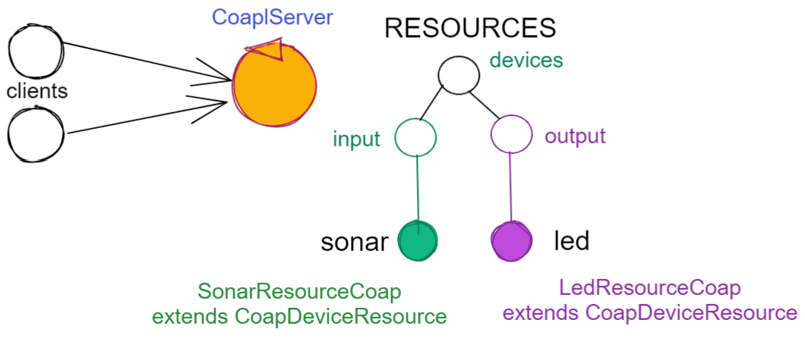

.. role:: red 
.. role:: blue 
.. role:: remark
  
.. _tuProlog: https://apice.unibo.it/xwiki/bin/view/Tuprolog/

.. _californium: https://www.eclipse.org/californium/

.. _paho: https://www.eclipse.org/paho/

==================================================
Verso un framework
==================================================

I primi SPRINT dello sviluppo hanno seguito un processo bottom-up, che ha fatto riferimento
a TCP come protocollo per le comunicazioni di rete.

Abbiamo anche costruito un  :ref:`prototipo<primoPrototipo>` di una versione distribuita del sistema, 
la cui architettura è schematizzata nella figura che segue:

.. image:: ./_static/img/Radar/sysDistr1.PNG
   :align: center 
   :width: 70%

Con maggior dettaglio, questa architettura si basa sugli elementi costitutivi di figura:

.. image:: ./_static/img/Architectures/framework0.PNG
   :align: center  
   :width: 70%

- Un oggetto (POJO) di interfaccia ``Ixxx`` che definisce il comportamento di un dispositivo reale o simulato.   
- Un oggetto di interfaccia :ref:`IApplIntepreter<IApplIntepreterEsteso>` che trasforma messaggi (di comando e richieste
  di informazione)   in chiamate a metodi di ``Ixxx``.
- Un oggetto di interfaccia :ref:`IApplMsgHandler<IApplMsgHandlerEsteso>` che definisce il codice di gestione
  dei messaggi di livello applicativo indirizzati a un particolare dispositivo.
- Un oggetto di tipo :ref:`ContextMsgHandler<ContextMsgHandler>` che realizza un gestore dei sistema dei messaggi 
  li reindirizza (dispatching) agli opportuni handler applicativi.
- Un (unico) :ref:`TcpContextServer<TcpContextServer>` attivato su un nodo di elaborazione ``A`` (ad esempio un Raspberry) che 
  permette a componenti :ref:`proxy<ProxyAsClient>` allocati su nodi esterni  (ad esempio un PC)
  di interagire con i dispositivi allocati su ``A``. Questo componente è un :ref:`TcpServer<TcpServer>` che crea un 
  :ref:`TcpApplMessageHandler` per ogni connessione, il quale riceve i messaggi e chiama il 
  :ref:`ContextMsgHandler<ContextMsgHandler>`.

La domanda che ci poniamo ora è se questa organizzazione possa essere riusata nel caso in cui si voglia sostituire
al protocolllo TCP un altro protocollo, tra quelli indicati in :ref:`ProtocolType`.

- Il caso ``UDP``: la possibilità di sostituire TCP con UDP è  resa possibile dalla libreria  ``unibonoawtsupports.jar`` sviluppata
  in anni passati. Il compito non si è rivelato troppo difficle, visto la relativa vicinanza operazionale tra le
  librerie dei due protocolli.
- Il caso ``HTTP``: affronteremo l'uso di questo protocollo più avanti, in relazione alla costruzione di un componente  
  Web GUI (se veda IssHttpSupport).
 
Più arduo sembra invece il caso di un protocollo di tipo publish-subscribe come MQTT o di un protocollo REST come CoAP
che cambiano l'impostazione logica della interazione. 

In ogni caso, dovremo costruire le nostre astrazioni utilizzando le librerie disponibili.

.. _librerieprotocolli:

------------------------------------
Liberie di riferimento
------------------------------------

Come librerie di riferimento useremo le seguenti:

- per MQTT: la libreria `paho`_
- per CoAP: la libreria `californium`_

---------------------------------------------------------
Nuovi supporti :ref:`Interaction2021<Interaction2021>`
---------------------------------------------------------

Il :ref:`tcpsupportClient` crea l'implemetazione TCP di :ref:`Interaction2021<Interaction2021>` 
introdotta a suo tempo, come oggetto di classe :ref:`TcpConnection<TcpConnection>`.

La creazione di analoghi supporti per MQTT e CoAP  parte dalle seguenti osservazioni:

- per MQTT si tratta di creare una connessione fisica con un broker che media la interazione tra mittente
  e destinatario e una connessione logica utilizzando le topic;
- per CoAP si tratta di utilizzare un oggetto  
  di classe ``CoapClient`` di `californium`_, che richiede come argomento l'``URI`` della risorsa
  a cui ci si vuole connettere.

  

.. _MqttConnection:

++++++++++++++++++++++++++++++++++++++++++++++++++++++++++++++++++++++++++++++++
``MqttConnection`` implementa :ref:`Interaction2021<Interaction2021>`
++++++++++++++++++++++++++++++++++++++++++++++++++++++++++++++++++++++++++++++++

Come :ref:`TcpConnection<TcpConnection>`, la classe ``MqttConnection`` implementa :ref:`Interaction2021<Interaction2021>` 
e quindi realizza il concetto di connessione tenendo conto delle seguenti caratteristiche del protocollo
MQTT e della libreria `paho`_:

- non vi è più (come in TCP)  una connessione punto-a-punto con il nodo destinatario ma una connessione punto-a-punto
  con un Broker (il cui indirizzo sarà nel parametro di configurazione ``RadarSystemConfig.mqttBrokerAddr``);
- la connessione col Broker viene effettuata da un client  di classe ``org.eclipse.paho.client.mqttv3.MqttClient``
  che deve avere un preciso ``clientId`` (di tipo ``String``). Il Broker accetta una sola connessione per volta
  da un dato ``clientId`` e dunque la ``MqttConnection`` è impostata come un singleton.

.. code:: java

  public class MqttConnection implements Interaction2021
  public static final String topicInput = "topicCtxMqtt";   
  protected static MqttConnection mqttSup ;  //for singleton

  protected BlockingQueue<String> blockingQueue = 
                new LinkedBlockingDeque<String>(10);
  protected String clientid;

    //Factory method
    public static synchronized MqttConnection getSupport( ){ ... }
    //Get the singleton
    public static MqttConnection getSupport() { return mqttSup; }
    
    //Hidden costructor
    protected MqttConnection( String clientName ) {
      connectToBroker(clientName, RadarSystemConfig.mqttBrokerAddr);	   	
    }
    public void connectToBroker(String clientid,  String brokerAddr) { 
      ... 
      client  = new MqttClient(brokerAddr, clientid);
    }

Il costruttore del singleton  ``MqttConnection``crea un ``MqttClient`` con ``clientId``, 
il quale si connette al Broker.

%%%%%%%%%%%%%%%%%%%%%%%%%%%%%%%%%%%%%%%%%%%%%%%
publish
%%%%%%%%%%%%%%%%%%%%%%%%%%%%%%%%%%%%%%%%%%%%%%%

``MqttConnection`` realizza l'invio di un messaggio invocando l'operazione ``publish`` su una topic;

.. code:: java 

    public void publish(String topic, String msg, int qos, boolean retain) {
		MqttMessage message = new MqttMessage();
      if (qos == 0 || qos == 1 || qos == 2) {
        //qos=0 fire and forget; qos=1 at least once(default);qos=2 exactly once
        message.setQos(qos);
      }
      try {
        message.setPayload(msg.toString().getBytes());		 
        client.publish(topic, message);
      } catch (MqttException e) { ...  }
	  }

Il metodo ``publish`` viene usato per la implementazione del motodo ``forward`` dei messaggi strutturati.

%%%%%%%%%%%%%%%%%%%%%%%%%%%%%%%%%%%%%%%%%%%%%%%
MqttConnection forward  
%%%%%%%%%%%%%%%%%%%%%%%%%%%%%%%%%%%%%%%%%%%%%%%

.. code:: java

  @Override
  public void forward(String msg) throws Exception {
    new ApplMessage(msg); //no exception => we can publish
    publish(topicInput, msg, 2, false);	
	}

%%%%%%%%%%%%%%%%%%%%%%%%%%%%%%%%%%%%%%%%%%%%%%%
subscribe
%%%%%%%%%%%%%%%%%%%%%%%%%%%%%%%%%%%%%%%%%%%%%%%

La ricezione di un messaggio si realizza attraverso la ``subscribe`` ad una topic; i messaggi pubblicati su
questa topic posssono essere gestiti associando al client (col metodo ``setCallback``) un oggetto di classe 
``org.eclipse.paho.client.mqttv3.MqttCallback`` 

.. code:: java  

    //To receive and handle a messagge (command or request)
    public void subscribe ( String topic, IApplMsgHandlerMqtt handler) {
      subscribe(clientid, topic, handler);    
    }
    protected void subscribe(String clientid, String topic, MqttCallback callback) {
      try {
        client.setCallback( callback );	
        client.subscribe( topic );			
      } catch (MqttException e) { ...		}
	  }

Poichè la gestione di un messaggio è competenza del livello applicativo, l'handler passato alla
``subscribe`` deve rispettare un contratto imposto sia dal nostro framework sia dalla libreria.
Questo contratto viene definito da una interfaccia che estende :ref:`IApplMsgHandler`.

%%%%%%%%%%%%%%%%%%%%%%%%%%%%%%%%%%%%%%%%%%%%%%%
IApplMsgHandlerMqtt
%%%%%%%%%%%%%%%%%%%%%%%%%%%%%%%%%%%%%%%%%%%%%%%

.. code:: java

   public interface IApplMsgHandlerMqtt 
        extends IApplMsgHandler, org.eclipse.paho.client.mqttv3.MqttCallback{}

.. _connessionecomecoppia:

%%%%%%%%%%%%%%%%%%%%%%%%%%%%%%%%%%%%%%%%%%%%%%%
Connessione come coppia di topic
%%%%%%%%%%%%%%%%%%%%%%%%%%%%%%%%%%%%%%%%%%%%%%%

Una connessione di tipo :ref:`Interaction2021<Interaction2021>` viene qui realizzata usando due topic: 
una per ricevere messaggi e una per inviare risposte relative ai messaggi di richiesta. 

Se la topic di ricezione ha nome ``t1``, la topic per le risposte deve avere il nome ``t1CXanswer`` 
ove ``CX`` è il nome del client che ha inviato una richiesta su ``t1``. 
Ad esempio, un proxyclient di nome ``ledPxy`` che usa la topic ``ctxEntry`` per inviare comandi e richieste al 
ContextServer,  fa una subscribe su ``ctxEntryledPxyanswer`` per ricevere le risposte.

.. code:: java

  //To receive and handle an answer
  public void subscribe(String clientid, String answertopic) {
    subscribe( clientid, answertopic, 
      new MqttConnectionCallback(client.getClientId(), blockingQueue)
    );
  }

Per permettere al livello applicativo di ricevere una risposta, l'handler di callback associato alla 
answertopic (``MqttConnectionCallback``) provvede a inserire il messaggio nella ``blockingQueue`` del supporto.

%%%%%%%%%%%%%%%%%%%%%%%%%%%%%%%%%%%%%%%%%%%%%%%
MqttConnection request  
%%%%%%%%%%%%%%%%%%%%%%%%%%%%%%%%%%%%%%%%%%%%%%%

Il metodo ``request`` di :ref:`Interaction2021<Interaction2021>` viene implementato facendo una ``publish`` sulla entry-topic
del nodo destinatario per poi far attendere la risposta a un nuovo client temporaneo appositamente creato per 
sottoscrivversi alla answertopic.

.. code:: java

  //To send a request and wait for the answer
  @Override
  public String request(String msg) throws Exception { 
    ApplMessage requestMsg = new ApplMessage(msg);

    //Preparo per ricevere la risposta
    String sender = requestMsg.msgSender();
    String reqid  = requestMsg.msgId();
    String answerTopicName = "answ_"+reqid+"_"+sender;
    MqttClient clientAnswer = setupConnectionFroAnswer(answerTopicName);

    //publish(topicInput, requestMsg.toString(), 2, false); //qos=2 !
    forward( requestMsg.toString() );
		String answer = receiveMsg();
		clientAnswer.disconnect();
		clientAnswer.close();
  }

Il client temporaneo viene disattivato dopo la ricezione della richiesta.

%%%%%%%%%%%%%%%%%%%%%%%%%%%%%%%%%%%%%%%%%%%%%%%
MqttConnection receiveMsg  
%%%%%%%%%%%%%%%%%%%%%%%%%%%%%%%%%%%%%%%%%%%%%%%

Il metodo ``receiveMsg`` attende un messaggio sulla  ``blockingQueue`` .

.. code:: java

  @Override
  public String receiveMsg() throws Exception {		
    String answer = blockingQueue.take();
    ApplMessage msgAnswer = new ApplMessage(answer); //answer is structured
    answer = msgAnswer.msgContent(); 		
    return answer;
  }

%%%%%%%%%%%%%%%%%%%%%%%%%%%%%%%%%%%%%%%%%%%%%%%
MqttConnection reply  
%%%%%%%%%%%%%%%%%%%%%%%%%%%%%%%%%%%%%%%%%%%%%%%

Il metodo reply viene implementato pubblicando un messaggio di risposta su una topic, il cui nome viene costruito
ai partire dai dati contenuti nel messaggio di richiesta come specificato in :ref:`connessionecomecoppia`.

.. code:: java

  public void reply(String msg) throws Exception {
    try {
      ApplMessage m = new ApplMessage(msg);
      String dest   = m.msgReceiver();
      String reqid  = m.msgId();
      String answerTopicName = "answ_"+reqid+"_"+dest;
      publish(answerTopicName,msg,2,false);  
 		}catch(Exception e) { ... 		}
    }

.. image:: ./_static/img/Radar/MqttConn.PNG
   :align: center  
   :width: 70%

++++++++++++++++++++++++++++++++++++++++++++++++++++++++++++++++++++++++++++++++
``CoapConnection`` implementa :ref:`Interaction2021<Interaction2021>`
++++++++++++++++++++++++++++++++++++++++++++++++++++++++++++++++++++++++++++++++

CoAP considera le interazioni (client/server) tra componenti come uno scambio di rappresentazioni di risorse
e si pone l'obiettivo di realizzare una infrastruttura di gestione di risorse remote tramite alcune semplici
funzioni di accesso e interazione come quelle di ``HTTP``: ``PUT, POST, GET, DELETE``.

La classe ``CoapConnection``  implementa :ref:`Interaction2021<Interaction2021>` 
e quindi realizza il concetto di connessione, tenendo conto delle seguenti caratteristiche del protocollo
CoAP e della libreria `californium`_:

- per interagire con una risorsa remota si può usare un oggetto di classe ``org.eclipse.californium.core.CoapClient`` 
  che invia richieste all'``URI`` speficato come argomento del costruttore, come ad esempio:

  .. code:: 

    "coap://"+hostaddress + ":5683/"+ resourcePath

- le risorse allocate su un nodo sono istanze della classe ``org.eclipse.californium.core.CoapResource`` 
  e sono gestite da un server di classe ``org.eclipse.californium.core.CoapServer``. Questo server realizza già
  funzioni analoghe a quelle da :ref:`IContext`.

.. code:: java 

  public class CoapConnection implements Interaction2021  {
  private CoapClient client;
  private String url;
  
    public CoapConnection( String address, String path) { //"coap://localhost:5683/" + path
      setCoapClient(address,path);
    }
    
    protected void setCoapClient(String address, String path) {
      url     = "coap://"+address + ":5683/"+ path;
      client  = new CoapClient( url );
      client.useExecutor(); //To be shutdown
      client.setTimeout( 1000L );		 		
    }

  }

%%%%%%%%%%%%%%%%%%%%%%%%%%%%%%%%%%%%%%%%%%%%%%%
CoapConnection forward  
%%%%%%%%%%%%%%%%%%%%%%%%%%%%%%%%%%%%%%%%%%%%%%%

Il metodo di invio di un messaggio si traduce in una operazione PUT effettuata dal CoapClient.

.. code:: java 

  @Override
  	public void forward(String msg)   {
			CoapResponse resp = client.put(msg, MediaTypeRegistry.TEXT_PLAIN); //Blocking!
 		} 
	}

%%%%%%%%%%%%%%%%%%%%%%%%%%%%%%%%%%%%%%%%%%%%%%%
CoapConnection request  
%%%%%%%%%%%%%%%%%%%%%%%%%%%%%%%%%%%%%%%%%%%%%%%

Il metodo di invio di una richiesta si traduce in una operazione GET effettuata dal CoapClient.

.. code:: java 

  @Override
  public String request( String query )   {
		String param = query.isEmpty() ? "" :  "?q="+query;
		client.setURI(url+param);
		CoapResponse respGet = client.get(  );
		if( respGet != null ) {
			return respGet.getResponseText();
		}else {
			return "0";
		}
	}

%%%%%%%%%%%%%%%%%%%%%%%%%%%%%%%%%%%%%%%%%%%%%%%
CoapConnection receiveMsg  
%%%%%%%%%%%%%%%%%%%%%%%%%%%%%%%%%%%%%%%%%%%%%%%

Il metodo di ricezione di un messaggio è già realizzato dalla infrastruutura CoAP fornita da  `californium`_.

.. code:: java 

	@Override
	public String receiveMsg() throws Exception {
 		throw new Exception(name + " | receiveMsg not allowed");
	}

%%%%%%%%%%%%%%%%%%%%%%%%%%%%%%%%%%%%%%%%%%%%%%%
CoapConnection reply 
%%%%%%%%%%%%%%%%%%%%%%%%%%%%%%%%%%%%%%%%%%%%%%%
Il metodo di invio di una risposta è già realizzato dalla infrastruutura CoAP fornita da `californium`_.

.. code:: java 

	@Override
	public String reply() throws Exception {
 		throw new Exception(name + " | reply not allowed");
	}

Una volta realizzati i nuovi supporti per :ref:`Interaction2021<Interaction2021>`, possiamo
fare in modo che la classe dei Proxy crei un supporto diverso per ogni protocollo, utilizzando
il tipo appropriato di connessione.
 

.. _ProxyAsClientEsteso:

--------------------------------------------------------
Estensione della classe :ref:`ProxyAsClient`
--------------------------------------------------------

.. code:: java

  public class ProxyAsClient {
  private Interaction2021 conn; 
    public ProxyAsClient( 
      String name, String host, String entry, ProtocolType protocol ){ 
        ... 
        setConnection(host, entry, protocol);
      }  
   
Il metodo ``setConnection`` invocato dal costruttore crea un supporto diverso per ogni protocollo, utilizzando
il tipo appropriato di connessione che implementa :ref:`Interaction2021<Interaction2021>`.

.. code:: java

  protected void setConnection( String host, String entry, 
                ProtocolType protocol  ) throws Exception {
    switch( protocol ) {
    case tcp : {
      int port = Integer.parseInt(entry);
      int numOfAttempts = 10;
      conn = TcpClientSupport.connect(host,port,numOfAttempts);  
      break;
    }
    case coap : {
      conn = new CoapConnection( host,entry );//entry is uri path
      break;
    }
    case mqtt : {
      conn = MqttConnection.getSupport();					
      break;
    }	
    default :{
      ColorsOut.outerr(name + " | Protocol unknown");
    }
  }

---------------------------------
I ContextServer
---------------------------------

Poichè dovremo definire un ContextServer per ogni protocollo, facciamo in modo che ciascuno di essi
rispetti uno stesso contratto, che imponga metodi per attivare/disattivare il server e per
aggiungere/rimuovere componenti di tipo :ref:`IApplMsgHandler<IApplMsgHandler>`:

++++++++++++++++++++++++++++++++++++++++++++++
IContext
++++++++++++++++++++++++++++++++++++++++++++++

.. code:: java

  public interface IContext {
    public void addComponent( String name, IApplMsgHandler h);
    public void removeComponent( String name );
    public void activate();
    public void deactivate();
  }

Questo contratto è già rispettato da :ref:`TcpContextServer`, così che possiamo estendere la sua definizione come segue: 

  public class TcpContextServer extends TcpServer **implements IContext**

Dobbiamo ora introdurre un ContextServer per MQTT (che denominiamo :ref:`MqttContextServer`) 
e per CoAP (che denominiamo :ref:`CoapContextServer`).

.. Individuare i punti in cui occorre tenere conto dello specifico protocollo per definire i parametri delle *operazioni astratte*

Al solito, è opportuno definire  una Factory per la creazione di un ContextServer in funzione del protocolllo:

++++++++++++++++++++++++++++++++++++++++++++++
Context2021
++++++++++++++++++++++++++++++++++++++++++++++

.. code:: java

  public class Context2021 {

    public static IContext create(String id, String entry ) {
    IContext ctx = null;
    ProtocolType protocol = RadarSystemConfig.protcolType;
      switch( protocol ) {
      case tcp : {
        ctx=new TcpContextServer(id, entry);
        ctx.activate();
        break;
      }
      case mqtt : {
        ctx= new MqttContextServer( id, entry);
        ctx.activate();
        break;
      }
      case coap : {
        ctx = new CoapContextServer( );
        ctx.activate();
        break;
      }
      default:
        break;
      }
      return ctx;
    }//create  

 

I parametri ``id`` ed ``entry`` da specificare nel costruttore nei vari casi sono:

===========================   ===========================    =========================== 
        Server                            id                        entry
---------------------------   ---------------------------    ---------------------------
:ref:`TcpContextServer`               nome dell'host                  port
:ref:`MqttContextServer`              id del client              nome di una topic     
:ref:`CoapContextServer`                    -                      -
===========================   ===========================    ===========================   

Il :ref:`CoapContextServer` non ha bisogno di parametri in quanto coorelato al  
``CoapServer``di ``org.eclipse.californium``.
 

+++++++++++++++++++++++++++++++
IContextMsgHandler
+++++++++++++++++++++++++++++++

Ogni ContextServer si avvale di un gestore di sistema dei messaggi  come il 
:ref:`ContextMsgHandler<ContextMsgHandler>`.

Introduciamo anche per questo gestore un contratto che imponga la implementazione di metodi per
aggiungere/rimuovere oggetti applicativi di tipo :ref:`IApplMsgHandler<IApplMsgHandler>`
(cosa che :ref:`ContextMsgHandler<ContextMsgHandler>` fa già).

  .. code:: java

    public interface IContextMsgHandler extends IApplMsgHandler{
      public void addComponent( String name, IApplMsgHandler h);
      public void removeComponent( String name );
      public IApplMsgHandler getHandler( String name );
    } 

L'operazione ``getHandler`` (che va ora aggiunta a :ref:`ContextMsgHandler<ContextMsgHandler>`) 
permette di ottenere il riferimento a un oggetto applicativo 'registrato' nel contesto, 
dato il nome dell'oggetto.

La situazione, generalizzata con le interfacce, si presenta ora come segue:

.. image:: ./_static/img/Architectures/framework1.PNG
   :align: center  
   :width: 70%

Osserviamo che il framework:

:remark:`realizza una infrastruttura di comunicazione`

:remark:`fornisce ai componenti applicativi la capacità di intergire in rete`

:remark:`impone che ogni componente applicativo abbia un nome univoco`

Abbiamo già introdotto :ref:`TcpContextServer` come implementazione di :ref:`IContext`
che utilizza librerie per la gestione di *Socket*.
La realizzazione di analoghi ContextServer per MQTT e CoAP si basa sulle citate :ref:`librerie<librerieprotocolli>`.

+++++++++++++++++++++++++++++++++++++++
MqttContextServer
+++++++++++++++++++++++++++++++++++++++

Il ContextServer per MQTT riceve nel costruttore due argomenti:

- ``String clientId``: rappresenta l'indentificativo del client che si connetterà al Broker;
- ``String topic``: rappresenta la 'porta di ingresso' (entry-topic) per i messaggi inivati al server.

.. code:: java

    public class MqttContextServer implements IContext{
    private MqttConnection mqtt ; //Singleton
    private IContextMsgHandlerMqtt ctxMsgHandler;
    private String clientId;
    private String topic;

    public MqttContextServer(String clientId, String topic) {
      this.clientId = clientId;
      this.topic    = topic;		
    }

Al momento della attivazione il server crea:

- un oggetto (``mqtt``) di tipo :ref:`MqttConnection<MqttConnection>`  per le comunicazioni, che viene 
  subito utilizzato per connettersi al Broker;
- un oggetto (``ctxMsgHandler``) di tipo  :ref:`ContextMqttMsgHandler` per la gestione di sistema dei messaggi.

.. code:: java

  @Override
  public void activate() {
    ctxMsgHandler = new ContextMqttMsgHandler("ctxH");
    mqtt = MqttConnection.createSupport( clientId, topic );
    mqtt.connectToBroker(clientId,  RadarSystemConfig.mqttBrokerAddr);
    mqtt.subscribe( topic, ctxMsgHandler );	
  }

  @Override
  public void addComponent(String name, IApplMsgHandler h) {
    ctxMsgHandler.addComponent(name, h);	
  }

Come :ref:`ContextMsgHandler<ContextMsgHandler>`, il gestore ``ctxMsgHandler`` memorizza i (riferimenti ai) componenti di 
gestione applicativa dei messaggi (di tipo :ref:`IApplMsgHandler<IApplMsgHandler>`).  

.. image:: ./_static/img/Architectures/frameworkMqtt.PNG
   :align: center  
   :width: 70%

A differenza di :ref:`ContextMsgHandler<ContextMsgHandler>`, il gestore ``ctxMsgHandler`` funge anche da callback
utilizzato dal supporto ``mqtt`` quando viene ricevuto un messaggio pubblicato sulla entry-topic.

Notiamo infatti che il gestore ``ctxMsgHandler`` implementa l'interfaccia
:ref:`IContextMsgHandlerMqtt` che estende :ref:`IContextMsgHandler` con :ref:`IApplMsgHandlerMqtt`:

%%%%%%%%%%%%%%%%%%%%%%%%%%%%%%%%%%%%%%%%%%%%%%%%%%%%%
IContextMsgHandlerMqtt
%%%%%%%%%%%%%%%%%%%%%%%%%%%%%%%%%%%%%%%%%%%%%%%%%%%%%

.. code:: java

  public interface IContextMsgHandlerMqtt 
        extends IContextMsgHandler, IApplMsgHandlerMqtt{}

 
.. Un ContextServer per MQTT richiede che un client di classe ``org.eclipse.paho.client.mqttv3.MqttClient``  si connetta al nodo facendo una subscribe alla  *topic* specificata dal parametro ``entry``.

 

%%%%%%%%%%%%%%%%%%%%%%%%%%%%%%%%%%%%%%%%%%%%%%%%%%%%%
ContextMqttMsgHandler
%%%%%%%%%%%%%%%%%%%%%%%%%%%%%%%%%%%%%%%%%%%%%%%%%%%%%

La rappresentazione in forma di String di un messaggio (di tipo ``org.eclipse.paho.client.mqttv3.MqttMessage``)
ricevuto sulla entry-topic deve avere la struttura introdotta in :ref:`msgApplicativi`:

.. code:: java

  msg(MSGID,MSGTYPE,SENDER,RECEIVER,CONTENT,SEQNUM)

Pertanto deve essere possibile eseguire il mapping della stringa in un oggetto di tipo :ref:`ApplMessage<ApplMessage>`,
senza generare eccezioni.
Il gestore di sistema dei messaggi  realizza questo mapping nel  metodo ``messageArrived``:

.. code:: java

  public class ContextMqttMsgHandler extends ApplMsgHandler 
                              implements IContextMsgHandlerMqtt{
 
    @Override  //from MqttCallback
    public void messageArrived(String topic, MqttMessage message)   {
      	ApplMessage msgInput = new ApplMessage(message.toString());
				elaborate(msgInput, MqttConnection.getSupport());
    }

L'elaborazione di sistema consiste, come nel caso di :ref:`ContextMsgHandler<ContextMsgHandler>`, nella invocazione
del gestore applicativo che corrisponde al nome del destinatario :

.. code:: java

  @Override
  public void elaborate( ApplMessage msg, Interaction2021 conn ) {
    String dest          = msg.msgReceiver();
    IApplMsgHandler  h   = handlerMap.get(dest);
    h.elaborate( msg , conn);	
  }

  @Override
  public void elaborate(String message, Interaction2021 conn) { 
			ApplMessage msg      = new ApplMessage(message);
			elaborate( msg.toString(), conn);
  }

  @Override
  public void addComponent( String devName, IApplMsgHandler h) { ... }
 

 

+++++++++++++++++++++++++++++++++++++++
CoapContextServer
+++++++++++++++++++++++++++++++++++++++

CoAP mira a modellizzare
tutte le interazioni client/server come uno scambio di rappresentazioni di risorse. L'obiettivo
è quello di realizzare una infrastruttura di gestione delle risorse remote tramite alcune semplici
funzioni di accesso e interazione come quelle di HTTP: PUT, POST, GET, DELETE.

Si tratta quindi di utilizzare un oggetto di `californium`_ (libreria di riferimento) di classe ``CoapServer``
in cui si siano aggiunte tutte le risorse che corrispondono ai componenti destinatari di messaggi (ad
esempio, una risorsa per il Led e una per il Sonar)

 

La libreria ``org.eclipse.californium`` offre ``CoapServer`` che viene decorato da ``CoapApplServer``.

- ``CoapApplServer`` extends CoapServer implements :ref:`IContext`
- class ``CoapSupport`` implements :ref:`Interaction2021`
- abstract class ``ApplResourceCoap`` extends CoapResource implements :ref:`IApplMsgHandler`

%%%%%%%%%%%%%%%%%%%%%%%%%%%%%%%%%%%%%%%%%%%
CoapApplServer2
%%%%%%%%%%%%%%%%%%%%%%%%%%%%%%%%%%%%%%%%%%%

.. code:: java

  public class CoapApplServer extends CoapServer implements IContext{
  private static CoapResource root      = new CoapResource("devices");
  private static CoapApplServer server  = null;
	
  public final static String outputDeviceUri = "devices/output";
  public final static String lightsDeviceUri = outputDeviceUri+"/lights";
  public final static String inputDeviceUri  = "devices/input";
	
  public static CoapApplServer getTheServer() {
    if( server == null ) server = new CoapApplServer();
    return server;
  }

 

La classe ``CoapResource`` viene decorata da ``ApplResourceCoap`` per implementare ``IApplMsgHandler``.
In questo modo una specializzazione come ``LedResourceCoap`` può operare come componente da aggiungere 
al sistema tramite ``CoapApplServer`` che la ``Context2021.create()`` riduce a ``CoapServer`` in cui 
sono registrate le risorse.

.. code:: java

  public class CoapContextServer implements IContext{
  @Override
  public void activate() {
		CoapApplServer.getTheServer();
  }

  }

