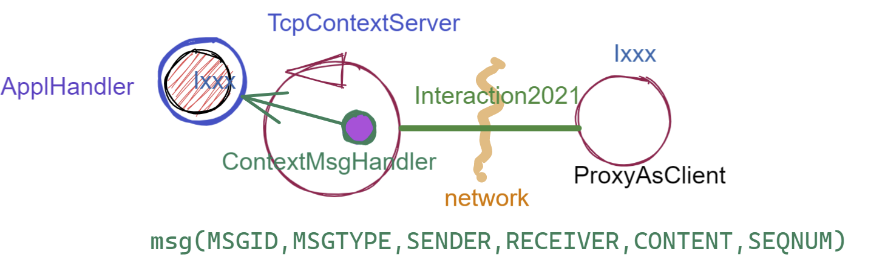
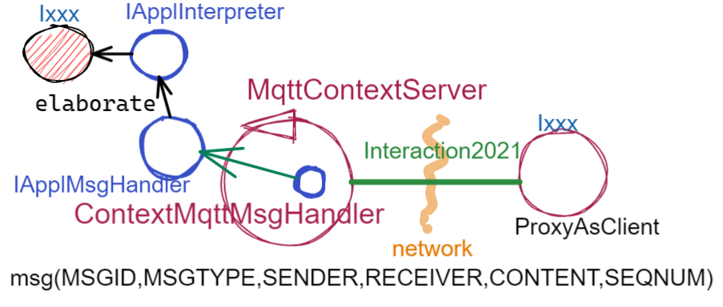

.. role:: red 
.. role:: blue 
.. role:: remark
  
.. _tuProlog: https://apice.unibo.it/xwiki/bin/view/Tuprolog/

.. _californium: https://www.eclipse.org/californium/

.. _paho: https://www.eclipse.org/paho/

==================================================
Verso un framework
==================================================

I primi SPRINT dello sviluppo hanno seguito un processo bottom-up, che ha fatto riferimento
a TCP come protocollo per le comunicazioni di rete.

Abbiamo anche costruito un  :ref:`prototipo<primoPrototipo>` di una versione distribuita del sistema, 
la cui architettura è schematizzata nella figura che segue:

.. image:: ./_static/img/Radar/sysDistr1.PNG
   :align: center 
   :width: 70%

Con maggior dettaglio, questa architettura si basa sugli elementi costitutivi di figura:

- Un oggetto (POJO) di interfaccia ``Ixxx`` che definisce il comportamento di un dispositivo reale o simulato.   
- Un oggetto di interfaccia :ref:`IApplIntepreter<IApplIntepreterEsteso>` che trasforma messaggi (di comando e richieste
  di informazione)   in chiamate a metodi di ``Ixxx``.
- Un oggetto di interfaccia :ref:`IApplMsgHandler<IApplMsgHandlerEsteso>` che definisce il codice di gestione
  dei messaggi di livello applicativo indirizzati a un particolare dispositivo.
- Un oggetto di tipo :ref:`ContextMsgHandler<ContextMsgHandler>` che realizza un gestore dei sistema dei messaggi 
  li reindirizza (dispatching) agli opportuni handler applicativi.
- Un (unico) :ref:`TcpContextServer<TcpContextServer>` attivato su un nodo di elaborazione ``A`` (ad esempio un Raspberry) che 
  permette a componenti :ref:`proxy<ProxyAsClient>` allocati su nodi esterni  (ad esempio un PC)
  di interagire con i dispositivi allocati su ``A``. Questo componente è un :ref:`TcpServer<TcpServer>` che crea un 
  :ref:`TcpApplMessageHandler` per ogni connessione, il quale riceve i messaggi e chiama il 
  :ref:`ContextMsgHandler<ContextMsgHandler>`.

La domanda che ci poniamo ora è se questa organizzazione possa essere riusata nel caso in cui si voglia sostituire
al protocolllo TCP un altro protocollo, tra quelli indicati in :ref:`ProtocolType`.

---------------------------------------
Il caso UDP
---------------------------------------

La possibilità di sostituire TCP con UDP è  resa possibile dalla libreria  ``unibonoawtsupports.jar`` sviluppata
in anni passati. Il compito non si è rivelato troppo difficle, visto la relativa vicinanza operazionale tra le
librerie dei due protocolli.

---------------------------------
Il caso HTTP
---------------------------------

Affronteremo l'uso di questo protocollo più avanti, in relazione alla costruzione di un componente  Web GUI.

.. code:: Java

  HttpURLConnection con =
  IssHttpSupport

Più arduo sembra invece il caso di un protocollo di tipo publish-subscribe come MQTT o di un protocollo REST come CoAP
che cambiano l'impostazione logica della interazione.

---------------------------------
I ContextServer
---------------------------------

Come primo passo per la definizione di un nostro framework di supporto alle applicazioni distribuite, 
introduciamo un contratto per 
il concetto di ContextServer che imponga metodi per attivare/disattivare il server e per
aggiungere/rimuovere componenti di tipo :ref:`IApplMsgHandler<IApplMsgHandler>`:

++++++++++++++++++++++++++++++++++++++++++++++
IContext
++++++++++++++++++++++++++++++++++++++++++++++

.. code:: java

  public interface IContext {
    public void addComponent( String name, IApplMsgHandler h);
    public void removeComponent( String name );
    public void activate();
    public void deactivate();
  }

Questo contratto è già rispettato da :ref:`TcpContextServer`, così che possiamo estendere la sua definizione come segue: 

  public class TcpContextServer extends TcpServer **implements IContext**

Dobbiamo ora introdurre un ContextServer per MQTT (si veda :ref:`MqttContextServer`) 
e per CoAP (si veda :ref:`CoapContextServer`).

.. Individuare i punti in cui occorre tenere conto dello specifico protocollo per definire i parametri delle *operazioni astratte*

Al solito, è opportuno definire  una Factory per la creazione di un ContextServer in funzione del protocolllo:

++++++++++++++++++++++++++++++++++++++++++++++
Context2021
++++++++++++++++++++++++++++++++++++++++++++++

.. code:: java

  public class Context2021 {

    public static IContext create(String id, String entry ) {
    IContext ctx = null;
    ProtocolType protocol = RadarSystemConfig.protcolType;
      switch( protocol ) {
      case tcp : {
        ctx=new TcpContextServer(id, entry);
        ctx.activate();
        break;
      }
      case mqtt : {
        ctx= new MqttContextServer( id, entry);
        ctx.activate();
        break;
      }
      case coap : {
        ctx = new CoapContextServer( );
        ctx.activate();
        break;
      }
      default:
        break;
      }
      return ctx;
    }//create  

 

I parametri ``id`` ed ``entry`` da specificare nel costruttore nei vari casi sono:

===========================   ===========================    =========================== 
        Server                            id                        entry
---------------------------   ---------------------------    ---------------------------
:ref:`TcpContextServer`               nome dell'host                  port
:ref:`MqttContextServer`              id del client              nome di una topic     
:ref:`CoapContextServer`                    -                      -
===========================   ===========================    ===========================   

Il :ref:`CoapContextServer` non ha bisogno di parametri in quanto per attivarlo occore conoscere
l'indirizzo del broker (unico per tutti i componenti del sistema), definito nel parametro di configurazione:
``RadarSystemConfig.mqttBrokerAddr``.
 

+++++++++++++++++++++++++++++++
IContextMsgHandler
+++++++++++++++++++++++++++++++

Ogni ContextServer necessita di un gestore di sistema dei messaggi  come il 
:ref:`ContextMsgHandler<ContextMsgHandler>` già definito per il TCP.

Introduciamo anche per questo gestore un contratto che imponga la implementazione di metodi per
aggiungere/rimuovere oggetti applicativi di tipo :ref:`IApplMsgHandler<IApplMsgHandler>`
(cosa che :ref:`ContextMsgHandler<ContextMsgHandler>` fa già).

  .. code:: java

    public interface IContextMsgHandler extends IApplMsgHandler{
      public void addComponent( String name, IApplMsgHandler h);
      public void removeComponent( String name );
      public IApplMsgHandler getHandler( String name );
    } 

L'operazione ``getHandler`` (che va ora aggiunta a :ref:`ContextMsgHandler<ContextMsgHandler>`) 
permette di ottenere il riferimento a un oggetto applicativo 'registrato' nel contesto, 
dato il nome dell'oggetto.

La situazione, generalizzata con le interfacce, si presenta ora come segue:

.. image:: ./_static/img/Architectures/framework1.PNG
   :align: center  
   :width: 70%

Osserviamo che il framework:

:remark:`realizza una infrastruttura di comunicazione`

:remark:`permette di creare componenti applicativi capaci di intergire in rete`

:remark:`impone che ogni componente applicativo abbia un nome univoco`

 
Il lavoro che ora dobbiamo compiere ora consiste nel definire un Proxy client e un ContextServer relativo a ogni protocollo. 

.. _libreriaProtocolli:

+++++++++++++++++++++++++++++++
Liberie di riferimento
+++++++++++++++++++++++++++++++

Questo lavoro richiede la disponibilità di opportune librerie, tra le quali noi useremo le seguenti:

- per MQTT: la libreria `paho`_
- per CoAP: la libreria `californium`_

.. _ProxyAsClientEsteso:

--------------------------------------------------------
Estensione della classe :ref:`ProxyAsClient`
--------------------------------------------------------
 
Il metodo ``setConnection`` invocato dal costruttore crea un supporto diverso per ogni protocollo, ma 
ciasuno realizza l'idea di connessione, implementando l'interf:ref:`Interaction2021<Interaction2021>`.

.. code:: java

  public class ProxyAsClient {
  private Interaction2021 conn; 
    public ProxyAsClient( 
      String name, String host, String entry, ProtocolType protocol ){ 
        ... 
        setConnection(host, entry, protocol);
      }  
   ....
  protected void setConnection( String host, String entry, 
                ProtocolType protocol  ) throws Exception {
    switch( protocol ) {
    case tcp : {
      int port = Integer.parseInt(entry);
      int numOfAttempts = 10;
      conn = TcpClientSupport.connect(host,port,numOfAttempts);  
      break;
    }
    case coap : {
      conn = new CoapSupport("CoapSupport_"+name, host,entry);//entry is uri path
      break;
    }
    case mqtt : {
      conn = MqttSupport.getSupport();					
      break;
    }	
    default :{
      ColorsOut.outerr(name + " | Protocol unknown");
    }
  }

---------------------------------------------------------
I supporti per :ref:`Interaction2021<Interaction2021>`
---------------------------------------------------------

Il :ref:`tcpsupportClient` crea l'implemetazione TCP di :ref:`Interaction2021<Interaction2021>` 
introdotta a suo tempo, come oggetto di classe :ref:`TcpConnection<TcpConnection>`.

La creazione di analoghi supporti per MQTT e CoAP  parte dalle seguenti osservazioni:

- per MQTT si tratta di creare una connessione con un broker che media la interazione tra mittente
  e destinatario
- per CoAP si tratta di utilizzare un oggetto  
  di classe ``CoapClient`` di `californium`_, che richiede come argomento l'``URL`` della risorsa
  a cui ci si vuole connettere, che ha la forma:

  .. code:: 

    "coap://"+host + ":5683/"+ entry

---------------------------------------
I nuovi ContextServer
---------------------------------------

Abbiamo già introdotto :ref:`TcpContextServer` come implementazione di :ref:`IContext`
che utilizza librerie per la gestione di *Socket*.

La creazione di analoghi ContextServer per MQTT e CoAP parte dalla disponibilità 
delle citate :ref:`librerie<libreriaProtocolli>`.

+++++++++++++++++++++++++++++++++++++++
ContextServer per MQTT
+++++++++++++++++++++++++++++++++++++++

Un ContextServer per MQTT richiede che un client di classe ``org.eclipse.paho.client.mqttv3.MqttClient`` 
si connetta al nodo facendo una subscribe alla  *topic* specificata dal parametro ``entry``.

Il server crea, al momento della costruzione:

- un oggetto (``ctxMsgHandler``) per la gestione dei messaggi di sistema
- un oggetto (``mqtt`` di tipo :ref:`MqttSupport` ) che realizza l'astrazione connessione implementando 
  :ref:`Interaction2021`.

La libreria `paho`_ (come molte altre) permette di gestire i messaggi inviati su questa entry-topic 
mediamte un oggetto che implementa l'interfaccia  ``org.eclipse.paho.client.mqttv3.MqttCallback``.
Il metodo che contiene il codice di gestione dei messaggi ha la signature che segue:

.. code:: java

    @Override  //from MqttCallback
    public void messageArrived(String topic, MqttMessage message)   {
      ...
    }

La rappresentazione in forma di String del messaggio ricevuto di tipo ``org.eclipse.paho.client.mqttv3.MqttMessage``
deve avere la struttura introdotta in :ref:`msgApplicativi`:

.. code:: java

  msg(MSGID,MSGTYPE,SENDER,RECEIVER,CONTENT,SEQNUM)

Pertanto deve essere possibile eseguire il mapping in un oggetto di tipo :ref:`ApplMessage` senza generare eccezioni:

.. code:: java

  ApplMessage msgInput = new ApplMessage(message.toString());

Queste trasformazioni sono quindi di pertinenza del gestore di sistema dei messaggi in arrivo
(``ctxMsgHandler``) che viene definito in modo da fungere anche da callBack MQTT in quanto implementa
una interfaccia :ref:`IContextMsgHandlerMqtt` che estende  :ref:`IContextMsgHandler<IContextMsgHandler>`.

%%%%%%%%%%%%%%%%%%%%%%%%%%%%%%%%%%%%%%%%%%%%%%%%%%%%%
IContextMsgHandlerMqtt
%%%%%%%%%%%%%%%%%%%%%%%%%%%%%%%%%%%%%%%%%%%%%%%%%%%%%

.. code:: java

  public interface IContextMsgHandlerMqtt 
      extends IContextMsgHandler, IApplMsgHandlerMqtt{}

  public interface IApplMsgHandlerMqtt extends IApplMsgHandler, MqttCallback{}

%%%%%%%%%%%%%%%%%%%%%%%%%%%%%%%%%%%%%%%%%%%%%%%%%%%%%
ContextMqttMsgHandler
%%%%%%%%%%%%%%%%%%%%%%%%%%%%%%%%%%%%%%%%%%%%%%%%%%%%%

.. code:: java

  public class ContextMqttMsgHandler extends ApplMsgHandler 
                              implements IContextMsgHandlerMqtt{
    ...
  @Override
  public void addComponent( String devName, IApplMsgHandler h) { ... }

  @Override
  public void elaborate( ApplMessage msg, Interaction2021 conn ) { ... }

  @Override
  public void elaborate(String message, Interaction2021 conn) { ... }

  @Override
  public void messageArrived(String topic, MqttMessage message){ ... }
  }

%%%%%%%%%%%%%%%%%%%%%%%%%%%%%%%%%%%%%%%%%%%%%%%%%%%%%
MqttContextServer
%%%%%%%%%%%%%%%%%%%%%%%%%%%%%%%%%%%%%%%%%%%%%%%%%%%%%

.. code:: java

    public class MqttContextServer implements IContext{
    private MqttSupport mqtt ; //Singleton
    private IContextMsgHandlerMqtt ctxMsgHandler;

    public MqttContextServer(String clientId, String topic) {
      ...
      ctxMsgHandler = new ContextMqttMsgHandler("ctxH");
    }
      ...
	  @Override
	  public void activate() {
		  mqtt = MqttSupport.createSupport( clientId, topic );
		  mqtt.connectToBroker(clientId,  RadarSystemConfig.mqttBrokerAddr);
      mqtt.subscribe( topic, ctxMsgHandler );	
   	}
	  @Override
	  public void addComponent(String name, IApplMsgHandler h) {
		  ctxMsgHandler.addComponent(name, h);	
	  }
      ...

Il metodo ``activate`` del ContextServer per MQTT, crea il singleton ``MqttSupport`` 
e lo utilizza per fare una subscribe sulla ``topic``.
Il ``ctxMsgHandler`` come 
gestore dei messaggi in arrivo.

Infatti la libreria `paho`_ (come molte altre) gestisce i messaggi ricevuti attraverso una callback
associata al 

.. code:: java

	public void subscribe(String clientid, String topic, MqttCallback callback) {
		try {
 			client.setCallback( callback );	
			client.subscribe(topic);			
 		} catch (MqttException e) {
			ColorsOut.outerr("MqttSupport  | subscribe Error:" + e.getMessage());
		}
	}

 

 
.. _MqttSupport:

%%%%%%%%%%%%%%%%%%%%%%%%%%%%%%%%%%%%%%%%%%%%%%%%%%%%%%%%%%%%%%%%%%%
``MqttSupport`` implementa :ref:`Interaction2021<Interaction2021>`
%%%%%%%%%%%%%%%%%%%%%%%%%%%%%%%%%%%%%%%%%%%%%%%%%%%%%%%%%%%%%%%%%%%

``MqttSupport`` implementa :ref:`Interaction2021` e quindi realizza il concetto di connessione come segue:

- una connessione è realizzata usando due topic: una per ricevere messaggi e una per inviare risposte relative
  a messaggi di richiesta. Se la topic di ricezione ha nome ``t1``, la seconda ha nome ``t1CXanswer``
  ove ``CX`` è il nome del client che ha inviato una richiesta su ``t1``. 
  
  Ad esempio, un proxyclient di nome ``ledPxy`` che usa la topic ``ctxEntry`` per inviare comandi e richieste al 
  ContextServer,  fa una subscribe su ``ctxEntryledPxyanswer`` per ricevere le risposte.

Il costruttore del singleton  ``MqttSupport``:

- crea un ``MqttClient`` con ``clientId``, il quale si connette al Broker e fa una subscribe a a ``topic``;
- crea un oggetto che implementa l'estensione :ref:`IContextMsgHandlerMqtt<IContextMsgHandlerMqtt>` 
  di :ref:`IContextMsgHandler<IContextMsgHandler>`. Questo oggetto realizza la gestione di sistema dei messaggi,
  che consiste nel loro reindirizzamento (dispathing) al componente applicativo il cui nome è
  menzionatio come ``RECEIVER`` nel messaggio.

.. code:: java

  public class MqttSupport implements Interaction2021
  
    ...
    protected MqttSupport(String clientName, String topicToSubscribe) {
      connectToBroker(clientName, RadarSystemConfig.mqttBrokerAddr);	   	
      handler = new ContextMqttMsgHandler( "ctxH"  );
      subscribe(topicToSubscribe, handler);
    }

.. image:: ./_static/img/Radar/MqttConn.PNG
   :align: center  
   :width: 70%

+++++++++++++++++++++++++++++++++++++++
CoapContextServer
+++++++++++++++++++++++++++++++++++++++

CoAP mira a modellizzare
tutte le interazioni client/server come uno scambio di rappresentazioni di risorse. L'obiettivo
è quello di realizzare una infrastruttura di gestione delle risorse remote tramite alcune semplici
funzioni di accesso e interazione come quelle di HTTP: PUT, POST, GET, DELETE.

Si tratta quindi di utilizzare un oggetto di `californium`_ (libreria di riferimento) di classe ``CoapServer``
  in cui si siano aggiunte tutte le risorse che corrispondono ai componenti destinatari di messaggi (ad
  esempio, una risorsa per il Led e una per il Sonar)

La libreria ``org.eclipse.californium`` offre ``CoapServer`` che viene decorato da ``CoapApplServer``.

- ``CoapApplServer`` extends CoapServer implements :ref:`IContext`
- class ``CoapSupport`` implements :ref:`Interaction2021`
- abstract class ``ApplResourceCoap`` extends CoapResource implements :ref:`IApplMsgHandler`

La classe ``CoapResource`` viene decorata da ``ApplResourceCoap`` per implementare ``IApplMsgHandler``.
In questo modo una specializzazione come ``LedResourceCoap`` può operare come componente da aggiungere 
al sistema tramite ``CoapApplServer`` che la ``Context2021.create()`` riduce a ``CoapServer`` in cui 
sono registrate le risorse.

