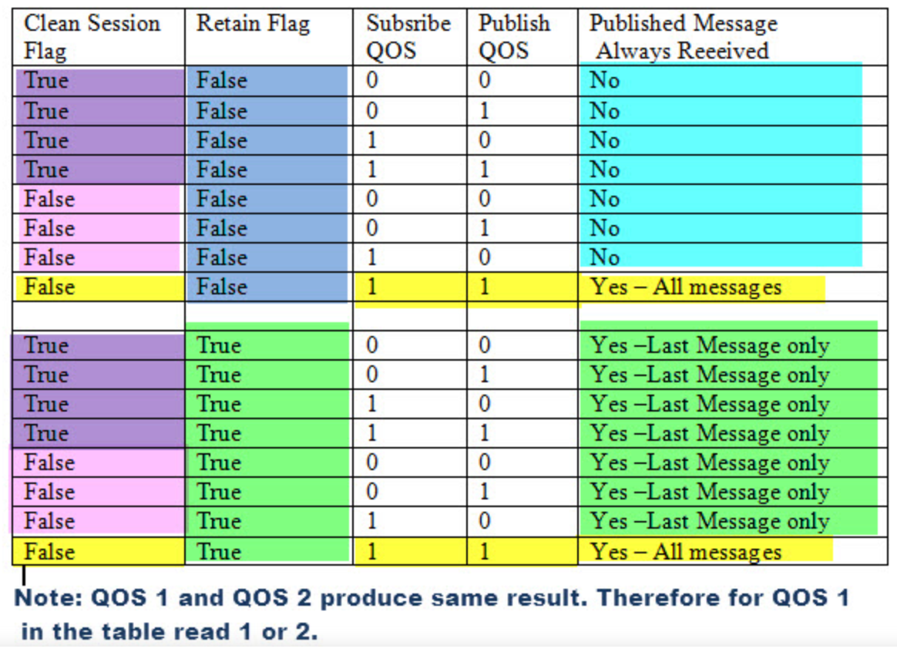

.. role:: red
.. role:: blue 
.. role:: remark

===================================
MQTT
===================================

MQTT (Message Queue Telemetry Transport) è un protocollo applicativo che funziona 
su stack TCP, basato sul paradigma publish/subscribe.

Il protocollo MQTT è leggero e flessibile e consente l’implementazione sia su 
dispositivi hardware fortemente vincolati, sia su reti ad elevata latenza 
o a larghezza di banda limitata in quanto risulta particolarmente 
resiliente in fase di comunicazione dei dati.

Tanto i mittenti quanto i destinatari sono client MQTT che possono comunicare 
esclusivamente attraverso il :blue:`message broker`.

Ogni messaggio MQTT ha un comando e un payload. 
Il comando definisce il tipo di messaggio (per esempio CONNECT o SUBSCRIBE).

i messaggi MQTT sono organizzati per :blue:`topic` (argomento).

La libreria che implementa MQTT in Java è ``org.eclipse.paho.client.mqttv3``.

---------------------------------------
Qos 
---------------------------------------

I livelli QOS sono un modo per garantire la consegna dei messaggi e si riferiscono 
alla connessione tra un broker e un client .

- Qos 0:  È la modalità di trasferimento più inaffidabile. 
  Il messaggio non viene memorizzato nel mittente e non viene riconosciuto.
  Il messaggio verrà recapitato una sola volta o per niente.

- Qos 1: garantisce che il messaggio venga recapitato almeno una volta, 
  ma che possa essere recapitato più di una volta.  Il mittente invia un messaggio 
  e attende una conferma ( PUBACK )

  .. image:: ./_static/img/Tecno/mqttQos1.PNG 

- Qos 2: garantisce che il messaggio venga recapitato una sola volta. 
  Questo è il metodo più lento in quanto richiede 4 messaggi.

  .. image:: ./_static/img/Tecno/mqttQos2.PNG 

---------------------------------------
Esperimenti in Python
---------------------------------------

La libreria che implementa MQTT in Python è ``paho-mqtt``.

.. code::

    pip install paho-mqtt

-----------------------------------------------------
Implementazione di Interaction2021
-----------------------------------------------------

.. image:: ./_static/img/Tecno/MqttConn.PNG 

.. From https://www.eclipse.org/paho/files/javadoc/org/eclipse/paho/client/mqttv3/internal/ClientState.html
The core of the client, which holds the state information for pending and in-flight messages. 
Messages that have been accepted for delivery are moved between several objects while 
being delivered. 

1) When the client is not running messages are stored in a persistent store 
   that implements the MqttClientPersistent Interface. 

   The default is MqttDefaultFilePersistencew which stores messages safely across failures 
   and system restarts. If no persistence is specified there is a fall back to MemoryPersistence 
   which will maintain the messages while the Mqtt client is instantiated. 

2) When the client or specifically ClientState is instantiated the messages are read 
   from the persistent store into: - outbound qos2 hashtable if a QoS 2 PUBLISH or PUBREL 
   - outboundqos1 hashtable if a QoS 1 PUBLISH (see restoreState) 

3) On Connect, copy messages from the outbound hashtables to the pendingMessages or pendingFlows 
   vector in messageid order. 
   - Initial message publish goes onto the pendingmessages buffer. 
   - - PUBREL goes onto the pendingflows buffer (see restoreInflightMessages) 
   - 
4) Sender thread reads messages from the pendingflows and pendingmessages buffer one at a time. 
   The message is removed from the pendingbuffer but remains on the outbound* hashtable. 
   The hashtable is the place where the full set of outstanding messages are stored in memory. 
   (Persistence is only used at start up) 

5) Receiver thread - receives wire messages: 
   - if QoS 1 then remove from persistence and outboundqos1 
   - if QoS 2 PUBREC send PUBREL. Updating the outboundqos2 entry with the PUBREL 
     and update persistence. 
   - if QoS 2 PUBCOMP remove from persistence and outboundqos2 
     Notes: because of the multithreaded nature of the client it is vital that any changes 
     to this class take concurrency into account. 
     For instance as soon as a flow / message is put on the wire it is possible for 
     the receiving thread to receive the ack and to be processing the response before 
     the sending side has finished processing. 
     For instance a connect may be sent, the conack received before the connect notify 
       send has been processed!

