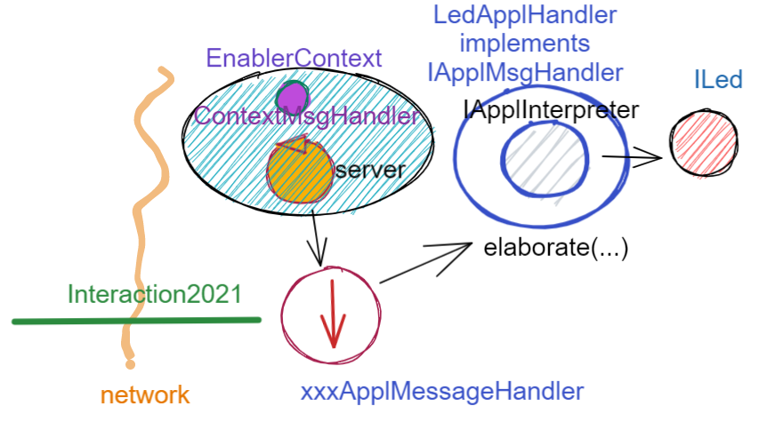
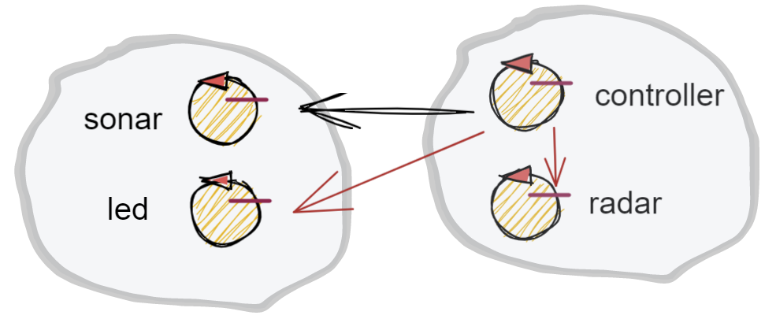

.. role:: red 
.. role:: blue 
.. role:: remark

.. _BlokingQueue: https://www.baeldung.com/java-blocking-
.. _Programmazione funzionale: https://it.wikipedia.org/wiki/Programmazione_funzionale
.. _Paradigma di programmazione: https://it.wikipedia.org/wiki/
.. _Modello computazionale ad attori: https://en.wikipedia.org/wiki/Actor_model
.. _CSP: https://en.wikipedia.org/wiki/Communicating_sequential_processes
.. _Hewitt: https://en.wikipedia.org/wiki/Carl_Hewitt
.. _Akka: https://akka.io/
.. _GOLang: ://www.html.it/guide/go-lang/
.. _GO: https://go.dev/
.. _GO doc: https://go.dev/doc/
.. _Go Manual: https://go.dev/doc/
.. _Kotlin Actors: https://kotlinlang.org/docs/shared-mutable-state-and-concurrency.html#actors
.. _Kotlin Channel: https://play.kotlinlang.org/hands-on/Introduction%20to%20Coroutines%20and%20Channels/08_Channels
.. _Akka Actors: https://doc.akka.io//docs/akka/current/typed/guide/actors-motivation.html
.. _Akka Documentation: https://doc.akka.io//docs/akka/current/index.html

.. http://www-lia.deis.unibo.it/Courses/RetiLM/proposteProgetti/akka_dds_proposal.html
.. it.unibo.qakactor/userDocs/LabQakPrologUsage2020.html

======================================
Attori 
======================================

Al termine de :ref:`Lo SPRINT4` abbiamo costruito un sistema la cui architettura è basata sul seguente schema-base:

Come conseguenza, risulta possibile che lo stesso componente applicativo di tipo :ref:`IApplMsgHandler<IApplMsgHandler>` possa
essere utilizzato da due o più clienti remoti. 

I casi di studio introdotto in :ref:`Sprint4: esperimenti`  pongono in evidenza comportamenti erronei che potrebbero derivare
da questa condivisione e la difficoltà di concepire test unit in grado di fare emergere le situazioni che li generano.

Non merviglia che, per evitare alla radice il problema, molti propongano di vincolare i componenti applicativi 
ad un modello di `Programmazione funzionale`_, privandoli di uno stato interno modificabile.

Abbiamo però anche osservato che la trasformazione di un componente applicativo da POJO ad Attore potrebbe evitare
questo vincolo, sostituendo alla interazione basata su procedure-call una interazione basata sullo scambio di messaggi.

.. image:: ./_static/img/Architectures/ContestiEComponenti.PNG
   :align: center 
   :width: 80%

In questo modo, il *'macro-mondo'* rappresentato dalla applicazioni distribuite di rete in cui macro-componenti (servizi)
interagiscono a messaggi, troverebbe una corrispondenza anche a livello del *'micro-mondo'* rappresentato dalla interazioni 
tra i componenti interni ai servizi.
Questa uniformità concettuale introduce di fatto un nuovo `Paradigma di programmazione`_.

---------------------------------
Il paradigma ad Attori
---------------------------------
Secondo Carl `Hewitt`_  (uno dei padri fondatori) il modello dell'attore è stato ispirato, 
a differenza dei precedenti modelli di calcolo,  
dalla fisica , inclusa la relatività generale e la meccanica quantistica.

Vi è oggi una ampia gamma di proposte di linguaggi / libreire ad attori, tra cui:

 
- `Akka`_ : ispirato a `Modello computazionale ad attori`_ di  Hewitt. Per le motivazioni si veda `Akka actors`_.
- `GO`_ : ispirato a `CSP`_ propone *goroutine* e *CanaliGO*. Per la documentazione si veda `GO doc`_.
- `Kotlin actors`_ : propone *croutines* e *channels* (si veda `Kotlin channel`_)

.. che potrebbe  però trovare un ostacolo nella prolificazione di Thread dovuta alla trasformazione dei POJO in Attori.
.. Ma fortunatamente è oggi possibile evitare questa prolificazione, come vedremo più avanti. 

Un motto di riferimento alquanto significativo per questo modello è il seguente:

:remark:`Do not communicate by sharing memory; instead, share memory by communicating.`

Prima di addentraci nei dettagli tecnici, può essere conveniente operare ancora come semplici utenti 
di un qualche supporto/infrastruttura disponibile, 
in modo da acquisire confidenza con il nuovo modo di organizzare il software implicato dal modello ad attori.

L'infrastruttura che useremo in questi esempi  è stata sviluppata negli anni precednti in Kotlin, 
linguaggio scelto per la sua compatibità con Java e per la sua capcità di impememntare gli attori
in modo molto efficiente usando le coroutines e i canali.

++++++++++++++++++++++++
Actor20 e Actor22  
++++++++++++++++++++++++

Nel seguito, per evitare confusioni e fraintendimentoi, indicheremo:

- **Actor20** o **ActorQak**: gli attori implementati in Kotlin dalla libreria ``it.unibo.qakactor-2.6.jar``
- **Actor22**: gli attori usabili in questa fase del nostro percorso all'interno di normali programmi Java, 
  grazie a due classi appositamente definite :
  
  - :blue:`Actor22.java` : classe che specializza la classe-base degli Actor20  (``ActorBasic.kt``)  per 
    agevolare l'uso degli Actor20 nell'ambito di applicazioni Java (e non Kotlin).
  - :blue:`ActorJK.java` : classe  che fornisce metodi **static** di utilità per l'uso di Attor20

Grazie a queste due classi potremo usare gli attori **Actor22** senza dovere, al momento, conoscere Kotlin.
Ovviamente, in una fase successiva cercheremo di operare avvaledoci dirattemnte di Kotlin.

---------------------------------
Progetto it.unibo.actorComm
---------------------------------

Questo progetto realizza una nuova versione del concetto di contesto introdotto in :ref:`Contesti-contenitori`
con le seguenti caratteristiche:

- utilizza una nuova versione del :ref:`ContextMsgHandler` **non memorizza più** (riferimenti a) POJO di tipo :ref:`IApplMsgHandler<IApplMsgHandler>`
  ma fa riferimento ad attori di tipo ``Actor22`` gestiti attraverso le cassi precedentemente indicat

- è un :ref:`Enabler` che permette comunicazioni ``TCP/UDP`` con componenti ``Actor22`` (attori versione 2022)
- produce la libreria: **it.unibo.actorComm-1.1.jar**
- dipende dalla libreria **it.unibo.qakactor-2.6** di cui usa;
  
  .. code::  java

    interface it.unibo.kactor.IApplMessage   
    class it.unibo.kactor.ApplMessage 
              implements it.unibo.kactor.IApplMessage
    class it.unibo.kactor.Actor22 
              extends it.unibo.kactor.ActorBasic

- definisce: 
 
  .. code::  java

     public interface Interaction2021  extends 
          it.unibo.is.interfaces.protocols.IConnInteraction //libreria uniboInterfaces.jar
     public  class ActorJK

++++++++++++++++++++++++++++++
Esempi in locale
++++++++++++++++++++++++++++++

%%%%%%%%%%%%%%%%%%%%%%%%%%%%%%%%%
LedActor
%%%%%%%%%%%%%%%%%%%%%%%%%%%%%%%%%
Un attore che incapsula un POJO ILed e gestisce i messaggi relativi al Led dichiarati nella classe  ``ApplData``.

%%%%%%%%%%%%%%%%%%%%%%%%%%%%%%%%%
UsingLedNoControllerOnPc 
%%%%%%%%%%%%%%%%%%%%%%%%%%%%%%%%%

Programma Java che usa un Led locale definito come attore, inviandogli comandi di accensione/spegnimento.
Non ha senso inviare al Led richieste sullo stato perchè il sistema richiede che ci sia un attore capace
di ricevere la reply.

%%%%%%%%%%%%%%%%%%%%%%%%%%%%%%%%%
ControllerActorForLed
%%%%%%%%%%%%%%%%%%%%%%%%%%%%%%%%%
Un attore che estisce i messaggi relativi al Controller dichiarati nella classe  ``ApplData`` (in pratica il solo 
messaggio ``IApplMessage activateCrtl`` che ne attiva il funzionamento.)

%%%%%%%%%%%%%%%%%%%%%%%%%%%%%%%%%
ControllerUsingLedOnPc 
%%%%%%%%%%%%%%%%%%%%%%%%%%%%%%%%%

Programma Java che crea due attori locali: un Controller e un Led e invia un messaggio di attivazione al Controller, il quale:
 
- invia messaggi al Led per accenderlo/spegnerlo   per un numero prefissato di volte;
- i messaggi di accesione/spegnimento non sono inviati all'interno di un ciclo, ma, dopo il primo, solo in conseguenza della ricezione
  della risposta a una richiesta del valore dello stato del Led.

Infatti tutti gli attori sono gestiti da un unico Thread Java. Se Controller non rilascia il controllo, il Led non può
essere eseguito.

++++++++++++++++++++++++++++++
Esempi in distribuito
++++++++++++++++++++++++++++++

%%%%%%%%%%%%%%%%%%%%%%%%%%%%%%%%%
LedActorOnRasp
%%%%%%%%%%%%%%%%%%%%%%%%%%%%%%%%%

Crea un attore Led su RaspberryPi che viene inserito nel Contesto.

%%%%%%%%%%%%%%%%%%%%%%%%%%%%%%%%%
ControllerOnPcUsingLedRemote 
%%%%%%%%%%%%%%%%%%%%%%%%%%%%%%%%%

Crea un attore Controller sul PC (lo stesso di `ControllerActorForLed`_) e dichiara il Led come attore remoto attraverso il metodo:

  ``ActorJK.setActorAsRemote(  ApplData.ledName, 
  ""+RadarSystemConfig.ctxServerPort,RadarSystemConfig.raspHostAddr, ProtocolType.tcp);``

Quindi attiva il Controller inviandogli un messggio.

---------------------------------
it.unibo.radarSystem22.actors
---------------------------------

---------------------------------
La visione
---------------------------------

- Un attore è una entità concettualmente autonoma che vive in un contesto 
- Un attore interagisce con altri attori inviando loro messaggi (dispatch o request)
- Un attore deve essere capace di ricevere messaggi (o risposte) al fine di elaborarli realizzando
  la voluta business-logic
- Un attore conosce il nome degli altri attori del sistema 

Focalizziamo l'attenzione su un componente, denominato **attore (actor)**, che presenta le seguenti proprietà:

- ha un **nome univoco** nell'ambito di tutto il sistema;
- è logicamente attivo, cioè dotato di flusso di controllo autonomo;
- nasce, vive e muore in un contesto che può essere comune a (molti) altri attori;
- è capace di eseguire elaborazioni autonome o elaborazioni di messaggi inviategli da perte di altri attori;
- è capace di inviare messaggi ad un altro attore, di cui conosce il **nome**;
- è dotato di una sua **coda locale** in cui sono depositati i messaggi inviategli da altri attori 
  (o da se stesso) quando i mesaaggi arrivano mentre l'attore è impegnato in una fase di elaborazione;
- elabora i messaggi ricevuti uno alla volta, prelevandoli dalla coda in modo FIFO.

Al momento possiamo pensare che ogni attore sia realizzato in Java con un Thread e una `BlokingQueue`_, 
ma motivi di efficienza ci porteranno in seguito ad utilizzare le *coroutines* e i *channel* di Kotlin.

.. image:: ./_static/img/Architectures/contesti.PNG 
    :align: center
    :width: 60%

 

Un contesto:

- costituisce una macro-parte di un sistema distribuito, di norma formato da due o più contesti;
- è associato a un nodo di elaborazione; come tale  possiede un indirizzo IP e utilizza uno o più protocolli 
- di comunicazione (tra cui sempre TCP);
- conosce tutti gli altri contesti del sistema e la dislocazione di ogni attore nei diversi contesti, 
  distinguendo gli attori in due categorie: locali (a sè) e remoti (allocati in altri contesti);
- fornisce agli attori locali la capacità di inviare/ricevere messaggi a/da un altro attore;
- implementa l'invio di un messaggio da parte di un attore locale a ad un attore locale b 
  usando la memoria comune (la coda di messaggi associata all'attore b);
- implementa l'invio di un messaggio da parte di un attore locale a ad un attore NON locale g 
  avvaledosi della sua conoscenza sulla dislocazione degli attori nel sistema e del protocollo 
  di comunicazione usato dal contesto di g;
- implementa la ricezione di un messaggio utilizzando il nome del destinatario  
 