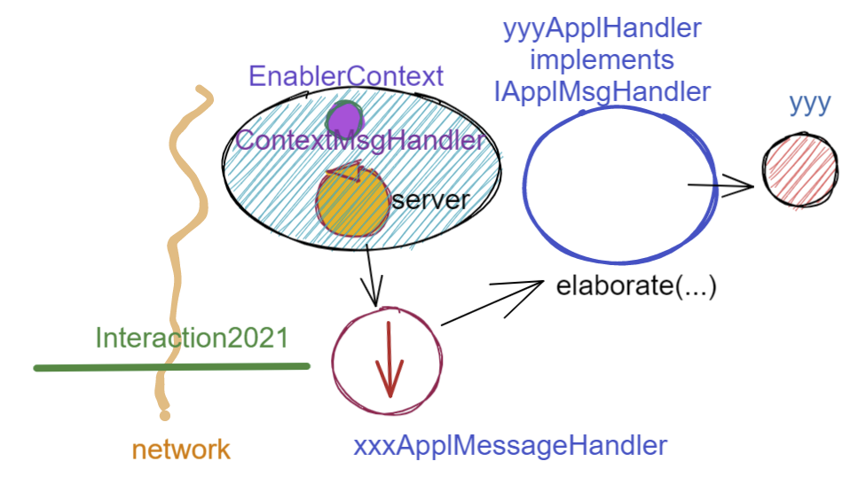
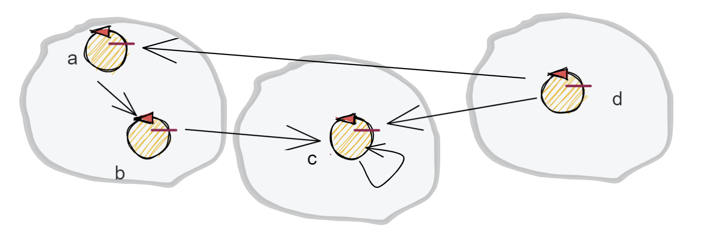

.. role:: red 
.. role:: blue 
.. role:: remark

.. _BlokingQueue: https://www.baeldung.com/java-blocking-
.. _Programmazione funzionale: https://it.wikipedia.org/wiki/Programmazione_funzionale
.. _Paradigma di programmazione: https://it.wikipedia.org/wiki/
.. _Modello computazionale ad attori: https://en.wikipedia.org/wiki/Actor_model
.. _CSP: https://en.wikipedia.org/wiki/Communicating_sequential_processes
.. _Hewitt: https://en.wikipedia.org/wiki/Carl_Hewitt
.. _Akka: https://akka.io/
.. _GOLang: //www.html.it/guide/go-lang/
.. _GO: https://go.dev/
.. _GO doc: https://go.dev/doc/
.. _Go Manual: https://go.dev/doc/
.. _Kotlin Actors: https://kotlinlang.org/docs/shared-mutable-state-and-concurrency.html#actors
.. _Kotlin Channel: https://play.kotlinlang.org/hands-on/Introduction%20to%20Coroutines%20and%20Channels/08_Channels
.. _Akka Actors: https://doc.akka.io//docs/akka/current/typed/guide/actors-motivation.html
.. _Akka Documentation: https://doc.akka.io//docs/akka/current/index.html

.. http://www-lia.deis.unibo.it/Courses/RetiLM/proposteProgetti/akka_dds_proposal.html
.. it.unibo.qakactor/userDocs/LabQakPrologUsage2020.html

======================================
Attori 
======================================

Al termine de :ref:`Lo SPRINT4` abbiamo costruito un sistema la cui architettura è basata sul seguente schema-base:

Come conseguenza, risulta possibile che lo stesso componente applicativo di tipo :ref:`IApplMsgHandler<IApplMsgHandler>` possa
essere utilizzato da due o più clienti remoti. 

I casi di studio introdotto in :ref:`Sprint4: esperimenti`  pongono in evidenza comportamenti erronei che potrebbero derivare
da questa condivisione e la difficoltà di concepire test unit in grado di fare emergere le situazioni che li generano.

Non merviglia che, per evitare alla radice il problema, molti propongano di vincolare i componenti applicativi 
ad un modello di `Programmazione funzionale`_, privandoli di uno stato interno modificabile.

Abbiamo però anche osservato che la trasformazione di un componente applicativo da POJO ad Attore potrebbe evitare
questo vincolo, sostituendo alla interazione basata su procedure-call una interazione basata sullo scambio di messaggi.

.. image:: ./_static/img/Architectures/ContestiEComponenti.PNG
   :align: center 
   :width: 80%

In questo modo, il *'macro-mondo'* rappresentato dalla applicazioni distribuite di rete in cui macro-componenti (servizi)
interagiscono a messaggi, troverebbe una corrispondenza anche a livello del *'micro-mondo'* rappresentato dalla interazioni 
tra i componenti interni ai servizi.
Questa uniformità concettuale introduce di fatto un nuovo `Paradigma di programmazione`_.

---------------------------------
Il paradigma ad Attori
---------------------------------
Secondo Carl `Hewitt`_  (uno dei padri fondatori) il modello dell'attore è stato ispirato, 
a differenza dei precedenti modelli di calcolo,  
dalla fisica , inclusa la relatività generale e la meccanica quantistica.

Vi è oggi una ampia gamma di proposte di linguaggi / librerie ad attori, tra cui:

 
- `Akka`_ : ispirato a `Modello computazionale ad attori`_ di  Hewitt. Per le motivazioni si veda `Akka actors`_.
- `GO`_ : ispirato a `CSP`_ propone *goroutine* e *CanaliGO*. Per la documentazione si veda `GO doc`_.
- `Kotlin actors`_ : propone *croutines* e *channels* (si veda `Kotlin channel`_)

.. che potrebbe  però trovare un ostacolo nella prolificazione di Thread dovuta alla trasformazione dei POJO in Attori.
.. Ma fortunatamente è oggi possibile evitare questa prolificazione, come vedremo più avanti. 

Un motto di riferimento alquanto significativo per questo modello è il seguente:

:remark:`Do not communicate by sharing memory; instead, share memory by communicating.`

Nel nostro modello computazionale, un attore presenta le seguenti proprietà:

- ha un **nome univoco** nell'ambito di tutto il sistema;
- è logicamente attivo, cioè dotato di flusso di controllo autonomo;
- nasce, vive e muore in un contesto che può essere comune a (molti) altri attori;
- è capace di inviare messaggi ad un altro attore, di cui conosce il **nome**, incluso sè stesso;
- è capace di eseguire elaborazioni autonome o elaborazioni di messaggi;
- è dotato di una sua **coda locale** in cui sono depositati i messaggi inviategli da altri attori 
  (o da sè stesso) quando i messaagi arrivano mentre l'attore è impegnato in una fase di elaborazione;
- elabora i messaggi ricevuti uno alla volta, prelevandoli dalla sua coda in modo FIFO.

Possiamo pensare che questo modello di attore sia realizzato in Java con un Thread e una `BlokingQueue`_, 
ma motivi di efficienza ci porteranno ad utilizzare le *coroutines* e i *channel* di Kotlin.

---------------------------------
Sistemi ad Attori locali
---------------------------------

Limitiamoci al momento a considerare un unico nodo di elaborazione in cui vive un certo numero di 
attori locali che interagiscono tra loro scambiandosi messaggi.

++++++++++++++++++++++++
Actor20 e Actor22  
++++++++++++++++++++++++

Nel seguito, per evitare confusioni, useremo i segenti termini:

- **Actor20** (o **ActorQak**): per indicare gli attori implementati in Kotlin dalla libreria ``it.unibo.qakactor-2.6.jar``
  realizzata in anni passati;
- **Actor22**: per inidicare gli attori che useremo in questa fase del nostro percorso, all'interno di normali programmi Java, 
  mediante a due classi appositamente definite :
  
  - :blue:`Actor22.java` : classe che specializza la classe-base degli Actor20  (``ActorBasic.kt``)  per 
    agevolare l'uso degli Actor20 nell'ambito di applicazioni Java (senza dover introdurre l'uso di Kotlin).
  - :blue:`ActorJK.java` : classe  che fornisce metodi **static** di utilità per l'uso di attori ``Actor22``.

Grazie a queste due classi potremo usare gli attori **Actor22** senza dovere, al momento, conoscere Kotlin.
Ovviamente, in una fase successiva cercheremo di operare avvaledoci dirattemnte di Kotlin.

++++++++++++++++++++++++
Actor22: creazione  
++++++++++++++++++++++++

