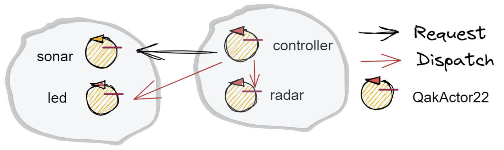

.. role:: red 
.. role:: blue 
.. role:: remark
.. role:: worktodo

.. _BlokingQueue: https://www.baeldung.com/java-blocking-
.. _Programmazione funzionale: https://it.wikipedia.org/wiki/Programmazione_funzionale
.. _Paradigma di programmazione: https://it.wikipedia.org/wiki/
.. _Modello computazionale ad attori: https://en.wikipedia.org/wiki/Actor_model
.. _CSP: https://en.wikipedia.org/wiki/Communicating_sequential_processes
.. _Hewitt: https://en.wikipedia.org/wiki/Carl_Hewitt
.. _Akka: https://akka.io/
.. _GOLang: //www.html.it/guide/go-lang/
.. _GO: https://go.dev/
.. _GO doc: https://go.dev/doc/
.. _Go Manual: https://go.dev/doc/
.. _Kotlin Actors: https://kotlinlang.org/docs/shared-mutable-state-and-concurrency.html#actors
.. _Kotlin Channel: https://play.kotlinlang.org/hands-on/Introduction%20to%20Coroutines%20and%20Channels/08_Channels
.. _Akka Actors: https://doc.akka.io//docs/akka/current/typed/guide/actors-motivation.html
.. _Akka Documentation: https://doc.akka.io//docs/akka/current/index.html

.. http://www-lia.deis.unibo.it/Courses/RetiLM/proposteProgetti/akka_dds_proposal.html
.. it.unibo.qakactor/userDocs/LabQakPrologUsage2020.html

======================================
Attori 
======================================

Al termine de :ref:`Lo SPRINT4` abbiamo costruito un sistema la cui architettura è basata sul seguente schema-base:

.. image:: ./_static/img/Architectures/EnablerContext.PNG
   :align: center 
   :width: 70%

Come conseguenza, risulta possibile che lo stesso componente applicativo di tipo :ref:`IApplMsgHandler<IApplMsgHandler>` possa
essere utilizzato da due o più clienti remoti. 

I casi di studio introdotto in :ref:`Sprint4: esperimenti`  pongono in evidenza comportamenti erronei che potrebbero derivare
da questa condivisione e la difficoltà di concepire test unit in grado di fare emergere le situazioni che li generano.

Non merviglia che, per evitare alla radice il problema, molti propongano di vincolare i componenti applicativi 
ad un modello di `Programmazione funzionale`_, privandoli di uno stato interno modificabile.

Abbiamo però anche osservato che la trasformazione di un componente applicativo da POJO ad Attore potrebbe evitare
questo vincolo, sostituendo alla interazione basata su procedure-call una interazione basata sullo scambio di messaggi.

.. image:: ./_static/img/Architectures/ContestiEComponenti.PNG
   :align: center 
   :width: 80%

In questo modo, il *'macro-mondo'* rappresentato dalla applicazioni distribuite di rete in cui macro-componenti (servizi)
interagiscono a messaggi, troverebbe una corrispondenza anche a livello del *'micro-mondo'* rappresentato dalla interazioni 
tra i componenti interni ai servizi.
Questa uniformità concettuale introduce di fatto un nuovo `Paradigma di programmazione`_.

---------------------------------
Il paradigma ad Attori
---------------------------------
Secondo Carl `Hewitt`_  (uno dei padri fondatori) il modello dell'attore è stato ispirato, 
a differenza dei precedenti modelli di calcolo,  
dalla fisica , inclusa la relatività generale e la meccanica quantistica.

Vi è oggi una ampia gamma di proposte di linguaggi / librerie ad attori, tra cui:

 
- `Akka`_ : ispirato a `Modello computazionale ad attori`_ di  Hewitt. Per le motivazioni si veda `Akka actors`_.
- `GO`_ : ispirato a `CSP`_ propone *goroutine* e *CanaliGO*. Per la documentazione si veda `GO doc`_.
- `Kotlin actors`_ : propone *croutines* e *channels* (si veda `Kotlin channel`_)

.. che potrebbe  però trovare un ostacolo nella prolificazione di Thread dovuta alla trasformazione dei POJO in Attori.
.. Ma fortunatamente è oggi possibile evitare questa prolificazione, come vedremo più avanti. 

Un motto di riferimento alquanto significativo per questo modello è il seguente:

:remark:`Do not communicate by sharing memory; instead, share memory by communicating.`

Nel nostro modello computazionale, un attore presenta le seguenti proprietà:

- ha un **nome univoco** nell'ambito di tutto il sistema;
- è logicamente attivo, cioè dotato di flusso di controllo autonomo;
- nasce, vive e muore in un contesto che può essere comune a (molti) altri attori;
- è capace di inviare messaggi ad un altro attore, di cui conosce il **nome**, incluso sè stesso;
- è capace di eseguire elaborazioni autonome o elaborazioni di messaggi;
- è dotato di una sua **coda locale** in cui sono depositati i messaggi inviategli da altri attori 
  (o da sè stesso) quando i messaagi arrivano mentre l'attore è impegnato in una fase di elaborazione;
- elabora i messaggi ricevuti uno alla volta, prelevandoli dalla sua coda in modo FIFO.

Possiamo pensare che questo modello di attore sia realizzato in Java con un Thread e una `BlokingQueue`_, 
ma motivi di efficienza ci porteranno ad utilizzare le *coroutines* e i *channel* di Kotlin.

.. image:: ./_static/img/Architectures/contesti.PNG 
    :align: center
    :width: 60%

---------------------------------
ActorQak e QakActor22  
---------------------------------

Nel seguito, per evitare confusioni, useremo i segenti termini:

- **ActorQak**: per indicare gli attori implementati in Kotlin dalla libreria ``it.unibo.qakactor-2.6.jar``
  realizzata in anni passati;
- **QakActor22**: per indicare gli attori che useremo in questa fase del nostro percorso, all'interno di normali programmi Java, 
  utilizzando classi appositamente definite nel progetto ``unibo.actor22``:
  
  - :blue:`QakActor22.java` : classe astratta che specializza la classe-base (``ActorBasic.kt``) degli ``ActorQak`` per 
    agevolare l'uso degli ``QakActor22`` nell'ambito di applicazioni Java;
  - :blue:`Qak22Util.java` : classe  che fornisce metodi **static** di utilità per l'uso di attori ``QakActor22``;
  - :blue:`Qak22Context.java` : classe  che realizza il contesto in cui vivono gli attori.

Grazie a queste classi potremo usare gli attori  ``QakActor22`` senza dovere, al momento, conoscere Kotlin.
Ovviamente, in una fase successiva cercheremo di operare avvaledoci dirattemnte di Kotlin.

Per introdurci all'uso degli attori ``QakActor22``, vediamo come definire ed usare un attore relativo al Led.

---------------------------------
LedActor
---------------------------------

Un attore relativo al Led è un componente attivo che specializza la classe astratta ``QakActor22``. 

.. code:: java

  public class LedActor extends QakActor22{
  private ILed led;
    public LedActor(String name) {
      super(name);
      led = DeviceFactory.createLed();
    }

Il dispositivo di tipo :ref:`ILed<ILed>` gestito dal core-code (si veda :ref:`concettodienabler`)
viene incapsulato (**embedded**) all'interno dell'attore.

---------------------------------
QakActor22: il costruttore
---------------------------------

Al momento della creazione del LedActor viene invocato il costruttore definito in ``QakActor22`` che aggiunge l'attore al contesto,
controllando che non ce ne sia già un altro con lo stesso nome.

.. code:: java

  public QakActor22(@NotNull String name ) {      
		  super(name, QakContext.Companion.createScope(), false, true, false, 50);
    if( Qak22Context.getActor(name) == null ) {
      Qak22Context.addActor( this );
    }
    else ColorsOut.outerr("QakActor22 | WARNING: an actor with name " + name + " already exists");	
	}

---------------------------------
Qak22Context
---------------------------------
La classe che realizza il contesto degli attori  ``QakActor22`` mantiene memoria di tutti gli attori creati attraverso una 
tabella (``ctxMap``) che associa il nome dell'attore al suo riferimento in quanto oggetto Java.

.. code:: java

  private static HashMap<String,QakActor22> ctxMap = new HashMap<String,QakActor22>();

  public static QakActor22 getActor(String actorName) {
    return ctxMap.get(actorName);
  }

Il metodo ``getActor`` restituisce il riferimento all'oggetto che implementa l'attore, dato il suo nome.

---------------------------------
QakActor22: handleMsg
---------------------------------
La classe ``QakActor22`` è astratta in quanto lascia alle classi specilizzate il compito di definire il metodo ``handleMsg`` 
con cui un attore applicativo gestisce (interpretandoli) comandi e richieste di tipo ``it.unibo.kactor.IApplMessage``.

Si noti che l'interfaccia c`IApplMessage`` è ora definita nel package ``it.unibo.kactor`` della libreria ``it.unibo.qakactor-2.6.jar``,
così da riutilizzare il codice già sviluppato negli anni scorsi.

+++++++++++++++++++++++++++++++++++++++
LedActor: handleMsg
+++++++++++++++++++++++++++++++++++++++
Nel caso del Led possiamo scrivere ``handleMsg`` come segue:

.. code:: java

  @Override
  protected void handleMsg(IApplMessage msg) {
    if( msg.isRequest() ) elabRequest(msg);
    else elabCommand(msg);
  }

Il metodo ``handleMsg`` viene invocato dalla infrastruttura di supporto quando (almeno) un messaggio è disponibile nella
coda di ingresso associata all'attore.

Nella implementazione attuale:

:remark:`Tutti gli attori sono eseguiti all'interno di uno stesso Thread Java`

+++++++++++++++++++++++++++++++++++++++++++++
LedActor: esecuzione di comandi
+++++++++++++++++++++++++++++++++++++++++++++

L'elaborazione dei comandi è analoga a quanto fatto in :ref:`LedApplHandler`; in questa versione
rinunciamo, per semplicità, alla introduzione di un :ref:`LedApplInterpreter<Un interpreter per il Led>` esplicito.

.. code:: java

  protected void elabCmd(IApplMessage msg) {
    String msgCmd = msg.msgContent();
    switch( msgCmd ) {
      case ApplData.comdLedon  : led.turnOn();break;
      case ApplData.comdLedoff : led.turnOff();break;
      default: ColorsOut.outerr(getName()  + " | unknown " + msgCmd);
    }
  }

+++++++++++++++++++++++++++++++++++++++++++++
La classe ApplData
+++++++++++++++++++++++++++++++++++++++++++++
Notiamo il ruolo importante della classe di livello applicativo ``ApplData`` che raccoglie le definizioni dei nomi e 
dei principlali messaggi.

.. code:: java
  
  public static final String ledName        = "led";
  public static final String controllerName = "controller";

  public static final String comdLedon   = "turnOn";
  public static final String comdLedoff  = "turnOff";
  public static final String reqLedState = "getState";

  public static final IApplMessage turnOnLed    = 
    buildDispatch(controllerName, "cmd", comdLedon,   ledName);
  public static final IApplMessage turnOffLed   = 
    buildDispatch(controllerName, "cmd", comdLedoff,  ledName);
  ...
  //msg(MSGID,MSGTYPE,SENDER,RECEIVER,CONTENT,SEQNUM)
	private static int msgNum=0;	

  public static IApplMessage buildDispatch(
      String sender, String msgId, String payload, String dest){ ... }
  ...
  public static IApplMessage prepareReply(
      IApplMessage requestMsg, String answer) { ... }

+++++++++++++++++++++++++++++++++++++++++++++
LedActor: esecuzione di richieste
+++++++++++++++++++++++++++++++++++++++++++++

L'elaborazione delle richieste è ancora del tutto simile a quanto fatto in :ref:`LedApplHandler`

.. code:: java

  protected void elabRequest(IApplMessage msg) {
    String msgReq = msg.msgContent();
    switch( msgReq ) {
    case ApplData.reqLedState  :{
      boolean b = led.getState();
      IApplMessage reply = 
        MsgUtil.buildReply(getName(), ApplData.reqLedState, ""+b, msg.msgSender());
      sendReply(msg, reply );				
      break;
			}
    default: ColorsOut.outerr(getName()  + " | unknown " + msgReq);
    }
  }
 
--------------------------------
QakActor22: sendReply
--------------------------------

Il metodo ``sendReply`` usato dal Led, viene ereditato dalla classe ``QakActor22`` e viene definito come segue:

.. code:: java

  protected void sendReply(IApplMessage msg, IApplMessage reply) {
    QakActor22 dest = Qak22Context.getActor( msg.msgSender() );
    if(dest != null) dest.elabMsg( reply );  //(1)
    else { //sender non locale
      ...
    }
  }	

Quando  ``sendReply`` non riesce a trovare il *sender* della richiesta nel contesto, vuol dire che il 
*sender* è un attore non locale. Vedremo più avanti come gestire questo caso.

In questa fase, approfondiamo invece i meccanismi relativi all'invio di messaggi, di cui abbiamo un esempio
alla linea **(1)** in cui avviene l'invio della risposta all'attore locale che ha effettuato la richiesta.

--------------------------------
QakActor22: invio di messaggi
--------------------------------
L'invio di un messaggio (comando o richiesta) ad un attore come :ref:`LedActor` può avvenire in due modi:

#. da parte di un normale programma Java
#. da parte di un altro attore

+++++++++++++++++++++++++++++++++++++++++++++
Invio di messaggi da programma
+++++++++++++++++++++++++++++++++++++++++++++

Un programma Java può inviare messaggi ad un attore attraverso il metodo ``sendAMsg`` definito nella classe ``Qak22Util``

.. code:: java

  public static void sendAMsg( IApplMessage msg ){ ... } 

Ad esempio, per accendere il Led, un programma può eseguire:

.. code:: java

    Qak22Util.sendAMsg( ApplData.turnOnLed  );

Esempi di questo tipo si trovano in ``UsingLedNoControllerOnPc`` del package ``unibo.actor22.prova`` del progetto ``unibo.actor22``.

%%%%%%%%%%%%%%%%%%%%%%%%%%%%%%%%%%%%%%%%%%%%%%%%%%%%%%%%
Invio di richieste da programma
%%%%%%%%%%%%%%%%%%%%%%%%%%%%%%%%%%%%%%%%%%%%%%%%%%%%%%%%

L'invio di un messaggio di richiesta ad un attore da parte di normale codice Java è possibile:
il sender potrebbe avere un nome qualsiasi (ad esempio ``main``), e  la richiesta viene eseguita,
ma il messaggio di risposta non trova alcun attore destinatario e quindi genera un segnale di errore.

+++++++++++++++++++++++++++++++++++++++++++++
Invio di messaggi da attore
+++++++++++++++++++++++++++++++++++++++++++++

Ogni attore possiede 'geneticamente' non solo la capacità di ricevere messaggi, ma anche la capacità di inviarli.
A questo fine, la classe ``QakActor22`` definisce il seguente metodo:

.. code:: java

  protected void sendMsg( IApplMessage msg  ) { ... }

La implementazione di questo metodo prevede l'uso di canali e coroutines Kotlin. Ne rimandiamo quindi 
la descrizione a quando esamineremo i dettagli della implementazione Kotlin.

Dal punto di vista dell'Application Designer, il metodo  ``sendMsg `` può anche essere ignorato, in quanto ``QakActor22``  
definisce metodi di invio messaggi al  livello di astrazione applicativo:

.. code:: java

  public void forward( IApplMessage msg ){
    if( msg.isDispatch() ) sendMsg( msg );
    else ColorsOut.outerr("QakActor22 | forward requires a dispatch");
  }
 
  public void request( IApplMessage msg ){
    if( msg.isRequest() ) sendMsg( msg );
    else ColorsOut.outerr("QakActor22 | forward requires a request");
  }

+++++++++++++++++++++++++++++++++++++++++++++
autoMsg
+++++++++++++++++++++++++++++++++++++++++++++

Se un attore vuole inviare un messaggio a sè stesso può utilizzare il metodo ``autoMsg``:

.. code:: java

  public void autoMsg( IApplMessage msg ){
    if( msg.msgReceiver().equals( getName() )) sendMsg( msg );
    else ColorsOut.outerr("QakActor22 | autoMsg wrong receiver");
  }

------------------------------------------------
UsingLedAndControllerOnPc
------------------------------------------------

Il programma ``UsingLedAndControllerOnPc`` del package ``unibo.actor22.prova`` del progetto ``unibo.actor22`` 
relaiiza il sistema rappresentato nella figura che segue, costituito da un attore Controller che invia
comandi e richieste a un attore Led.

.. image:: ./_static/img/Radar/ControllerLedActorLocal.PNG 
    :align: center
    :width: 60%

La configurazione del sistema si riduce alla creazione dei due attori, mentre l'esecuzione si attiva inviando un dispatch al Controller:

.. code:: java

  protected void configure() {
    new LedActor( ApplData.ledName );
    new ControllerActor( ApplData.controllerName );
  }
  protected void execute() {
    Qak22Util.sendAMsg( ApplData.activateCrtl );
  } 

Per comprendere (e poi progettare) il comportamento del sistema, si tenga conto dei seguenti **vincoli**:

:remark:`Tutti gli attori vengono eseguiti all'interno di un unico Thread`

Pertanto, affinchè ogni attore possa essere eseguito e affinchè un attore possa elaborare un altro messaggio:

:remark:`Un attore deve cedere il controllo`

In altre parole, solo quando il metodo **handleMsg termina** restituendo il controllo alla infrastruttura che lo ha invocato,
si apre la possibilità che altri attori possano essere eseguiti e che l'attore stesso possa elaborare un altro messaggio.

+++++++++++++++++++++++++++++++++++++++++
ControllerActor
+++++++++++++++++++++++++++++++++++++++++

Al momento della costruzione, ControllerActor prepara un messaggio di richiesta sullo stato del Led

.. code:: java

  public class ControllerActor extends QakActor22{
  protected int numIter = 0;
  protected IApplMessage getStateRequest ;

  public ControllerActor(String name  ) {
    super(name);
    getStateRequest  = 
      ApplData.buildRequest(name,"ask", ApplData.reqLedState, ApplData.ledName);
    }

La gestione dei messaggi del ``ControllerActor`` riguarda i seguenti messaggi:

- il comando di attivazione ``ApplData.activateCrtl``  
- la risposta ad ua sua richiesta al Led sullo stato

.. code:: java

	@Override
	protected void handleMsg(IApplMessage msg) {  
		if( msg.isReply() ) elabAnswer(msg);
		else elabCmd(msg) ;	
 	}
	
	protected void elabCmd(IApplMessage msg) {
		String msgCmd = msg.msgContent();
		switch( msgCmd ) {
			case ApplData.cmdActivate : {
				doControllerWork();
	 			break;
			}
			default:break;
		}		
	}

%%%%%%%%%%%%%%%%%%%%%%%%%%%%%%%%%%%%%%%
ControllerActor: comportamento
%%%%%%%%%%%%%%%%%%%%%%%%%%%%%%%%%%%%%%%

Alla ricezione del messaggio di attivazione, il ``ControllerActor`` esegue il primo passo della sua BusinessLogic
inviando al Led un comando di accensione o spegnimento  
seguito da una richiesta sullo stato del Led;  poi cede il controllo.

.. code:: java

  protected void doControllerWork() {
    if( numIter++ < 5 ) {
      if( numIter%2 == 1)  forward( ApplData.turnOnLed ); //accesione
      else forward( ApplData.turnOffLed ); //spegnimento
      request(getStateRequest);
    }else	forward( ApplData.turnOffLed );
   }
	
All'arrivo della risposta del Led, il ``ControllerActor``  esegue un altro passo della sua BusinessLogic:

.. code:: java

  protected void elabAnswer(IApplMessage msg) {
    CommUtils.delay(500);
    doControllerWork();
  }

:worktodo:`WORKTODO: riprogettare il sistema inserendo un SonarActor`

---------------------------------------------------
Dal locale al distribuito
---------------------------------------------------

Ora che abbiamo esplorato i meccanismi-base del modello ad attori in ambiente locale, poniamoci il problema 
di distribuire gli attori in nodi diversi.

+++++++++++++++++++++++++++++++++++++++++
Progetto it.unibo.actorComm
+++++++++++++++++++++++++++++++++++++++++

Questo progetto realizza una nuova versione del concetto di contesto introdotto in :ref:`Contesti-contenitori`
con le seguenti caratteristiche:

- utilizza una nuova versione del :ref:`ContextMsgHandler` **non memorizza più** (riferimenti a) POJO di tipo :ref:`IApplMsgHandler<IApplMsgHandler>`
  ma fa riferimento ad attori di tipo ``QakActor22``  

- è un :ref:`EnablerContext` che permette comunicazioni ``TCP/UDP`` con componenti ``QakActor22``  
- dipende dalla libreria *it.unibo.qakactor-2.6*  e produce la libreria: **it.unibo.actorComm-1.1.jar**,  
- definisce: 
 
  .. code::  java

     public interface Interaction2021  extends 
        it.unibo.is.interfaces.protocols.IConnInteraction 
        //libreria uniboInterfaces.jar
     
