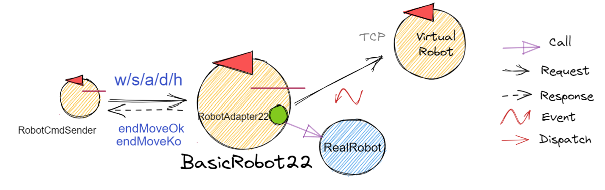

.. role:: red 
.. role:: blue 
.. role:: remark
.. role:: worktodo

.. _BasicRobot2021: ../../../../../it.unibo.qak21.basicrobot/userDocs/basicrobot2021.html
.. _LabNanoRobot2021: ../../../../../it.unibo.qak21.basicrobot/userDocs/LabNanoRobot.html
.. _Mbot2020: ../../../../../it.unibo.qak21.basicrobot/userDocs/Mbot2020.html

.. _wssupportAsActorKotlin: ../../../../../it.unibo.kotlinSupports/userDocs/wssupportAsActorKotlin.html
.. _RobotService: ../../../../../it.unibo.kotlinSupports/userDocs/RobotService.html
.. _BasicStepRobotService: ../../../../../it.unibo.kotlinSupports/userDocs/BasicStepRobotService.html
.. _ActorWithKotlinSupport: ../../../../../it.unibo.kotlinSupports/userDocs/ActorWithKotlinSupport.html

==================================================
BasicRobot22
==================================================

Introduciamo un componente che esegue comandi di spostamento di un DDR-robot in 'modo indipendente dalla tecnologia', 
rispetto alla natura del robot (virtuale o reale).

Questo obiettivo viene raggiunto introducendo un insieme di diversi supporti di basso livello e una fase di configurazione 
che seleziona il supporto appropriato per il tipo di robot specificato in un file di configurazione del robot.

.. image::  ./_static/img/Robot22/basicrobotComponent.PNG 
  :align: center 
  :width: 95%

- `BasicRobot2021`_
- `LabNanoRobot2021`_
- `Mbot2020`_

- console
- /it.unibo.issLabStart/resources/jupyter/qakbasicrobotcallerTCP.ipynb
- /it.unibo.issLabStart/resources/jupyter/qakbasicrobotcallerMQTT.ipynb
  
.. 2022: il progetto it.unibo.qak21.robots è stato incluso in it.unibo.qak21.basicrobot

   
--------------------------------------------------
basicrobotConfig.json
--------------------------------------------------
Il file di configurazione basicrobotConfig.json è scritto dal progettista dell'applicazione:

.. code::

    Robot virtuale
    {"type":"virtual","port":"8090","ipvirtualrobot":"..."}

    Nanorobot
    {"type":"realnano","port":"8020","ipvirtualrobot":"dontcare"}

    Robot Mbot
    //Arduino connesso al PC:
    {"type":"realmbot","port":"COM6","ipvirtualrobot":"dontcare"}	

    //Arduino connesso al Raspberry:
    {"type":"realmbot", "port":"/dev/ttyUSB0", "ipvirtualrobot":"-"}

--------------------------------------------------
basicrobot.qak
--------------------------------------------------

Il **basicrobot.qak** (nel progetto *it.unibo.qak21.basicrobot* ):

- è in grado di eseguire comandi di spostamento di base, gestendo aspedizione un dispatch 
  (per i comandi elementari :blue:`w | s | a | d | h` ) e una request (per la un comando :blue:`step`);

- è una risorsa CoAP-osservabile  che mantiene le informazioni sul suo stato funzionale corrente 
  (variabile ActorResourceRep);

- interagisce con un robot concreto per mezzo di un POJO  ( resources/unibo/robot/robotSupport.kt ) 
  che funge da adattatore per i dispositivi descritti nel file di configurazione :blue:`basicrobotConfig.json` 

++++++++++++++++++++++++++++
Avvertenze
++++++++++++++++++++++++++++

- Per muovere un robot reale occorre inviare comendi ai motori. La esecuzione di uno step di durata DT 
  implica l'invio di due comandi ("w" e "h"), intervallati da DT.

- Per muovere un VirtualRobot occorre inviare comandi che specificano già la durata del movimento.
  Al fine di usare il VirtualRobot in modo del tutto analogo al robot reale, si definisce una durata 
  adeguatamente 'lunga' del comando "w" (ad esempio 1000 msec)

- Le informazioni proveniente dall'ambiente sono percepibili come eventi, grazie alla feature :ref:`Actors as streams`.
  
   .. image::  ./_static/img/Robot22/sonarpipenano.png 
     :align: center 
     :width: 75%

Il codice è definito come un modello qak che costruisce i propri supporti di basso livello leggendo il file 
di configurazione :ref:`basicrobotConfig.json`.

+++++++++++++++++++++++++++++++++
BasicRobot22: Comandi
+++++++++++++++++++++++++++++++++

L'interazione con il robot è definita, in termini di operazioni di passaggio messaggi, come segue:

.. code::
    
    Messaggi di comando
    Dispatch  cmd : cmd(MOVE)     
    Dispatch  end : end(ARG)  
    
    Request   step ( TIME )	
    Reply     stepdone : stepdone(V)  
    Reply     stepfail : stepfail(DURATA, CAUSA)

.. code::

    halt (cmd : cmd(h)): the robot stops.
    step (step : step(T)): the robot moves forwards for a prefixed time T. 
        If the command is executed with success, it replies with 
            stepdone : stepdone(T); 
        otherwise, if it fails after the time D for some reason C, it replies with 
            stepfail : stepfail(D, C).
    forward (cmd : cmd(w)): the robot moves forwards for a prefixed time TF, 
        being able to receive and execute the halt command before the end of TF and 
        to emit a obstacle event if it stops after the collision with an obstacle.
    backward (cmd : cmd(s)): the robot moves backward for a prefixed time TF, 
        being able to emit a obstacle event if it stops after the collision with an obstacle.
    turnLeft (cmd : cmd(l)): the robot rotates on the left of 90 degrees.
    turnRight (cmd : cmd(l)): the robot rotates on the right of 90 degrees.

+++++++++++++++++++++++++++++++++
BasicRobot22: Supporti
+++++++++++++++++++++++++++++++++

Come regola generale possiamo affermare che:

- il supporto per il VirtualRobot termina automaticamente (cioè arresta il robot) un comando w / s   
  dopo un periodo di tempo prefissato. Si veda Il robot virtuale .
- il supporto per un vero robot **non termina automaticamente** un comando w / s . 
  Maggiori dettagli sono forniti nella sezione I  robot reali.

.. image::  ./_static/img/Robot22/basicrobotproject.PNG 
  :align: center 
  :width: 65%

 

+++++++++++++++++++++++++++++++++
BasicRobot22: Eventi
+++++++++++++++++++++++++++++++++

.. code::

    obstacle:obstacle( V ):  
    sonar:sonar( D ):  

.. code::
    
    RobotCmdSender ---request---> 
            BasicRobot22 (usa)  RobotAdapter22
                                (usa) RobotReal oppure VirtualRoot
                                                            
Si veda:  `BasicRobot2021`_
 

