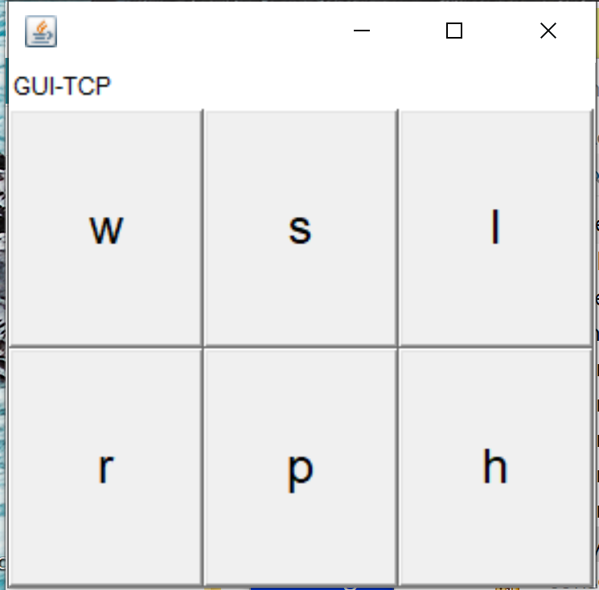

.. role:: red 
.. role:: blue 
.. role:: remark
.. role:: worktodo

.. _BasicRobot2021: ../../../../../unibo.basicrobot22/userDocs/basicrobot2021.html
.. _NanoRobot: ../../../../../unibo.basicrobot22/userDocs/LabNanoRobot.html
.. _Mbot: ../../../../../unibo.basicrobot22/userDocs/Mbot2020.html

.. basicrobot.qak: ../../../../../unibo.basicrobot22/src/basicrobot.qak 
.. _kotlinUnibo: ../../../../../it.unibo.kotlinIntro/userDocs/LabIntroductionToKotlin.html

.. _basicrobotqak: ../../../../../unibo.basicrobot22/src/basicrobot.qak 
.. _connQak.sysConnKb.kt: ../../../../../unibo.basicrobot22/resources/connQak/connQak.sysConnKb.kt

.. _virtualrobotSupport: ../../../../../unibo.basicrobot22/resources/robotVirtual/virtualrobotSupport2021.kt
.. _nanoSupport: ../../../../../unibo.basicrobot22/resources/robotNano/nanoSupport.kt
.. _motors: ../../../../../unibo.basicrobot22/resources/robotNano/Motors.c
.. _mbotSupport: ../../../../../unibo.basicrobot22/resources/robotNano/nanoSupport.kt

.. _wssupportAsActorKotlin: ../../../../../it.unibo.kotlinSupports/userDocs/wssupportAsActorKotlin.html
.. _RobotService: ../../../../../it.unibo.kotlinSupports/userDocs/RobotService.html
.. _BasicStepRobotService: ../../../../../it.unibo.kotlinSupports/userDocs/BasicStepRobotService.html
.. _ActorWithKotlinSupport: ../../../../../it.unibo.kotlinSupports/userDocs/ActorWithKotlinSupport.html

==================================================
BasicRobot22
==================================================

Introduciamo un componente che esegue comandi di spostamento di un DDR-robot in 'modo indipendente dalla tecnologia', 
rispetto alla natura del robot (virtuale o reale).

Questo obiettivo viene raggiunto introducendo un insieme di diversi supporti di basso livello e una fase di configurazione 
che seleziona il supporto appropriato per il tipo di robot specificato in un file di configurazione del robot.

--------------------------------------------------
BasicRobot22: tipi di robot
--------------------------------------------------
Il file di configurazione ``basicrobotConfig.json`` attualmente distingue tre diversi tipi di robot: 
due reali e uno virtuale.

.. code::
     
    {"type":"virtual","port":"8090","ipvirtualrobot":"..."}    
    {"type":"realnano","port":"8020","ipvirtualrobot":"dontcare"}     
    //Arduino connesso al Raspberry:
    {"type":"realmbot", "port":"/dev/ttyUSB0", "ipvirtualrobot":"-"}
    //Arduino connesso al PC:
    {"type":"realmbot","port":"COM6","ipvirtualrobot":"dontcare"}	

- :ref:`VirtualRobot`
- `Mbot`_ (realmbot)
- `NanoRobot`_ (realnano)

.. image::  ./_static/img/Robot22/basicrobotComponent.PNG 
  :align: center 
  :width: 60%
 

+++++++++++++++++++++++++++++++++
BasicRobot22: requisiti
+++++++++++++++++++++++++++++++++

L'interazione con il robot è definita, in termini di operazioni di message-passing, come segue 
(si veda :ref:`BasicRobot22: il modello basicrobot.qak`):

.. (si veda :ref:`basicrobotqak`):

.. code::
    
     
    Dispatch  cmd : cmd(MOVE)      
         
    Request   step ( TIME )	
    Reply     stepdone : stepdone(V)  
    Reply     stepfail : stepfail(DT, REASON)

    Event  sonar     	: sonar(DISTANCE,NAME)		

Più specificatamente, ``BasicRobot22``:
 
- è in grado di eseguire comandi-base  **cmd** di spostamento, con argomento :blue:`MOVE = w | s | l | r | h`
- è in grado di rispondere alla richiesta di effettuare uno **step** in avanti per il tempo :blue:`TIME` specificato 
  nell'argomento, fornendo una risposta che può essere:

   - **stepdone** se lo *step* è stato eseguito con successo
   - **stepfail** se lo *step* è fallito dopo il tempo :blue:`DT` (``DT<TIME``) per una qualche ragione :blue:`REASON`.
     In questo caso, ``BasicRobot22`` effettua uno spostamento all'indietro **'di riposizionamenmto'** con durate (approssimativa)
     :blue:`DT`.
- è in grado di percepire come eventi le informazioni proveniente dall'ambiente, grazie alla feature :ref:`Actors as streams`.
  
   .. image::  ./_static/img/Robot22/sonarpipenano.png 
     :align: center 
     :width: 75%
- è una risorsa CoAP-osservabile che mantiene le informazioni sul suo stato funzionale corrente (``RObState``):
 
  - *basicrobot(start)*, when the basicrobot is activated.
  - *moveactivated(M)*, when the basicrobot has activated a non-step move M.
  - *step(ST)*, when the basicrobot has activated a step with time ST.
  - *stepDone(ST)*, when the basicrobot has terminated with success a step with time ST.
  - *stepFail(D)*, when the basicrobot has failed a step after time D<ST.
  - *obstacle(M)*, when the basicrobot hits an obstacle while executing the move M.
  - *basicrobot(end)*, when the basicrobot terminates.

- `BasicRobot2021`_ 

++++++++++++++++++++++++++++
Avvertenze
++++++++++++++++++++++++++++

:remark:`Sulla durata dei comandi-base`

- Per muovere un robot reale occorre inviare comendi ai motori. La esecuzione di uno step di durata ``DT`` 
  implica l'invio di due comandi (:blue:`w` e :blue:`h`), intervallati da ``DT``.

- Per muovere un VirtualRobot si inviano comandi che specificano già la durata del movimento.
  Al fine di usare il VirtualRobot in modo del tutto analogo al robot reale, si definisce una durata 
  adeguatamente 'lunga' del comando :blue:`w` (ad esempio 1000 msec)

-------------------------------------
Progetto unibo.basicrobot22
-------------------------------------  

- La realizzazione del ``BasicRobot22`` viene affidata al progetto **unibo.basicrobot22**. 
- Il modello viene definito nel file :ref:`basicrobot.qak<BasicRobot22: il modello basicrobot.qak>`.
- Per parti di basso livello definite in Kotlin, può essere utile consultare `kotlinUnibo`_.
  
++++++++++++++++++++++++++++++
Console di comando
++++++++++++++++++++++++++++++

Per inviare comandi al ``BasicRobot22`` si può usare una console GUI come quella di figura

La console  ``consoleGuiSimple`` può connettersi al ``BasicRobot22`` usando uno dei seguenti protocolli, 
secondo quanto definito nel file `connQak.sysConnKb.kt`_

- TCP
- HTTP
- CoAP
- MQTT

Il pulsante **p** invia una richiesta di *step* con ``TIME=350``.

:remark:`La console invia i comandi mediante dispatch`

Sono anche disponibili file **Jupyter**, nella directory ``resources/jupiter``.

++++++++++++++++++++++++++++
Esperimenti di uso
++++++++++++++++++++++++++++
 
#. Attivare ``BasicRobot22`` eseguendo ``it.unibo.ctxbasicrobot.MainCtxbasicrobot.kt``
#. Atiivare una console eseguendo  ``consoles.consoleGuiSimple.kt``
#. Attivare un CoapObserver eseguendo ``basicrobotCoapObserver``
#. Attivare una ulteriore console con protocollo CoAP

Per provocare interazioni usando MQTT, occorre 

- (in `basicrobotqak`_) togliere il commento  

  ``mqttBroker "broker.hivemq.com" : 1883 eventTopic "unibo/basicrobot"``

- Attivare una console con protocollo MQTT oppure ``qakbasicrobotcallerMQTT.ipynb`` in ``it.unibo.issLabStart/resources/jupyter/``

..  /it.unibo.issLabStart/resources/jupyter/qakbasicrobotcallerTCP.ipynb
.. /it.unibo.issLabStart/resources/jupyter/qakbasicrobotcallerMQTT.ipynb
  
.. 2022: il progetto it.unibo.qak21.robots è stato incluso in it.unibo.qak21.basicrobot

+++++++++++++++++++++++++++++++++
BasicRobot22: architettura
+++++++++++++++++++++++++++++++++

.. image::  ./_static/img/Robot22/basicrobotproject.PNG 
  :align: center 
  :width: 50%

%%%%%%%%%%%%%%%%%%%%%%%%%%%%%
BasicRobot22: supporti
%%%%%%%%%%%%%%%%%%%%%%%%%%%%%

.. list-table:: 
  :widths: 30,70
  :width: 100%
  
  * - 
      .. image::  ./_static/img/Robot22/wenvscene1.PNG 
           :align: center 
           :width: 90%
    - per il VirtualRobot: `virtualrobotSupport`_ 
  * -
      .. image::  ./_static/img/Robot22/robotsUnibo.jpg 
           :align: center 
           :width: 90%
    - per il  NanoRObot. `nanoSupport`_, `motors`_
  * -
      .. image::  ./_static/img/Robot22/mbot.PNG 
           :align: center 
           :width: 90%
    - per il  NanoRObot. `mbotSupport`_
 

-----------------------------------------------
BasicRobot22: il modello basicrobot.qak
-----------------------------------------------
 
Per realizzare i :ref:`requisiti<BasicRobot22: requisiti>` impostiamo un :ref:`modello QAk<QActor (meta)model>` 
con l'obiettivo di 
definire gli aspetti essenziali della 'business logic' del robot, lasciando ai :ref:`supporti<BasicRobot22: supporti>` 
il compito di occuparsi dei dettagli tecnologici relativi ai diversi :ref:`tipi di robot<BasicRobot22: tipi di robot>`.

Per il modello completo si veda  `basicrobotqak`_. In questa sede cercheremo di introdurlo in modo incrementale. 

++++++++++++++++++++++++++++++++++++++++
basicrobot.qak: dichiarazioni
++++++++++++++++++++++++++++++++++++++++

I messaggi 

.. code::

    System /* -trace */   basicrobot                
    //mqttBroker "broker.hivemq.com" : 1883 eventTopic "unibo/basicrobot"   		//broker.hivemq.com

    Dispatch cmd       	: cmd(MOVE)     
    Dispatch end       	: end(ARG)  
    Dispatch stepok   	: stepok(ARG)  
    Dispatch stepko   	: stepko(ARG)  
    
    Request step       : step( TIME )	
    Reply   stepdone   : stepdone(V)  
    Reply   stepfail   : stepfail(DURATION, CAUSE)
      
    Dispatch obstacle  : obstacle( ARG ) 	//generated by distancefilter
    Event  endall	     : endall( ARG )   
    Event   info       : info( ARG ) 	    //for external components, not coap-observed

    Event  sonar     	: sonar(DISTANCE,NAME)			//emitted by distancefilter
    
    Context ctxbasicrobot ip [host="localhost" port=8020]  

    CodedQActor datacleaner    context ctxbasicrobot className "rx.dataCleaner"
    CodedQActor distancefilter context ctxbasicrobot className "rx.distanceFilter"
    
    QActor basicrobot context ctxbasicrobot{ ... }

    QActor envsonarhandler context ctxbasicrobot{ ... }
 

:ref:`Creazione di una pipe`

 

 
 :worktodo:`WORKTODO: creazione della mappa di una stanza vuota`

- impostare il modello QAk di un sistema che opera come il :ref:`RobotMapperBoundary`
