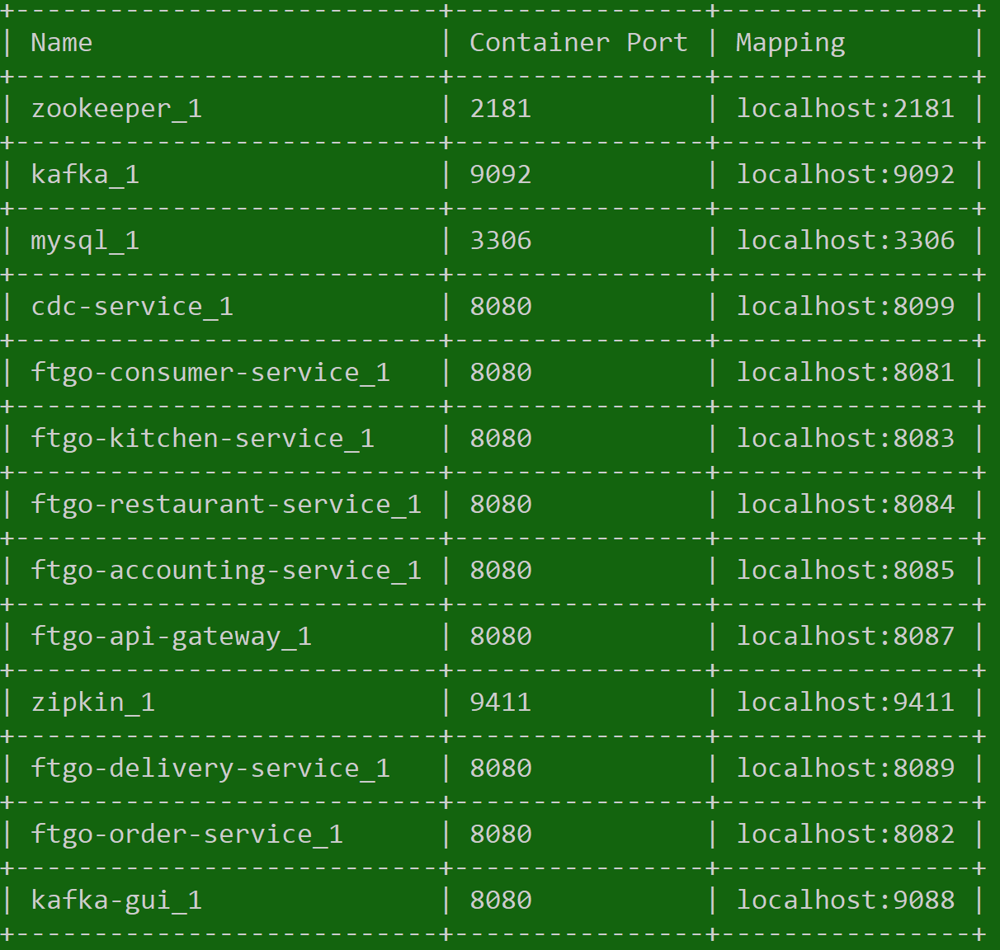

.. role:: red 
.. role:: blue 
.. role:: remark
.. role:: worktodo

=====================================
BookMspatterns
=====================================
 

---------------------------------------
Libro
---------------------------------------

This is the example code for my book https://microservices.io/book[Microservice patterns].

.. image::http://microservices.io/i/Microservices-Patterns-Cover.png[width=50%]

+++++++++++++++++++++++++
Please note
+++++++++++++++++++++++++

* The code is still work in progress
* It primarily illustrates the technical aspects of the microservice architecture and so the business logic is minimal
* The documentation is sparse/non-existent and you will need to look in the book
* The application consists of many services and so requires a lot of memory. It runs well, for example, 
  on a 16GB Macbook pro.
* The application's services and the infrastructure services, such as MySQL and Apache Kafka, are deployed 
  using Docker containers using either Docker Compose or Kubernetes.

+++++++++++++++++++++++++
Got questions?
+++++++++++++++++++++++++

Please create a https://github.com/microservices-patterns/ftgo-application/issues[github issue] 
and I'll do my best to help you.

++++++++++++++++++++++++++++++++++
Application architecture
++++++++++++++++++++++++++++++++++
Not surprisingly, this application has a microservice architecture.
There are the following services:

* link:./ftgo-consumer-service[ftgo-consumer-service] - the `Consumer Service`
* link:./ftgo-restaurant-service[ftgo-restaurant-service] - the `Restaurant Service`
* link:./ftgo-order-service[ftgo-order-service] - the `Order Service`
* link:./ftgo-kitchen-service[ftgo-kitchen-service] - the `Kitchen Service`
* link:./ftgo-accounting-service[ftgo-accounting-service] - the `Accounting Service`
* link:./ftgo-order-history-service[ftgo-order-history-service] - a `Order History Service`, which is a CQRS view
* link:./ftgo-api-gateway[ftgo-api-gateway] - the API gateway

++++++++++++++++++++++++++++++++++
Service design
++++++++++++++++++++++++++++++++++

Key points:

* A service consists of a single Gradle module.
  For example, `ftgo-order-service` implements the `Order Service`
* A service is a Spring Boot application
* A service has a Swagger UI `http://.../swagger-ui.html`. See `open-swagger-uis.sh`
* A service typically consists of the following packages:
  ** domain - domain logic including aggregates
  ** messaging - messaging adapters
  ** web - Spring MVC controllers (HTTP adapters)
  ** main - the main application
* The services use the following other frameworks
  ** https://github.com/eventuate-tram/eventuate-tram-core[`Eventuate Tram framework`] - 
  implements transactional messaging
  ** https://github.com/eventuate-tram/eventuate-tram-sagas[`Eventuate Tram Saga framework`] - 
  implements sagas
  ** https://github.com/eventuate-clients/eventuate-client-java[`Eventuate Client framework`] - 
  implements event sourcing

++++++++++++++++++++++++++++++++++
Chapter by chapter
++++++++++++++++++++++++++++++++++

This section maps the chapters to the code.

%%%%%%%%%%%%%%%%%%%%%%%%%%%%%%%%%%%%%%%%%%%%%%%%%%%%%%%%%%%%%%%%%%%%%%%%%%%
Chapter 3 Inter-process communication in a microservice architecture
%%%%%%%%%%%%%%%%%%%%%%%%%%%%%%%%%%%%%%%%%%%%%%%%%%%%%%%%%%%%%%%%%%%%%%%%%%%

* The services have a REST API
* The services also communicate using the Apache Kafka message broker via the `Eventuate Tram` framework

%%%%%%%%%%%%%%%%%%%%%%%%%%%%%%%%%%%%%%%%%%%%%%%%%%%%%%%%%%%%%%%%%%%%%%%%%%%
Chapter 4 Managing transactions with sagas
%%%%%%%%%%%%%%%%%%%%%%%%%%%%%%%%%%%%%%%%%%%%%%%%%%%%%%%%%%%%%%%%%%%%%%%%%%%

The link:./ftgo-order-service[ftgo-order-service] uses sagas to maintain data consistency:

* link:./ftgo-order-service/src/main/java/net/chrisrichardson/ftgo/orderservice/sagas/createorder/CreateOrderSaga.java[CreateOrderSaga]
* link:./ftgo-order-service/src/main/java/net/chrisrichardson/ftgo/orderservice/sagas/cancelorder/CancelOrderSaga.java[CancelOrderSaga]
* link:./ftgo-order-service/src/main/java/net/chrisrichardson/ftgo/orderservice/sagas/reviseorder/ReviseOrderSaga.java[ReviseOrderSaga]

The services that participate in these sagas define the following command handlers:

* `Accounting Service` link:
   .. code::
    
     ./ftgo-accounting-service/src/main/java/net/chrisrichardson/ftgo/accountingservice/messaging/AccountingServiceCommandHandler.java[AccountingServiceCommandHandler]
* `Consumer Service` link:
   .. code::
    
     ./ftgo-consumer-service/src/main/java/net/chrisrichardson/ftgo/consumerservice/domain/ConsumerServiceCommandHandlers.java[ConsumerServiceCommandHandlers]
* `Kitchen Service` link:
   .. code::

    ./ftgo-kitchen-service/src/main/java/net/chrisrichardson/ftgo/kitchenservice/messagehandlers/KitchenServiceCommandHandler.java[KitchenServiceCommandHandler]
* `Order Service` link:
   .. code::

    ./ftgo-order-service/src/main/java/net/chrisrichardson/ftgo/orderservice/service/OrderCommandHandlers.java[OrderCommandHandlers]

%%%%%%%%%%%%%%%%%%%%%%%%%%%%%%%%%%%%%%%%%%%%%%%%%%%%%%%%%%%%%%%%%%%%%%%%%%%
Chapter 5 Designing business logic in a microservice architecture
%%%%%%%%%%%%%%%%%%%%%%%%%%%%%%%%%%%%%%%%%%%%%%%%%%%%%%%%%%%%%%%%%%%%%%%%%%%

All the services' business logic is implemented using Domain-Driven design aggregates.

* `Accounting Service`
   .. code::

    link:./ftgo-accounting-service/src/main/java/net/chrisrichardson/ftgo/accountingservice/domain/Account.java[`Account`] aggregate in the link:./ftgo-accounting-service[ftgo-accounting-service]
* `Consumer Service`
  .. code::

    link:./ftgo-consumer-service/src/main/java/net/chrisrichardson/ftgo/consumerservice/domain/Consumer.java[Consumer]
* `Order Service`
  .. code::
    
    link:./ftgo-order-service/src/main/java/net/chrisrichardson/ftgo/orderservice/domain/Order.java[Order]
    link:./ftgo-order-service/src/main/java/net/chrisrichardson/ftgo/orderservice/domain/Restaurant.java[Restaurant]
* `Kitchen Service`
  .. code::
    
    link:./ftgo-kitchen-service/src/main/java/net/chrisrichardson/ftgo/kitchenservice/domain/Restaurant.java[Restaurant]
    link:./ftgo-kitchen-service/src/main/java/net/chrisrichardson/ftgo/kitchenservice/domain/Ticket.java[Ticket]
* `Restaurant Service`
  .. code::
    
    link:./ftgo-restaurant-service/src/main/java/net/chrisrichardson/ftgo/restaurantservice/domain/Restaurant.java[Restaurant]

%%%%%%%%%%%%%%%%%%%%%%%%%%%%%%%%%%%%%%%%%%%%%%%%%%%%%%%%%%%%%%%%%%%%%%%%%%%
Chapter 6 Developing business logic with event sourcing
%%%%%%%%%%%%%%%%%%%%%%%%%%%%%%%%%%%%%%%%%%%%%%%%%%%%%%%%%%%%%%%%%%%%%%%%%%%
* The link:./ftgo-accounting-service/src/main/java/net/chrisrichardson/ftgo/accountingservice/domain/Account.java[`Account`] aggregate in the link:./ftgo-accounting-service[ftgo-accounting-service] is implemented using event sourcing

%%%%%%%%%%%%%%%%%%%%%%%%%%%%%%%%%%%%%%%%%%%%%%%%%%%%%%%%%%%%%%%%%%%%%%%%%%%
Chapter 7 Implementing queries in a microservice architecture
%%%%%%%%%%%%%%%%%%%%%%%%%%%%%%%%%%%%%%%%%%%%%%%%%%%%%%%%%%%%%%%%%%%%%%%%%%%
* link:./ftgo-order-history-service[ftgo-order-history-service] is an example of a CQRS view
* link:./ftgo-api-gateway[ftgo-api-gateway] uses API composition to implement the REST endpoint 
  for retrieving the order history

%%%%%%%%%%%%%%%%%%%%%%%%%%%%%%%%%%%%%%%%%%%%%%%%%%%%%%%%%%%%%%%%%%%%%%%%%%%
Chapter 8 External API patterns
%%%%%%%%%%%%%%%%%%%%%%%%%%%%%%%%%%%%%%%%%%%%%%%%%%%%%%%%%%%%%%%%%%%%%%%%%%%

* link:./ftgo-api-gateway[ftgo-api-gateway] is the API gateway

+++++++++++++++++++++++++++++++++++++++++++++
Building and running the application
+++++++++++++++++++++++++++++++++++++++++++++

%%%%%%%%%%%%%%%%%%%%%%%%%%%%%%%%%%%%%%%%%%%%%%%%%%%%%%%%%%%%%%%%%%%%%%%%%%%
Pre-requisites
%%%%%%%%%%%%%%%%%%%%%%%%%%%%%%%%%%%%%%%%%%%%%%%%%%%%%%%%%%%%%%%%%%%%%%%%%%%
* Java 8+
* Docker and Docker Compose
* Internet access so that Gradle and Docker can download dependencies and container images

%%%%%%%%%%%%%%%%%%%%%%%%%%%%%%%%%%%%%%%%%%%%%%%%%%%%%%%%%%%%%%%%%%%%%%%%%%%
Building
%%%%%%%%%%%%%%%%%%%%%%%%%%%%%%%%%%%%%%%%%%%%%%%%%%%%%%%%%%%%%%%%%%%%%%%%%%%
Temporary: Build the Spring Cloud Contracts using this command:

.. code::

 ./gradlew buildContracts
 

Build the services using this command:

.. code::

   ./gradlew assemble
 
%%%%%%%%%%%%%%%%%%%%%%%%%%%%%%%%%%%%%%%%%%%%%%%%%%%%%%%%%%%%%%%%%%%%%%%%%%%
Running the application
%%%%%%%%%%%%%%%%%%%%%%%%%%%%%%%%%%%%%%%%%%%%%%%%%%%%%%%%%%%%%%%%%%%%%%%%%%%

Run the application using this command:

.. code::
  
   ./gradlew :composeUp
 

Note: the ':'

This can take a while.

%%%%%%%%%%%%%%%%%%%%%%%%%%%%%%%%%%%%%%%%%%%%%%%%%%%%%%%%%%%%%%%%%%%%%%%%%%%
Using the application
%%%%%%%%%%%%%%%%%%%%%%%%%%%%%%%%%%%%%%%%%%%%%%%%%%%%%%%%%%%%%%%%%%%%%%%%%%%

Use the services Swagger UIs to invoke the services.

* Create consumer - `http://localhost:8081/swagger-ui/index.html`
* Create a restaurant - `http://localhost:8084/swagger-ui/index.html`
* Create an order - `http://localhost:8082/swagger-ui/index.html`
* View the order - `http://localhost:8082/swagger-ui/index.html`
* View the order history -  `http://localhost:8086/swagger-ui/index.html`

You can also access the application via the `API Gateway` at `http://localhost:8087`.
However, currently it  doesn't have a Swagger UI so you will have to use `curl`, for example.

Note: if the containers aren't accessible via `localhost` - e.g. you are using Docker Toolbox, you will have to use `${DOCKER_HOST_IP}` as described below.

%%%%%%%%%%%%%%%%%%%%%%%%%%%%%%%%%%%%%%%%%%%%%%%%%%%%%%%%%%%%%%%%%%%%%%%%%%%
Stopping the application
%%%%%%%%%%%%%%%%%%%%%%%%%%%%%%%%%%%%%%%%%%%%%%%%%%%%%%%%%%%%%%%%%%%%%%%%%%%

Stop the application using this command:

.. code::

  ./gradlew :composeDown
 
+++++++++++++++++++++++++++++++++++++++++++++
Deploying the application on Kubernetes
+++++++++++++++++++++++++++++++++++++++++++++

You can find Kubernetes YAML files in the following directories: `deployment/kubernetes` and `*/src/deployment/kubernetes`.
There are also some helpful shell scripts.

%%%%%%%%%%%%%%%%%%%%%%%%%%%%%%%%%%%%%%%%%%%%%%%%%%%%%%%%%%%%%%%%%%%%%%%%%%%
Deploying services
%%%%%%%%%%%%%%%%%%%%%%%%%%%%%%%%%%%%%%%%%%%%%%%%%%%%%%%%%%%%%%%%%%%%%%%%%%%

You can run this command

.. code::

  ./deployment/kubernetes/scripts/kubernetes-deploy-all.sh

%%%%%%%%%%%%%%%%%%%%%%%%%%%%%%%%%%%%%%%%%%%%%%%%%%%%%%%%%%%%%%%%%%%%%%%%%%%
Undeploying the services
%%%%%%%%%%%%%%%%%%%%%%%%%%%%%%%%%%%%%%%%%%%%%%%%%%%%%%%%%%%%%%%%%%%%%%%%%%%

You can run the script to undeploy the services:

.. code::

    ./deployment/kubernetes/scripts/kubernetes-delete-all.sh
 

If you want to delete the persistent volumes for Apache Kafka, Zookeeper and MySQL please run the command:

.. code::

    ./deployment/kubernetes/scripts/kubernetes-delete-volumes.sh
 

+++++++++++++++++++++++++++++++++++++++++++++++++
Setting environment variables to do development
+++++++++++++++++++++++++++++++++++++++++++++++++

You should not need to set any environment variables.
To run the application, you certainly do not.
Similarly, to do development (e.g. run tests), you typically do not need to set any environment variables.
That's because Docker containers are generally accessible (e.g. Docker for Windows/Mac) on the host via `localhost`.
However, if Docker is running elsewhere (e.g. you are using Docker Toolbox) you will need to set `DOCKER_HOST_IP`.

%%%%%%%%%%%%%%%%%%%%%%%%%%%%%%%%%%%%%%%%%%%%%%%%%%%%%%%%%%%%%%%%%%%%%%%%%%%
Quick way
%%%%%%%%%%%%%%%%%%%%%%%%%%%%%%%%%%%%%%%%%%%%%%%%%%%%%%%%%%%%%%%%%%%%%%%%%%%

A quick way to set the environment variables is to run the script `./set-env.sh`.

%%%%%%%%%%%%%%%%%%%%%%%%%%%%%%%%%%%%%%%%%%%%%%%%%%%%%%%%%%%%%%%%%%%%%%%%%%%
Long way
%%%%%%%%%%%%%%%%%%%%%%%%%%%%%%%%%%%%%%%%%%%%%%%%%%%%%%%%%%%%%%%%%%%%%%%%%%%

The value of `DOCKER_HOST_IP` must be meaningful to both Java services/tests running on your desktop/laptop and to Docker containers.
Please do NOT set it to the unresolvable hostname of your machine, `localhost` or `127.0.0.1` since the Docker containers will probably not work correctly.

%%%%%%%%%%%%%%%%%%%%%%%%%%%%%%%%%%%%%%%%%%%%%%%%%%%%%%%%%%%%%%%%%%%%%%%%%%%
Verifying that DOCKER_HOST_IP is set correctly
%%%%%%%%%%%%%%%%%%%%%%%%%%%%%%%%%%%%%%%%%%%%%%%%%%%%%%%%%%%%%%%%%%%%%%%%%%%

You can verify that `DOCKER_HOST_IP` is set correctly by running this command:

.. code::

   docker run -p 8889:8888 -e DOCKER_DIAGNOSTICS_PORT=8889 -e DOCKER_HOST_IP \
     --rm eventuateio/eventuateio-docker-networking-diagnostics:0.2.0.RELEASE
 

%%%%%%%%%%%%%%%%%%%%%%%%%%%%%%%%%%%%%%%%%%%%%%%%%%%%%%%%%%%%%%%%%%%%%%%%%%%
Setting the environment variable in your IDE
%%%%%%%%%%%%%%%%%%%%%%%%%%%%%%%%%%%%%%%%%%%%%%%%%%%%%%%%%%%%%%%%%%%%%%%%%%%

If you want to run Java services/tests within your IDE on your desktop/laptop AND  the Docker containers are not accessible via `localhost` THEN you will need to set `DOCKER_HOST_IP` within your IDE.
How to do this depends on your operating system and IDE.
For example, I find it convenient to launch my IDE from the command line and after setting this environment variable.

-----------------------------------
 Codice
-----------------------------------

+++++++++++++++++++++++++++++++++++++++++++
.gitignore
+++++++++++++++++++++++++++++++++++++++++++

.. code::

    .gradle
    build/
    *.idea/
    *.iml
    *.log
    *.pid
    out
    target
    .serverless
    *.pid
    .classpath
    .project
    .settings
    bin
    node_modules
    dist
    ftgo-api-gateway-graphql/jest_0

+++++++++++++++++++++++++++++++++++++++++++
Gradle settings
+++++++++++++++++++++++++++++++++++++++++++
.. code::
    
    include "common-swagger"
    include "ftgo-test-util"
    include "ftgo-test-util-json-schema"
    include "ftgo-common"
    include "ftgo-common-jpa"

    include "ftgo-order-service"

    include "ftgo-order-service-api"
    include "ftgo-order-service-contracts"

    include "ftgo-kitchen-service-api"
    include "ftgo-kitchen-service"
    include "ftgo-kitchen-service-contracts"

    include "ftgo-accounting-service-api"
    include "ftgo-accounting-service-api-spec"
    include "ftgo-accounting-service"
    include "ftgo-accounting-service-contracts"

    include "ftgo-consumer-service-api"
    include "ftgo-consumer-service-api-spec"
    include "ftgo-consumer-service"
    include "ftgo-consumer-service-contracts"

    include "ftgo-restaurant-service-api"
    include "ftgo-restaurant-service-api-spec"
    include "ftgo-restaurant-service-contracts"
    include "ftgo-restaurant-service"

    include "ftgo-order-history-service"

    include "ftgo-delivery-service"
    include "ftgo-delivery-service-api"

    include "ftgo-api-gateway"
    include "ftgo-end-to-end-tests"

    include "ftgo-restaurant-service-aws-lambda"

+++++++++++++++++++++++++++++++++++++++++++
Gradlew for windows
+++++++++++++++++++++++++++++++++++++++++++

.. code::

    @if "%DEBUG%" == "" @echo off
    @rem ##########################################################################
    @rem
    @rem  Gradle startup script for Windows
    @rem
    @rem ##########################################################################

    @rem Set local scope for the variables with windows NT shell
    if "%OS%"=="Windows_NT" setlocal

    @rem Add default JVM options here. You can also use JAVA_OPTS and GRADLE_OPTS to pass JVM options to this script.
    set DEFAULT_JVM_OPTS=

    set DIRNAME=%~dp0
    if "%DIRNAME%" == "" set DIRNAME=.
    set APP_BASE_NAME=%~n0
    set APP_HOME=%DIRNAME%

    @rem Find java.exe
    if defined JAVA_HOME goto findJavaFromJavaHome

    set JAVA_EXE=java.exe
    %JAVA_EXE% -version >NUL 2>&1
    if "%ERRORLEVEL%" == "0" goto init

    echo.
    echo ERROR: JAVA_HOME is not set and no 'java' command could be found in your PATH.
    echo.
    echo Please set the JAVA_HOME variable in your environment to match the
    echo location of your Java installation.

    goto fail

    :findJavaFromJavaHome
    set JAVA_HOME=%JAVA_HOME:"=%
    set JAVA_EXE=%JAVA_HOME%/bin/java.exe

    if exist "%JAVA_EXE%" goto init

    echo.
    echo ERROR: JAVA_HOME is set to an invalid directory: %JAVA_HOME%
    echo.
    echo Please set the JAVA_HOME variable in your environment to match the
    echo location of your Java installation.

    goto fail

    :init
    @rem Get command-line arguments, handling Windowz variants

    if not "%OS%" == "Windows_NT" goto win9xME_args
    if "%@eval[2+2]" == "4" goto 4NT_args

    :win9xME_args
    @rem Slurp the command line arguments.
    set CMD_LINE_ARGS=
    set _SKIP=2

    :win9xME_args_slurp
    if "x%~1" == "x" goto execute

    set CMD_LINE_ARGS=%*
    goto execute

    :4NT_args
    @rem Get arguments from the 4NT Shell from JP Software
    set CMD_LINE_ARGS=%$

    :execute
    @rem Setup the command line

    set CLASSPATH=%APP_HOME%\gradle\wrapper\gradle-wrapper.jar

    @rem Execute Gradle
    "%JAVA_EXE%" %DEFAULT_JVM_OPTS% %JAVA_OPTS% %GRADLE_OPTS% "-Dorg.gradle.appname=%APP_BASE_NAME%" -classpath "%CLASSPATH%" org.gradle.wrapper.GradleWrapperMain %CMD_LINE_ARGS%

    :end
    @rem End local scope for the variables with windows NT shell
    if "%ERRORLEVEL%"=="0" goto mainEnd

    :fail
    rem Set variable GRADLE_EXIT_CONSOLE if you need the _script_ return code instead of
    rem the _cmd.exe /c_ return code!
    if  not "" == "%GRADLE_EXIT_CONSOLE%" exit 1
    exit /b 1

    :mainEnd
    if "%OS%"=="Windows_NT" endlocal

    :omega   

+++++++++++++++++++++++++++++++++++++++++++
Build
+++++++++++++++++++++++++++++++++++++++++++

.. code::

    buildscript {
    repositories {
        mavenCentral()
        jcenter()
    }
    dependencies {
        classpath "org.springframework.boot:spring-boot-gradle-plugin:${springBootVersion}"
        classpath "io.spring.gradle:dependency-management-plugin:$springDependencyManagementPluginVersion"
        classpath "com.avast.gradle:gradle-docker-compose-plugin:$dockerComposePluginVersion"
        classpath "org.springframework.cloud:spring-cloud-contract-gradle-plugin:$springCloudContractDependenciesVersion"
    }
    }

    apply plugin: WaitForMySqlPlugin
    apply plugin: 'docker-compose'

    subprojects {

        apply plugin: "java"

        // TODO apply plugin: 'pmd'

        sourceCompatibility = '1.8'
        targetCompatibility = '1.8'

        group = "net.chrisrichardson.ftgo"

        repositories {
            eventuateMavenRepoUrl.split('[ ,]').each { repoUrl -> maven { url repoUrl.trim() } }

            mavenCentral()
            jcenter()

            maven {
                url 'https://jitpack.io'
            }

            maven {
                url "${project.rootDir}/build/repo"
            }

        }

        dependencies {

            implementation(platform("io.eventuate.platform:eventuate-platform-dependencies:$eventuatePlatformVersion"))
            constraints {
                    compile ("io.netty:netty-codec-http2") {
                        version {
                            strictly("4.1.72.Final")
                        }
                    }
            }

        }
    }

    task buildContracts(type: GradleBuild) {
    tasks = subprojects.collect { it.name }.findAll { it.endsWith("-contracts") }.collect { ":" + it + ":publish"}
    }

    task compileAll(type: GradleBuild) {
    tasks = ["testClasses", "compileIntegrationTestJava", "compileComponentTestJava"]
    }

    dockerCompose {

    environment.put "EVENTUATE_COMMON_VERSION", eventuateCommonImageVersion
    environment.put "EVENTUATE_CDC_VERSION", eventuateCdcImageVersion
    environment.put "EVENTUATE_SAGA_VERSION", eventuateTramSagasImageVersion
    environment.put "EVENTUATE_JAVA_BASE_IMAGE_VERSION", eventuateExamplesBaseImageVersion
    environment.put "EVENTUATE_MESSAGING_KAFKA_IMAGE_VERSION", eventuateMessagingKafkaImageVersion

    projectName = null
    removeOrphans = true
    retainContainersOnStartupFailure = true

    if (project.hasProperty('startedServices'))
        startedServices= project.ext.startedServices.split(',')

    mysql {
        projectName = null
        startedServices = ["mysql"]
    }    
    
    infrastructure {
        projectName = null
        startedServices = ["mysql", "cdc-service", "dynamodblocal-init", "kafka", "zookeeper"]
    }    
    
    kafkaGui {
        projectName = null
        startedServices = ["kafka-gui"]
    }  
    }

    composeUp.dependsOn(infrastructureComposeUp)

    subprojects.each {
    if (it.name.endsWith("-service") || it.name.endsWith("-gateway")) {
        composeBuild.dependsOn(":" + it.name + ":assemble")
        composeUp.dependsOn(":" + it.name + ":assemble")
    }
    }

+++++++++++++++++++++++++++++++++++++++++++
docker-compose.yaml
+++++++++++++++++++++++++++++++++++++++++++

.. code::
    
    version: '3'
    services:
    zookeeper:
        image: eventuateio/eventuate-zookeeper:$EVENTUATE_COMMON_VERSION
        ports:
        - 2181:2181
        environment:
        ZOOKEEPER_CLIENT_PORT: 2181
        KAFKA_HEAP_OPTS: -Xmx64m

    kafka:
        image: "eventuateio/eventuate-kafka:$EVENTUATE_MESSAGING_KAFKA_IMAGE_VERSION"
        ports:
        - 9092:9092
        depends_on:
        - zookeeper
        environment:
        KAFKA_LISTENERS: LC://kafka:29092,LX://kafka:9092
        KAFKA_ADVERTISED_LISTENERS: LC://kafka:29092,LX://${DOCKER_HOST_IP:-localhost}:9092
        KAFKA_LISTENER_SECURITY_PROTOCOL_MAP: LC:PLAINTEXT,LX:PLAINTEXT
        KAFKA_INTER_BROKER_LISTENER_NAME: LC
        KAFKA_ZOOKEEPER_CONNECT: zookeeper:2181
        KAFKA_OFFSETS_TOPIC_REPLICATION_FACTOR: 1
        KAFKA_HEAP_OPTS: -Xmx192m
    mysql:
        build:
        context: ./mysql
        args:
            EVENTUATE_COMMON_VERSION: ${EVENTUATE_COMMON_VERSION?}
            EVENTUATE_SAGA_VERSION: ${EVENTUATE_SAGA_VERSION?}
        ports:
        - 3306:3306
        environment:
        - MYSQL_ROOT_PASSWORD=rootpassword
        - MYSQL_USER=mysqluser
        - MYSQL_PASSWORD=mysqlpw
    cdc-service:
        image: eventuateio/eventuate-cdc-service:$EVENTUATE_CDC_VERSION
        ports:
        - "8099:8080"
        depends_on:
        - mysql
        - kafka
        environment:
        EVENTUATELOCAL_KAFKA_BOOTSTRAP_SERVERS: kafka:29092
        EVENTUATELOCAL_ZOOKEEPER_CONNECTION_STRING: zookeeper:2181
        EVENTUATE_CDC_PIPELINE_PIPELINE1_TYPE: eventuate-tram
        EVENTUATE_CDC_PIPELINE_PIPELINE1_READER: reader1
        EVENTUATE_CDC_PIPELINE_PIPELINE1_EVENTUATEDATABASESCHEMA: ftgo_consumer_service

        EVENTUATE_CDC_PIPELINE_PIPELINE2_TYPE: eventuate-tram
        EVENTUATE_CDC_PIPELINE_PIPELINE2_READER: reader1
        EVENTUATE_CDC_PIPELINE_PIPELINE2_EVENTUATEDATABASESCHEMA: ftgo_order_service

        EVENTUATE_CDC_PIPELINE_PIPELINE3_TYPE: eventuate-tram
        EVENTUATE_CDC_PIPELINE_PIPELINE3_READER: reader1
        EVENTUATE_CDC_PIPELINE_PIPELINE3_EVENTUATEDATABASESCHEMA: ftgo_kitchen_service

        EVENTUATE_CDC_PIPELINE_PIPELINE4_TYPE: eventuate-tram
        EVENTUATE_CDC_PIPELINE_PIPELINE4_READER: reader1
        EVENTUATE_CDC_PIPELINE_PIPELINE4_EVENTUATEDATABASESCHEMA: ftgo_restaurant_service

        EVENTUATE_CDC_PIPELINE_PIPELINE5_TYPE: eventuate-tram
        EVENTUATE_CDC_PIPELINE_PIPELINE5_READER: reader1
        EVENTUATE_CDC_PIPELINE_PIPELINE5_EVENTUATEDATABASESCHEMA: ftgo_accounting_service

        EVENTUATE_CDC_PIPELINE_PIPELINE6_TYPE: eventuate-tram
        EVENTUATE_CDC_PIPELINE_PIPELINE6_READER: reader1
        EVENTUATE_CDC_PIPELINE_PIPELINE6_EVENTUATEDATABASESCHEMA: ftgoorderhistoryservice

        EVENTUATE_CDC_PIPELINE_PIPELINE7_TYPE: eventuate-local
        EVENTUATE_CDC_PIPELINE_PIPELINE7_READER: reader1
        EVENTUATE_CDC_PIPELINE_PIPELINE7_EVENTUATEDATABASESCHEMA: ftgo_accounting_service

        EVENTUATE_CDC_PIPELINE_PIPELINE8_TYPE: eventuate-tram
        EVENTUATE_CDC_PIPELINE_PIPELINE8_READER: reader1
        EVENTUATE_CDC_PIPELINE_PIPELINE8_EVENTUATEDATABASESCHEMA: ftgo_delivery_service

        EVENTUATE_CDC_READER_READER1_TYPE: mysql-binlog
        EVENTUATE_CDC_READER_READER1_DATASOURCEURL: jdbc:mysql://mysql:3306/eventuate
        EVENTUATE_CDC_READER_READER1_DATASOURCEUSERNAME: root
        EVENTUATE_CDC_READER_READER1_DATASOURCEPASSWORD: rootpassword
        EVENTUATE_CDC_READER_READER1_DATASOURCEDRIVERCLASSNAME: com.mysql.jdbc.Driver
        EVENTUATE_CDC_READER_READER1_LEADERSHIPLOCKPATH: /eventuate/cdc/leader/common
        EVENTUATE_CDC_READER_READER1_CDCDBUSERNAME: root
        EVENTUATE_CDC_READER_READER1_CDCDBPASSWORD: rootpassword
        EVENTUATE_CDC_READER_READER1_READOLDDEBEZIUMDBOFFSETSTORAGETOPIC: "false"
        EVENTUATE_CDC_READER_READER1_MYSQLBINLOGCLIENTUNIQUEID: 1
        EVENTUATE_CDC_READER_READER1_OFFSETSTOREKEY: MySqlBinlog
        EVENTUATE_CDC_READER_READER1_OFFSETSTORAGETOPICNAME: db.history.common
        EVENTUATE_CDC_READER_READER1_OUTBOXID: 1

    ftgo-consumer-service:
        build: 
        context: ./ftgo-consumer-service
        args:
            baseImageVersion: ${EVENTUATE_JAVA_BASE_IMAGE_VERSION}
        ports:
        - "8081:8080"
        depends_on:
        - mysql
        - kafka
        - cdc-service
        environment:
        SPRING_DATASOURCE_URL: jdbc:mysql://mysql/ftgo_consumer_service
        SPRING_DATASOURCE_USERNAME: ftgo_consumer_service_user
        SPRING_DATASOURCE_PASSWORD: ftgo_consumer_service_password
        SPRING_DATASOURCE_DRIVER_CLASS_NAME: com.mysql.jdbc.Driver
        EVENTUATELOCAL_KAFKA_BOOTSTRAP_SERVERS: kafka:29092
        EVENTUATELOCAL_ZOOKEEPER_CONNECTION_STRING: zookeeper:2181
        EVENTUATE_DATABASE_SCHEMA: ftgo_consumer_service
    ftgo-order-service:
        build: 
        context: ./ftgo-order-service
        args:
            baseImageVersion: ${EVENTUATE_JAVA_BASE_IMAGE_VERSION}
        ports:
        - "8082:8080"
        depends_on:
        - mysql
        - kafka
        - cdc-service
        - zipkin
        environment:
        SPRING_DATASOURCE_URL: jdbc:mysql://mysql/ftgo_order_service
        SPRING_DATASOURCE_USERNAME: ftgo_order_service_user
        SPRING_DATASOURCE_PASSWORD: ftgo_order_service_password
        SPRING_DATASOURCE_DRIVER_CLASS_NAME: com.mysql.jdbc.Driver
        EVENTUATELOCAL_KAFKA_BOOTSTRAP_SERVERS: kafka:29092
        EVENTUATELOCAL_ZOOKEEPER_CONNECTION_STRING: zookeeper:2181
        SPRING_SLEUTH_ENABLED: "true"
        SPRING_SLEUTH_SAMPLER_PROBABILITY: 1
        SPRING_ZIPKIN_BASE_URL: http://zipkin:9411/
        EVENTUATE_DATABASE_SCHEMA: ftgo_order_service
    ftgo-kitchen-service:
        build: 
            context: ./ftgo-kitchen-service
            args:
                baseImageVersion: ${EVENTUATE_JAVA_BASE_IMAGE_VERSION}
        ports:
            - "8083:8080"
        depends_on:
            - mysql
            - kafka
            - zookeeper
            - cdc-service
        environment:
            SPRING_DATASOURCE_URL: jdbc:mysql://mysql/ftgo_kitchen_service
            SPRING_DATASOURCE_USERNAME: ftgo_kitchen_service_user
            SPRING_DATASOURCE_PASSWORD: ftgo_kitchen_service_password
            SPRING_DATASOURCE_DRIVER_CLASS_NAME: com.mysql.jdbc.Driver
            EVENTUATELOCAL_KAFKA_BOOTSTRAP_SERVERS: kafka:29092
            EVENTUATELOCAL_ZOOKEEPER_CONNECTION_STRING: zookeeper:2181
            EVENTUATE_DATABASE_SCHEMA: ftgo_kitchen_service
    ftgo-restaurant-service:
        build: 
            context: ./ftgo-restaurant-service
            args:
                baseImageVersion: ${EVENTUATE_JAVA_BASE_IMAGE_VERSION}
        ports:
            - "8084:8080"
        depends_on:
            - mysql
            - kafka
            - zookeeper
            - cdc-service
        environment:
            SPRING_DATASOURCE_URL: jdbc:mysql://mysql/ftgo_restaurant_service
            SPRING_DATASOURCE_USERNAME: ftgo_restaurant_service_user
            SPRING_DATASOURCE_PASSWORD: ftgo_restaurant_service_password
            SPRING_DATASOURCE_DRIVER_CLASS_NAME: com.mysql.jdbc.Driver
            EVENTUATELOCAL_KAFKA_BOOTSTRAP_SERVERS: kafka:29092
            EVENTUATELOCAL_ZOOKEEPER_CONNECTION_STRING: zookeeper:2181
            EVENTUATE_DATABASE_SCHEMA: ftgo_restaurant_service
    ftgo-accounting-service:
            build: 
            context: ./ftgo-accounting-service
            args:
                baseImageVersion: ${EVENTUATE_JAVA_BASE_IMAGE_VERSION}
            ports:
            - "8085:8080"
            depends_on:
            - mysql
            - kafka
            - zookeeper
            - cdc-service
            environment:
            SPRING_DATASOURCE_URL: jdbc:mysql://mysql/ftgo_accounting_service
            SPRING_DATASOURCE_USERNAME: ftgo_accounting_service_user
            SPRING_DATASOURCE_PASSWORD: ftgo_accounting_service_password
            SPRING_DATASOURCE_DRIVER_CLASS_NAME: com.mysql.jdbc.Driver
            EVENTUATELOCAL_KAFKA_BOOTSTRAP_SERVERS: kafka:29092
            EVENTUATELOCAL_ZOOKEEPER_CONNECTION_STRING: zookeeper:2181
            EVENTUATE_DATABASE_SCHEMA: ftgo_accounting_service
    ftgo-delivery-service:
        build: 
        context: ./ftgo-delivery-service
        args:
            baseImageVersion: ${EVENTUATE_JAVA_BASE_IMAGE_VERSION}
        ports:
        - "8089:8080"
        depends_on:
        - mysql
        - kafka
        - cdc-service
        - zipkin
        environment:
        SPRING_DATASOURCE_URL: jdbc:mysql://mysql/ftgo_delivery_service
        SPRING_DATASOURCE_USERNAME: ftgo_delivery_service_user
        SPRING_DATASOURCE_PASSWORD: ftgo_delivery_service_password
        SPRING_DATASOURCE_DRIVER_CLASS_NAME: com.mysql.jdbc.Driver
        EVENTUATELOCAL_KAFKA_BOOTSTRAP_SERVERS: kafka:29092
        EVENTUATELOCAL_ZOOKEEPER_CONNECTION_STRING: zookeeper:2181
        SPRING_SLEUTH_ENABLED: "true"
        SPRING_SLEUTH_SAMPLER_PROBABILITY: 1
        SPRING_ZIPKIN_BASE_URL: http://zipkin:9411/
        EVENTUATE_DATABASE_SCHEMA: ftgo_delivery_service
    ftgo-order-history-service:
        build: 
        context: ./ftgo-order-history-service
        args:
            baseImageVersion: ${EVENTUATE_JAVA_BASE_IMAGE_VERSION}
        ports:
        - "8086:8080"
        depends_on:
        - kafka
        - zookeeper
        - cdc-service
        - dynamodblocal
        - dynamodblocal-init
        environment:
        EVENTUATELOCAL_KAFKA_BOOTSTRAP_SERVERS: kafka:29092
        EVENTUATELOCAL_ZOOKEEPER_CONNECTION_STRING: zookeeper:2181
        AWS_ACCESS_KEY_ID: ${AWS_ACCESS_KEY_ID:-id_key}
        AWS_SECRET_ACCESS_KEY: ${AWS_SECRET_ACCESS_KEY:-access_key}
        AWS_DYNAMODB_ENDPOINT_URL: http://dynamodblocal:8000
        AWS_REGION: ${AWS_REGION:-us-west-2}
    ftgo-api-gateway:
        build: 
        context: ./ftgo-api-gateway
        args:
            baseImageVersion: ${EVENTUATE_JAVA_BASE_IMAGE_VERSION}
        ports:
        - "8087:8080"
        environment:
        ORDER_DESTINATIONS_ORDERSERVICEURL: http://ftgo-order-service:8080
        ORDER_DESTINATIONS_ORDERHISTORYSERVICEURL: http://ftgo-order-history-service:8080
        CONSUMER_DESTINATIONS_CONSUMERSERVICEURL: http://ftgo-consumer-service:8080
        SPRING_SLEUTH_ENABLED: "true"
        SPRING_SLEUTH_SAMPLER_PROBABILITY: 1
        SPRING_ZIPKIN_BASE_URL: http://zipkin:9411/

    zipkin:
        image: openzipkin/zipkin:2.21
        ports:
        - "9411:9411"
        environment:
            JAVA_OPTS: -Xmx128m

    dynamodblocal:
        build: ./dynamodblocal
        ports:
        - "8000:8000"
        environment:
        JAVA_OPTS: -Xmx128m

    dynamodblocal-init:
        build: ./dynamodblocal-init
        depends_on:
        - dynamodblocal
        restart: on-failure
        environment:
        AWS_DYNAMODB_ENDPOINT_URL: http://dynamodblocal:8000
        AWS_ACCESS_KEY_ID: ${AWS_ACCESS_KEY_ID:-id_key}
        AWS_SECRET_ACCESS_KEY: ${AWS_SECRET_ACCESS_KEY:-access_key}
        AWS_REGION: ${AWS_REGION:-us-west-2}

    kafka-gui:
        image: quay.io/cloudhut/kowl:master-1d07695
        ports:
        - 9088:8080
        depends_on:
        - kafka
        environment:
        KAFKA_BROKERS: kafka:29092

----------------------------------
ftgo-restaurant-service
----------------------------------

+++++++++++++++++++++++++++++++++
build for restaurant
+++++++++++++++++++++++++++++++++

.. code::

    apply plugin: FtgoServicePlugin

    apply plugin: IntegrationTestsPlugin

    apply plugin: 'spring-cloud-contract'

    contracts {
        contractsDslDir = new File("../ftgo-restaurant-service-contracts/src/main/resources/contracts")
        packageWithBaseClasses = 'net.chrisrichardson.ftgo.restaurantservice.contract'
        generatedTestSourcesDir = project.file("${project.buildDir}/generated-integration-test-sources/contracts")
        sourceSet = "integrationTest"
    }

    sourceSets {
        integrationTest {
            java {
                srcDir project.file("${project.buildDir}/generated-integration-test-sources/contracts")
            }
        }
    }

    compileTestGroovy.enabled=false

    dependencyManagement {
        imports {
            mavenBom "org.springframework.cloud:spring-cloud-contract-dependencies:$springCloudContractDependenciesVersion"
        }
    }

    configurations.all {
        // Out of date, conflicting JSON library
        exclude  group: "com.vaadin.external.google"
    }

    dependencies {

        compile "io.eventuate.tram.core:eventuate-tram-spring-jdbc-kafka"
        compile "io.eventuate.tram.core:eventuate-tram-spring-events"
        compile "io.eventuate.tram.core:eventuate-tram-spring-messaging"
        compile "io.eventuate.tram.sagas:eventuate-tram-sagas-spring-orchestration-simple-dsl"
        compile "io.eventuate.tram.core:eventuate-tram-aggregate-domain-events"

        compile project(":common-swagger")
        compile project(":ftgo-restaurant-service-api")
        compile project(":ftgo-restaurant-service-api-spec")
        compile project(":ftgo-common-jpa")
        compile project(":ftgo-common")

        compile "org.springframework.boot:spring-boot-starter-data-jpa:$springBootVersion"
        compile "org.springframework.boot:spring-boot-starter-web:$springBootVersion"
        compile "org.springframework.boot:spring-boot-starter-actuator:$springBootVersion"

        compile 'javax.el:javax.el-api:2.2.5'

        compile('org.apache.kafka:kafka-clients:2.3.0') {
            force = true
        }

        testCompile "io.eventuate.util:eventuate-util-test"
        testCompile "io.eventuate.tram.core:eventuate-tram-test-util"

        testCompile "io.eventuate.tram.sagas:eventuate-tram-sagas-spring-in-memory"
        testCompile "org.springframework.boot:spring-boot-starter-test:$springBootVersion"
        testCompile "com.jayway.restassured:rest-assured:$restAssuredVersion"
        testCompile "com.jayway.jsonpath:json-path:2.3.0"
        testCompile "io.eventuate.tram.core:eventuate-tram-spring-testing-support-cloud-contract"
        testCompile project(":ftgo-test-util-json-schema")

        integrationTestCompile "org.springframework.cloud:spring-cloud-contract-wiremock"
        integrationTestCompile "org.springframework.cloud:spring-cloud-starter-contract-stub-runner"
        integrationTestCompile "io.eventuate.tram.sagas:eventuate-tram-sagas-spring-testing-support"
        integrationTestCompile "io.eventuate.tram.core:eventuate-tram-spring-in-memory"

    }

+++++++++++++++++++++++++++++++++++++++++++++++++++++
resources/application.properties for restaurant
+++++++++++++++++++++++++++++++++++++++++++++++++++++

.. code::

    spring.application.name=ftgo-restaurant-service

    management.endpoint.health.show-details=always

    spring.jpa.generate-ddl=true
    logging.level.org.springframework.orm.jpa=INFO
    logging.level.org.hibernate.SQL=DEBUG
    logging.level.io.eventuate=DEBUG
    logging.level.net.chrisrichardson.ftgo=DEBUG
    logging.level.io.eventuate.tram=DEBUG

    spring.datasource.url=jdbc:mysql://${DOCKER_HOST_IP:localhost}/ftgo_restaurant_service
    spring.datasource.username=ftgo_restaurant_service_user
    spring.datasource.password=ftgo_restaurant_service_password
    spring.datasource.driver-class-name=com.mysql.jdbc.Driver

    eventuatelocal.kafka.bootstrap.servers=${DOCKER_HOST_IP:localhost}:9092
    eventuatelocal.zookeeper.connection.string=${DOCKER_HOST_IP:localhost}:2181

+++++++++++++++++++++++++++++++++
Dockerfile for restaurant
+++++++++++++++++++++++++++++++++
.. code::

    ARG baseImageVersion
    FROM eventuateio/eventuate-examples-docker-images-spring-example-base-image:$baseImageVersion
    COPY build/libs/ftgo-restaurant-service.jar service.jar

+++++++++++++++++++++++++++++++++
ApplInfo
+++++++++++++++++++++++++++++++++

