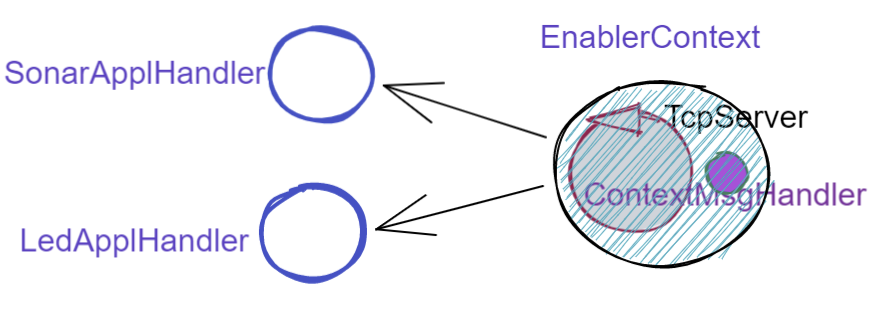

.. role:: red 
.. role:: blue 
.. role:: remark
  
.. _tuProlog: https://apice.unibo.it/xwiki/bin/view/Tuprolog/

==================================================
Contesti-contenitori
==================================================

Nella versione attuale, ogni :ref:`enable<EnablerAsServer>` attiva un ``TCPServer`` su una propria porta.

.. image::  ./_static/img/Radar/EnablersLedSonar.PNG
  :align: center 
  :width: 70%

Una ottimizzazione delle risorse può essere ottenuta introducendo :blue:`un solo TCPServer` per ogni nodo
computazionale. 

----------------------------------------------
Analisi del concetto di Contesto
----------------------------------------------

Introdurre un solo server per nodo computazionale significa introdurre un componente con due responabilità
principali:

- permettere che 'client' allocati su altri nodi computazionali possano inviare messaggi al nodo e gestire 
  tali messaggi a 'livello di sistema';
- fungere da contenitore di componenti  capaci di gestire i messaggi a livello applicativo.

D'ora in poi denomineremo col termone generico ``Contesto`` un componente di questo tipo, lasciando
indeterminata la sua natura.

Tuttavia, in questa fase dello sviluppo, è opportuno realizzare la nuova idea riusando il software sviluppato 
negli SPRINT precedenti. In questa prospettiva:

- il contesto potrà essere implementato da una classe (denominata :ref:`TcpContextServer<TcpContextServer>`) che specializza
  la classe  :ref:`TcpServer<TcpServer>`;
- componenti applicativi gestori dei messaggi potrano essere definiti da classi che specializzano la classe 
  :ref:`ApplMsgHandler<ApplMsgHandler>`  e implementano :ref:`IApplMsgHandler`;
- la 'businnss logic' del contesto consiste nel reindirizzare un messaggio ricevuto ad uno specificato
  componente applicativo (come :ref:`LedApplHandler` e :ref:`SonarApplHandler`) può essere delegata 
  a un oggetto di tipo :ref:`IApplMsgHandler` (si veda :ref:`ContextMsgHandler`) che funhe da 
  contenitore di componenti e da gestore  a 'livello di sistema' dei messaggi.

In questo quadro:

:remark:`il ContextMsgHandler deve sapere a quale componente è destinato un messaggio`

Occorre quindi superare l'idea che un messaggio sia una String interpretabile dal
solo dal livello applicativo (si veda :ref:`Interpreti`).

Più specificatamente, occorre definire una estensione sulla struttura dei messaggi, 
che ci darà  anche uno 
:blue:`standard interno` sulla struttura delle informazioni scambiate via rete:

Parti di questa estensione dovranno essere interpretate dal :ref:`ContextMsgHandler`,
che svolge il ruolo di un 'interprete di sistema'  che implementa l'operazione
``elaborate(String message)`` effettuando il voluto reindirizzamento del messaggio
a uno dei componenti applicativi memorizzati.
 

.. _msgApplicativi:

-------------------------------------------------------
Struttura dei messaggi applicativi
-------------------------------------------------------

Introduciamo dunque una  estensione sulla struttura dei messaggi, che ci darà d'ora in poi anche uno 
:blue:`standard interno` sulla struttura delle informazioni scambiate via rete:

 .. code:: java

    msg( MSGID, MSGTYPE, SENDER, RECEIVER, CONTENT, SEQNUM )

  - MSGID:    identificativo del messaggio
  - MSGTYPE:  tipo del msg (Dispatch, Invitation,Request,Reply,Event)  
  - SENDER:   nome del componente che invia il messaggio
  - CONTENT:  contenuto applicativo (payload) del messaggio 
  - RECEIVER: nome del componente chi riceve il messaggio 
  - SEQNUM:   numero di sequenza del messaggio

I messaggi scambiati sono logicamente suddivisi in diverse categorie:

.. list-table:: 
  :widths: 70,30
  :width: 100%

  * - - :blue:`dispatch`: un messaggio inviato a un preciso destinatario senza attesa  di una risposta 
        (in modo detto anche  `fire-and-forget`);
      - :blue:`invitation`: un messaggio inviato a un preciso destinatario aspettandosi un 'ack' da parte di questi;
      - :blue:`request`: un messaggio inviato a un preciso destinatario aspettandosi da parte di questi una 
        :blue:`response/reply` logicamente correlata alla richiesta;
      - :blue:`event`: un messaggio inviato a chiunque sia in grado di elaborarlo.

    - .. image:: ./_static/img/Architectures/legendMessages.PNG
        :align: center
        :width: 80%

.. code:: java

  enum ApplMessageType{
      event, dispatch, request, reply, invitation
  }   
   

.. _ApplMessage:

++++++++++++++++++++++++++++++++++++++++++++++++
La classe ApplMessage
++++++++++++++++++++++++++++++++++++++++++++++++

La classe ``ApplMessage`` fornisce metodi per la costruzione e la gestione di messaggi organizzati
nel modo descritto. La classe si avvale del supporto del tuProlog_.

 .. code:: java

   public class ApplMessage {
    protected String msgId       = "";
    protected String msgType     = null;
    protected String msgSender   = "";
    protected String msgReceiver = "";
    protected String msgContent  = "";
    protected int msgNum         = 0;
    public ApplMessage( String MSGID, String MSGTYPE, String SENDER, 
          String RECEIVER, String CONTENT, String SEQNUM ) {
      ...
    }
    public ApplMessage( String msg ) {
      Struct msgStruct = (Struct) Term.createTerm(msg);
      setFields(msgStruct);
    }  
    public String msgId() {   return msgId; }
    public String msgType() { return msgType; }
    public String msgSender() { return msgSender; }
    public String msgReceiver() { return msgReceiver;  }
    public String msgContent() { return msgContent;  }
    public String msgNum() { return "" + msgNum; }
    public boolean isEvent(){ 
      return msgType == ApplMessageType.event.toString(); }
    ...
    public String toString() { ... }
  }

.. _IApplMsgHandlerEsteso:

-----------------------------------------------------------------------
Estensione della interfaccia :ref:`IApplMsgHandler<IApplMsgHandler>`
-----------------------------------------------------------------------

In relazione alla nuova esigenza, provvediamo ad estendere il contratto relativo ai gestori dei messaggi di
livello applicativo, in modo da gestire anche messaggi di tipo :ref:`ApplMessage`.

.. code:: Java

  public interface IApplMsgHandler {
    ...
    public void elaborate( ApplMessage message, Interaction2021 conn ); 
  }

Di conseguenza, introduciamo nella classe astratta :ref:`ApplMsgHandler<ApplMsgHandler>`  
un nuovo metodo ``abstract  elaborate( ApplMessage message, Interaction2021 conn )`` 
che dovrà essere definto dalle classi specializzate.

.. _IApplIntepreterEsteso:

-------------------------------------------------------------------------------
Estensione della interfaccia :ref:`IApplIntepreter<IApplIntepreterNoCtx>`
-------------------------------------------------------------------------------

In modo analogo estendiamo il contratto relativo alla interpretazione dei messaggi:

.. code:: java

  public interface IApplIntepreter {
    ...
    public String elaborate( ApplMessage message );    
  }

D'ora in poi il meotodo ``elaborate`` con argomento di tipo ``ApplMessage`` diventerà il metodo di riferimento
per la gestione dei messaggi. In altre parole, tutte le nostre applicazioni distribuite 
invieranno messaggi della forma:

 .. code:: java

    msg( MSGID, MSGTYPE, SENDER, RECEIVER, CONTENT, SEQNUM )

.. _TcpContextServer:

-------------------------------------------------------
Il TcpContextServer
-------------------------------------------------------

Il ``TcpContextServer`` è una specializzazione del :ref:`TcpServer<TcpServer>` che lega il campo ``userDefHandler`` 
a un gestore di messaggi (il `ContextMsgHandler`_ ) che ha il compito
di reindirizzare il messaggio ricevuto di forma ``msg( MSGID, MSGTYPE, SENDER, RECEIVER, CONTENT, SEQNUM )``
al gestore applicativo, sulla base dell'attributo  ``RECEIVER``.

.. image:: ./_static/img/Architectures/MessageHandlers.PNG
   :align: center 
   :width: 70%

Per ottenere questo scopo, il ``TcpContextServer``
definisce metodi per aggiungere al  (ed eliminare dal)  `ContextMsgHandler`_  oggetti di tipo :ref:`IApplMsgHandler<IApplMsgHandler>` 
che realizzano la gestione di livello applicativo dei messaggi di tipo `ApplMessage`_.

 
.. code:: java

  public class TcpContextServer extends TcpServer{
  private static boolean activated = false;
  private ContextMsgHandler ctxMsgHandler;
    public TcpContextServer(String name, int port ) {
      super(name, port, new ContextMsgHandler("ctxH"));
      this.ctxMsgHandler = (ContextMsgHandler) userDefHandler;
    } 
    public void addComponent( String name, IApplMsgHandler h) {
      ctxMsgHandler.addComponent(name,h);
    }
    public void removeComponent( String name ) {
      ctxMsgHandler.removeComponent(name );
    }
  }
 
.. _ContextMsgHandler:

-------------------------------------------------------
Il gestore di sistema dei messaggi
-------------------------------------------------------

Il gestore dei sistema dei messaggi attua il reindirizzamento (dispatching) consultando una mappa
interna che associa un :blue:`identificativo univoco` (il nome del destinatario) a un handler.

 .. code:: java

  public class ContextMsgHandler extends IApplMsgHandler{
  private HashMap<String,IApplMsgHandler> handlerMap = 
                           new HashMap<String,IApplMsgHandler>();
    public ContextMsgHandler(String name) { super(name); }
    @Override
    public void elaborate(String message,Interaction2021 conn) {
      //msg( MSGID, MSGTYPE, SENDER, RECEIVER, CONTENT, SEQNUM )
      try {
        ApplMessage msg  = new ApplMessage(message);
        elaborate( msg, conn );
      }catch(Exception e) { ...	}
    }
    @Override
    public void elaborate(ApplMessage msg,Interaction2021 conn) {
      String dest       = msg.msgReceiver();
      IApplMsgHandler h = handlerMap.get( dest );
      if( dest!=null && (! msg.isReply()) ) 
        h.elaborate(msg.msgContent(), conn);
    }
    public void addComponent( String name, IApplMsgHandler h) {
      handlerMap.put(name, h);
    }
    public void removeComponent( String name ) {
      handlerMap.remove( name );
    }
  }

.. image:: ./_static/img/Architectures/ContextServer.PNG
   :align: center 
   :width: 70%

I componenti di tipo :ref:`IApplMsgHandler<IApplMsgHandler>`:

- :remark:`sono gestori di messaggi`
- :remark:`acquisiscono dal contesto la capacità di comunicazione`
 
 
+++++++++++++++++++++++++++++++++++++++++++++++++++++
Verso gli attori 
+++++++++++++++++++++++++++++++++++++++++++++++++++++

I componenti di tipo :ref:`IApplMsgHandler<IApplMsgHandler>` potrebbero essere realizzati come 
enti attivi dotati di una coda di messaggi, denominati **attori**:

.. image:: ./_static/img/Architectures/ContestiEComponenti.PNG
   :align: center 
   :width: 80%

La trasformazione di un componente-gestore in attore sarà introdotta nella sezione :doc:`Attori`.