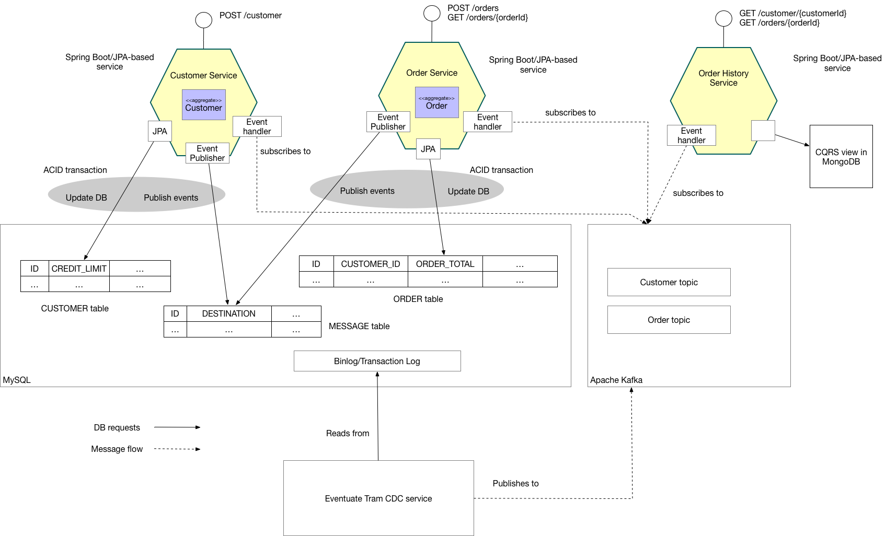
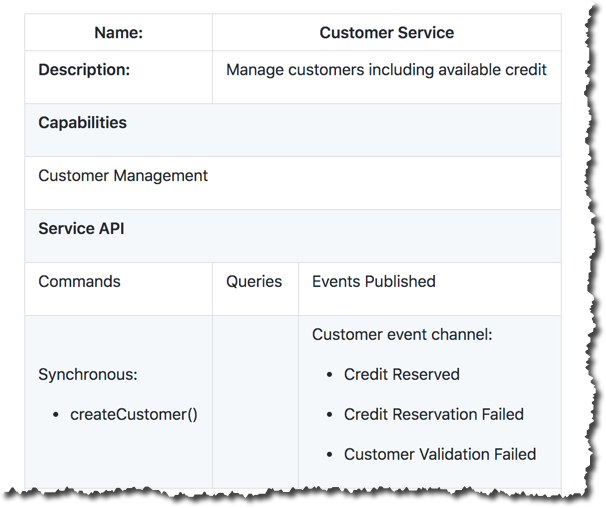
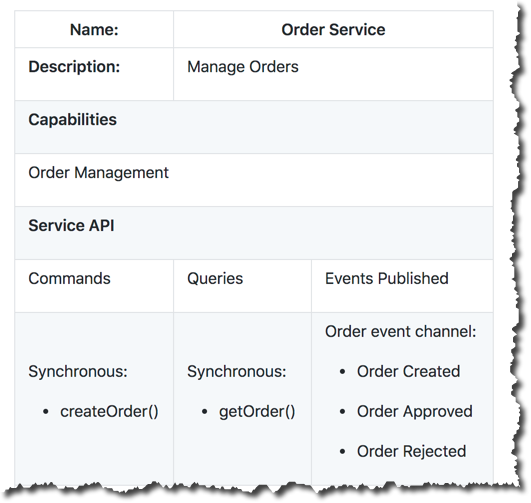
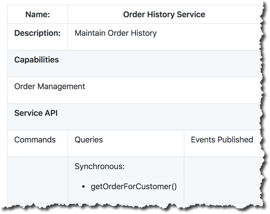

.. role:: red 
.. role:: blue 
.. role:: remark
.. role:: worktodo

=====================================
EventuateTram
=====================================

-----------------------------------------
Eventuate Tram Basic Examples
-----------------------------------------

https://github.com/eventuate-tram/eventuate-tram-core[Eventuate Tram] implements transactional messaging for microservices written using JDBC.
This project implements the examples shown in that project's https://github.com/eventuate-tram/eventuate-tram-core[README].

It consists of the following modules:

* `eventuate-tram-examples-common` - the examples for basic messaging, domain events and command/async reply
* `eventuate-tram-examples-in-memory` - runs the examples using in-memory stubs
* `eventuate-tram-examples-jdbc-kafka` - runs the examples using MySQL and Apache Kafka

++++++++++++++++++++++++++++++++++++++++++++++++++++++
About `eventuate-tram-examples-common`
++++++++++++++++++++++++++++++++++++++++++++++++++++++

This module defines the transactional messaging examples:

* Basic messaging
* Domain events
* Commands, which implement request/asynchronous response

You can run the examples using the tests in the `eventuate-tram-examples-in-memory` and `eventuate-tram-examples-jdbc-kafka` modules.

++++++++++++++++++++++++++++++++++++++++++++++++++++++++++++++++++++++++++++++
About `eventuate-tram-examples-in-memory` 
++++++++++++++++++++++++++++++++++++++++++++++++++++++++++++++++++++++++++++++
Running in-memory examples

This module executes the examples using `eventuate-tram-in-memory` module, which is extremely useful for writing fast running tests.

To run this version of the tests:

.. code::

   ./gradlew :eventuate-tram-examples-in-memory:test

+++++++++++++++++++++++++++++++++++++++++++++++++++++++++++++++++++++++++++++++++++++++++++++
About `eventuate-tram-examples-jdbc-kafka` 
+++++++++++++++++++++++++++++++++++++++++++++++++++++++++++++++++++++++++++++++++++++++++++++
Running examples with MySQL and Apache Kafka

This module executes the examples using MySQL and Apache Kafka.

%%%%%%%%%%%%%%%%%%%%%%%%%%%%%%%%%%%%%%%%%%%%
Set DOCKER_HOST_IP environment variable
%%%%%%%%%%%%%%%%%%%%%%%%%%%%%%%%%%%%%%%%%%%%

Before running MySQL and Apache Kafka using Docker Compose, you first need to set the `DOCKER_HOST_IP` environment variable.
This must be an IP address or resolvable hostname.
It cannot be `localhost` or `127.0.0.1`.
Please see this http://eventuate.io/docs/usingdocker.html[guide to setting `DOCKER_HOST_IP`] for more information.

%%%%%%%%%%%%%%%%%%%%%%%%%%%%%%%%%%%%%%%%%%%%
Run MySQL and Apache Kafka
%%%%%%%%%%%%%%%%%%%%%%%%%%%%%%%%%%%%%%%%%%%%

Once you have set `DOCKER_HOST_IP` you can then run MySQL and Apache Kafka using Docker Compose.

.. code::

    gradlew <database><mode>ComposeBuild
    gradlew <database><mode>ComposeUp
 
where <database><mode> one of

* mysqlbinlog
* postgrespolling
* postgreswal

%%%%%%%%%%%%%%%%%%%%%%%%%%%%%%%%%%%%%%%%%%%%
Run the tests
%%%%%%%%%%%%%%%%%%%%%%%%%%%%%%%%%%%%%%%%%%%%

Once the containers have started you can run the tests:

.. code::

  ./gradlew :eventuate-tram-examples-jdbc-kafka:test
 

%%%%%%%%%%%%%%%%%%%%%%%%%%%%%%%%%%%%%%%%%%%%
Inspect the database
%%%%%%%%%%%%%%%%%%%%%%%%%%%%%%%%%%%%%%%%%%%%

You can inspect the Eventuate Tram-related database tables:

.. code::
    $ ./mysql-cli.sh -it
    Welcome to the MySQL monitor.  Commands end with ; or \g.
 

    mysql> select * from message\G
    *************************** 1. row ***************************
            id: 00000168d96469db-acde480011220000
    destination: destination1549835461824
        headers: {"DESTINATION":"destination1549835461824","ID":"00000168d96469db-acde480011220000"}
        payload: Hello1549835461824
    published: 0

 
    mysql> select * from received_messages\G
    *************************** 1. row ***************************
    consumer_id: commandDispatcheId1549835467791
    message_id: 00000168d9647f65-acde480011220000
    *************************** 2. row ***************************

    mysql> quit
    Bye
 

%%%%%%%%%%%%%%%%%%%%%%%%%%%%%%%%%%%%%%%%%%%%
Clean up
%%%%%%%%%%%%%%%%%%%%%%%%%%%%%%%%%%%%%%%%%%%%

To clean up:

.. code::

   ./gradlew <database><mode>ComposeDown

+++++++++++++++++++++++++++++++++++++++++++++++++++++++++++++++++++++++++++++++++++++++++++++
For more information
+++++++++++++++++++++++++++++++++++++++++++++++++++++++++++++++++++++++++++++++++++++++++++++

Please read the http://eventuate.io/tram/gettingstarted.html[Eventuate Tram getting started guide] or look at the http://eventuate.io/exampleapps.html[examples].

-----------------------------------------
Eventuate Tram Customers and Orders
-----------------------------------------

 

This application demonstrates two key patterns:

* http://microservices.io/patterns/data/saga.html[Sagas] - implement transactions that span services
* http://microservices.io/patterns/data/cqrs.html[CQRS] - implement queries that retrieve data from multiple services.

The application consists of three services:

* `Order Service` - manages orders
* `Customer Service` - manages customers
* `Order History Service` - maintains the order history

All services are implemented using Spring Boot, JPA and the 
https://github.com/eventuate-tram/eventuate-tram-core[Eventuate Tram framework], 
which provides transactional publish/subscribe.

The `Order Service` uses a choreography-based saga to enforce the customer's credit limit when creating orders.

The `Order History Service` implements a CQRS view and subscribes to domain events published by the `Order Service` 
and `Customer Service`

+++++++++++++++++++++++++++++++++++
About Sagas
+++++++++++++++++++++++++++++++++++

http://microservices.io/patterns/data/saga.html[Sagas] are a mechanism for maintaining data consistency 
in a http://microservices.io/patterns/microservices.html[microservice architecture].
A saga is a sequence of transactions, each of which is local to a service.

There are two main ways to coordinate sagas: orchestration and choreography.
This example uses choreography-based sagas, which use domain events for coordination.
Each step of a saga updates the local database and publishes a domain event.
The domain event is processed by an event handler, which performs the next local transaction.

To learn more about why you need sagas if you are using microservices:

* Look at the https://github.com/eventuate-tram/eventuate-tram-sagas-examples-customers-and-orders[Orchestration-based saga example]
* Read the http://microservices.io/patterns/data/saga.html[Saga pattern]
* Look at https://microservices.io/microservices/general/2019/04/28/asynchronous-microservices.html[MicroCPH 2019 presentation]
* Read about sagas in my https://microservices.io/book[Microservices patterns book]

%%%%%%%%%%%%%%%%%%%%%%%%%%%%%%%%%%%%%%%%%
The Create Order saga
%%%%%%%%%%%%%%%%%%%%%%%%%%%%%%%%%%%%%%%%%

The saga for creating an `Order` consists of the follow steps:

1. The Order Service creates an `Order` in a `PENDING` state and publishes an `OrderCreated` event
2. The `Customer Service` receives the event attempts to reserve credit for that `Order`. It publishes either a `Credit Reserved` event or a `CreditLimitExceeded` event.
3. The `Order Service` receives the event and changes the state of the order to either `APPROVED` or `REJECTED`.

+++++++++++++++++++++++++++++++++++++++++++++++++++++++++++++
About Command Query Responsibility Segregation (CQRS)
+++++++++++++++++++++++++++++++++++++++++++++++++++++++++++++

The http://microservices.io/patterns/data/cqrs.html[CQRS pattern] implements queries that retrieves data from multiple services.
It maintains a queryable replica of the data by subscribing to domain events published by the services that own the data.

In this example, the `Order History Service`  maintains a CQRS view in MongoDB by subscribing to domain events published by the `Order Service` and `Customer Service`.
The CQRS view stores each customer as a MongoDB document that contains information the customer and their orders.

To learn more about why you need CQRS if you are using microservices:

* Read the http://microservices.io/patterns/data/cqrs.html[CQRS pattern]
* Look at https://microservices.io/microservices/general/2019/04/28/asynchronous-microservices.html[GOTO Chicago 2019 presentation]
* Read about CQRS in my https://microservices.io/book[Microservices patterns book]

+++++++++++++++++++++++++++++++++++++++++++++++++++++++++++++
Transactional messaging with Eventuate Tram
+++++++++++++++++++++++++++++++++++++++++++++++++++++++++++++

The services uses the https://github.com/eventuate-tram/eventuate-tram-core[Eventuate Tram framework] to communicate asynchronously using events.
The flow for publishing a domain event using Eventuate Tram is as follows:

1. Eventuate Tram inserts events into the `MESSAGE` table as part of the ACID transaction that updates the JPA entity.
2. The Eventuate Tram CDC service tracks inserts into the `MESSAGE` table using the MySQL binlog (or Postgres WAL) and publishes messages to Apache Kafka.
3. A service subscribes to the events, updates its database, and possibly publishes more events.

+++++++++++++++++++++++++++++++++++++++++++++++++++++++++++++
E Architecture
+++++++++++++++++++++++++++++++++++++++++++++++++++++++++++++

The following diagram shows the architecture of the Customers and Orders application.

The application consists of three services: `Customer Service`, `Order Service`, and `Order History Service`

%%%%%%%%%%%%%%%%%%%%%%%%%%%%%%%%%%%%%%%%%
Customer Service
%%%%%%%%%%%%%%%%%%%%%%%%%%%%%%%%%%%%%%%%%

The `Customer Service` implements a REST API for managing customers.
The service persists the `Customer` JPA entity in a MySQL/MsSQL/Postgres database.
Using `Eventuate Tram`, it publishes `Customer` domain events that are consumed by the `Order Service`.

For more information, see the link:./customer-service-canvas.adoc[microservice canvas for the `Customer Service`].

 

%%%%%%%%%%%%%%%%%%%%%%%%%%%%%%%%%%%%%%%%%
Order Service
%%%%%%%%%%%%%%%%%%%%%%%%%%%%%%%%%%%%%%%%%

The `Order Service` implements REST API for managing orders.
The service persists the `Order` JPA entity in MySQL/MsSQL/Postgres database.
Using `Eventuate Tram`, it publishes `Order` domain events that are consumed by the `Customer Service`.

For more information, see the link:./order-service-canvas.adoc[microservice canvas for the `Order Service`].

   
 

%%%%%%%%%%%%%%%%%%%%%%%%%%%%%%%%%%%%%%%%%
Order History Service
%%%%%%%%%%%%%%%%%%%%%%%%%%%%%%%%%%%%%%%%%

The `Order History Service` implements REST API for querying a customer's order history
This service subscribes to events published by the `Order Service` and `Customer Service` and updates a MongoDB-based CQRS view.

For more information, see the link:./order-history-service-canvas.adoc[microservice canvas for the `Order History Service`].

 

+++++++++++++++++++++++++++++++++++++++++++++++++++++++++++++
E Building and running
+++++++++++++++++++++++++++++++++++++++++++++++++++++++++++++

Note: you do not need to install Gradle since it will be downloaded automatically.
You just need to have Java 8 installed.

First, build the application

.. code::

    ./gradlew assemble
 

Next, launch the services using https://docs.docker.com/compose/[Docker Compose]:

.. code::

  ./gradlew mysqlbinlogComposeBuild mysqlbinlogComposeUp

Note:

If the containers aren't accessible via `localhost` - e.g. you are using Docker Toolbox, 
you will have to use `${DOCKER_HOST_IP}` instead of localhost.
See this http://eventuate.io/docs/usingdocker.html[guide to setting `DOCKER_HOST_IP`] for more information.

You can also run the MsSQL version using `./gradlew mssqlpollingComposeUp` or Postgres version 
using `./gradlew postgreswalComposeUp`

+++++++++++++++++++++++++++++++++++++++++++++++++++++++++++++
E Using the application
+++++++++++++++++++++++++++++++++++++++++++++++++++++++++++++

Once the application has started, you can use the application via the Swagger UI:

* `Customer Service` - `http://localhost:8082/swagger-ui/index.html`
* `Order Service` - `http://localhost:8081/swagger-ui/index.html`
* `Order History Service` - `http://localhost:8083/swagger-ui/index.html`

You can also use `curl` to interact with the services.
First, let's create a customer:

.. code::

    bash
    $ curl -X POST --header "Content-Type: application/json" -d '{
    "creditLimit": {
        "amount": 5
    },
    "name": "Jane Doe"
    }' http://localhost:8082/customers

    HTTP/1.1 200
    Content-Type: application/json;charset=UTF-8

    {
    "customerId": 1
    }
 

Next, create an order:

.. code::
    
    bash
    $ curl -X POST --header "Content-Type: application/json" -d '{
    "customerId": 1,
    "orderTotal": {
        "amount": 4
    }
    }' http://localhost:8081/orders

    HTTP/1.1 200
    Content-Type: application/json;charset=UTF-8

    {
    "orderId": 1
    }

 

Next, check the status of the `Order` in the `Order Service`:

.. code::
    
    bash
    $ curl -X GET http://localhost:8081/orders/1

    HTTP/1.1 200
    Content-Type: application/json;charset=UTF-8

    {
    "orderId": 1,
    "orderState": "APPROVED"
    }
 

Finally, look at the customer's order history in the `Order History Service`:

.. code::

    bash
    $ curl -X GET --header "Accept: */*" "http://localhost:8083/customers/1"

    HTTP/1.1 200
    Content-Type: application/json;charset=UTF-8

    {
    "id": 1,
    "orders": {
        "1": {
        "state": "APPROVED",
        "orderTotal": {
            "amount": 4
        }
        }
    },
    "name": "Chris",
    "creditLimit": {
        "amount": 100
    }
    }
 
+++++++++++++++++++++++++++++++++++++++++++++++++++++++++++++
E Got questions?
+++++++++++++++++++++++++++++++++++++++++++++++++++++++++++++

Don't hesitate to create an issue or see

* https://groups.google.com/d/forum/eventuate-users[Mailing list]
* https://join.slack.com/t/eventuate-users/shared_invite/enQtNTM4NjE0OTMzMDQ3LTc3ZjYzYjYxOGViNTdjMThkZmVmNWQzZWMwZmQyYzhjNjQ4OTE4YzJiYTE2NDdlOTljMDFlMDlkYTI2OWU1NTk[Slack Workspace]
* http://eventuate.io/contact.html[Contact us].
