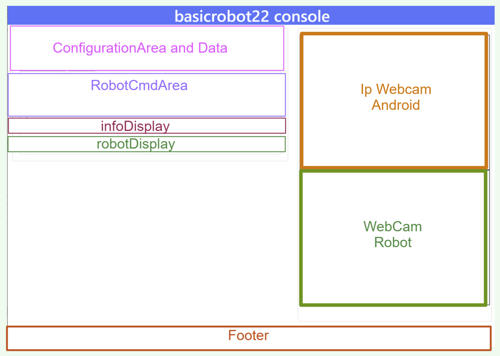
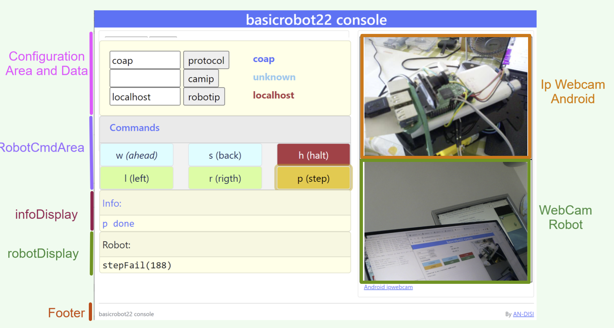

.. role:: red 
.. role:: brown
.. role:: blue 
.. role:: green
.. role:: remark
.. role:: worktodo  

.. _SpringBoot: https://spring.io/projects/spring-boot
.. _User experience design: https://it.wikipedia.org/wiki/User_experience_design

.. _IPWebcam:  https://play.google.com/store/apps/details?id=nfo.webcam&hl=it&gl=US
.. _Thymeleaf: https://www.thymeleaf.org/doc/tutorials/3.0/usingthymeleaf.html
.. _ThymeleafSyntax: https://www.thymeleaf.org/doc/articles/standardurlsyntax.html

.. _FormHTML: https://www.w3schools.com/html/html_forms.asp
.. _InputHTML: https://www.w3schools.com/tags/tag_input.asp

.. _bannerOnline: https://manytools.org/hacker-tools/ascii-banner/
.. _Bootstrap4: https://www.w3schools.com/bootstrap4/bootstrap_get_started.asp
.. _Bootstrap5: https://www.w3schools.com/bootstrap5/
.. _Containers: https://getbootstrap.com/docs/5.0/layout/containers/
 
.. _Grids: https://www.w3schools.com/bootstrap5/bootstrap_grid_basic.php
.. _Cards: https://www.w3schools.com/bootstrap5/bootstrap_cards.php
.. _Colors: https://getbootstrap.com/docs/4.0/utilities/colors/
.. _Spacing: https://getbootstrap.com/docs/5.0/utilities/spacing/
.. _Toasts: https://www.w3schools.com/bootstrap5/bootstrap_toast.php

.. _jsdelivr: https://www.jsdelivr.com/
.. _WebJars: https://mvnrepository.com/artifact/org.webjars
.. _WebJarsExplained: https://www.baeldung.com/maven-webjars 
.. _WebJarsDocs: https://getbootstrap.com/docs/5.1/getting-started/introduction/
.. _WebJarsExamples: https://getbootstrap.com/docs/5.1/examples/
.. _WebJarsContainer: https://getbootstrap.com/docs/5.1/layout/containers/
.. _Heart-beating: https://stomp.github.io/stomp-specification-1.2.html#Heart-beating

.. _basicrobot22Gui.html: ../../../../../webRobot22/src/main/resources/templates/basicrobot22Gui.html
.. _issSpec.css: ../../../../../webRobot22/src/main/resources/static/css/issSpec.css
.. _application.properties: ../../../../../webRobot22/src/main/resources/application.properties
 

========================================
webrobot22
========================================

Lo scopo di questo lavoro è usare `SpringBoot`_  per costruire una applicazione Web che fornisca una console di comando
per  il  :ref:`BasicRobot22<Una prima architettura>`.

Procederemo in due passi:

#. Come primo passo, costruiremo la *'parte statica'* dell'applicazione che riguarda la impostazione della pagina HTML.
#. Come secondo passo, costruiremo la *'parte dinamica'* che permette all'applicazione Web di interagire da un lato 
   con utente umano (attraverso un Browser e da un altro lato con l':ref:`attore Qak<QActor (meta)model>` 
   che realizza il  :ref:`bascirobot22<Impostazione del modello>`.

  .. image::  ./_static/img/Robot22/webRobot22ComeSistDistr.PNG
    :align: center 
    :width: 40%

 

:brown:`Creazione del progetto`

#. Iniziamo il **progetto webrobot22** :ref:`webrobot22: startup`

:brown:`Parte statica`

#. :ref:`Usiamo Bootstrap5` per impostare la pagina usando `Bootstrap5`_
#. :ref:`Visualizziamo la pagina statica`, come primo passo di un processo di `User experience design`_.

:brown:`Parte dinamica` 

#. Impostiamo l'organizzazione di un :ref:`RobotController` lato seerver.
#. :green:`PgToRc`: Realizziamo l'interazione sincrona :blue:`Pagina-RobotController`  via HTTP
#. :green:`RcToBr`: Realizziamo l'interazione :blue:`RobotController-basicrobot22` usando un protocollo specificato dall'utente.  
#. :green:`BrToRc`: Realizziamo l'interazione :blue:`basicrobot22-RobotController` per far giungere alla applicazione Web informazioni 
   sullo stato del sistema.
#. :green:`RcToPg`: Realizziamo l'interazione asincrona :blue:`RobotController-Pagina` per visualizzare sulla pagina HTML 
   le informazioni sullo stato del sistema. (Direttamente o con la mediazione del :ref:`RobotController`)

   .. image::  ./_static/img/Robot22/webRobot22Interactions.PNG
     :align: center 
     :width: 60%

-----------------------------------------------------------
webrobot22: startup
-----------------------------------------------------------

#. Costruiamo il file ``webRobot22.zip`` in accordo a :ref:`Primi passi con SpringBoot`.
  
 
  .. image::  ./_static/img/Robot22/webRobot22Springio.PNG
    :align: center 
    :width: 50%

#. Scompattiamo il file ``webRobot22.zip``  nella nostra cartella di lavoro.
#. Modifichiamo   ``7.4.1`` in ``7.4.2`` nel file ``webRobot22\gradle\wrapper\gradle-wrapper.properties``
#. Aggiungiamo il file ``gradle.properties`` con il contenuto:

   .. code::

       kotlinVersion = 1.6.0

#. Aggiungiamo il file ``banner.txt`` in ``src\main\resources\`` usando `bannerOnline`_ (*small* font)
#. Nel file  ``application.properties`` di ``src\main\resources\`` inseriamo:

   .. code::

       spring.application.name = webRobot22
       spring.banner.location  = classpath:banner.txt
       server.port             = 8085      

+++++++++++++++++++++++++++++++++++++++++
Enable SpringBoot live DevTools
+++++++++++++++++++++++++++++++++++++++++

settings(ctrl +alt+s) -> Build,Execution,Deployment -> compiler, check "Build project automatically"
Enable option 'allow auto-make to start even if developed application is currently running' in 
Settings -> Advanced Settings under compiler

++++++++++++++++++++++++++++++++++++++
build.gradle di webRobot22 
++++++++++++++++++++++++++++++++++++++

- Aggiorniamo ``build.gradle``:
 
  .. code::

    plugins {
        ...
        id 'application'
    }     

    version = '1.0'
    sourceCompatibility = '11'

    repositories {
        mavenCentral()
        flatDir {   dirs '../unibolibs'	 }
    }
    dependencies {
        ...
        //Libreria Kotlin-runtime
        implementation 'org.jetbrains.kotlin:kotlin-stdlib-jdk8'

        //Per comunicazioni WebSocket NOSTOMP della pagina HTML
        implementation("org.springframework:spring-websocket:5.3.14")

        //webjars
        implementation 'org.webjars:webjars-locator-core'
        implementation 'org.webjars:bootstrap:5.1.3'
        implementation 'org.webjars:jquery:3.6.0'

        /* UNIBO ********************************** */
        implementation name: 'uniboInterfaces'
        implementation name: '2p301'
        implementation name: 'it.unibo.qakactor-2.7'
        implementation name: 'unibonoawtsupports'  //required by the old infrastructure
        implementation name: 'unibo.actor22-1.1'   //using actor22comm in ConnQakBase
    }
    mainClassName = 'unibo.webRobot22.WebRobot22Application'
    jar {
        println("executing jar")
        from sourceSets.main.allSource
        manifest {
            attributes 'Main-Class': "$mainClassName"
        }
    }
 

I `WebJars`_ sono stati introdotti in :ref:`Bootstrap e webJars`.

-----------------------------------------------------------
basicrobot22Gui.html
-----------------------------------------------------------

Avvalendoci di `Bootstrap5`_, impostiamo una pagina HTML (nel file `basicrobot22Gui.html`_ in ``src/main/resources/templates``) 
in modo che presenti le aree mostrate in figura:

- :ref:`ConfigurationArea and Data`: area che include campi di input per la configurazione del sistema 
  e campi di output che mostrano i valori dei dati di configurazione fissati dall'utente.
- :ref:`RobotCmdArea`: area di input con pulsanti per inviare comandi di movimento al robot.
- :ref:`infoDisplay`: area di output  che visualizza informazioni di sistema.
- :ref:`robotDisplay`: area di output  che visualizza informazioni relative al robot o al suo ambiente.
- :ref:`Ip Webcam Android<WebcamArea>`: area di output  che visualizza lo stream prodotto da un telecamera posta su Android (ad esempio `IpWebcam`_) o su PC.
  Viene introdotta per chi non abbia un robot fisico dotato di telecamera.
- :ref:`WebCam robot<WebcamArea>`: area di output che visualizza lo stream prodotto da un telecamera posta sul robot fisico.

Avvalendo di `Thymeleaf`_,  impostiamo la pagina come un template che presenta alcuni campi 
(*protocol, robotip, webcamip*) 
che corrispondo a quanto definito nella :ref:`Specifica dei dati applicativi`, i cui valori verranno fissati 
dal :ref:`RobotController` nella fase di costruzione della pagina (si veda :ref:`buildThePage`).

+++++++++++++++++++++++++++++++
Usiamo Bootstrap5
+++++++++++++++++++++++++++++++

Abilitiamo l'uso di `Bootstrap5`_, nella sezione ``head`` del file `basicrobot22Gui.html`_ e poi impostiamo la struttura 
del contenuto della pagina:

.. code::

   <head>
    <meta charset="UTF-8">
    <meta name="viewport" content="width=device-width, initial-scale=1.0"> 
    <title>basicrobot22Gui</title>
    <link href=
    "https://cdn.jsdelivr.net/npm/bootstrap@5.1.3/dist/css/bootstrap.min.css" rel="stylesheet">
    
    <link rel="stylesheet" href="css/issSpec.css">     <!-- stili custom -->
    <link rel=
    "shortcut icon" href="images/mbotIot.png" type="image/x-icon"> <!-- ICONA su browser -->
    </head>

+++++++++++++++++++++++++++++++
Contenuto della pagina
+++++++++++++++++++++++++++++++

La pagina viene suddivisa in due `Containers`_ di tipo *fluid*, uno per il titolo e uno per il contenuto vero e proprio.

.. code::

    <body>
        
  
            <h1>basicrobot22 console</h1>
        

    
        

            <!-- Contenuto della pagina -->
        
  

        <footer>
            <!-- FOOTER -->
        </footer>
    </body>

Il contenuto della pagina viene organizzato entro una riga (di ``12`` colonne, come indicato in `Grids`_ ) 
che contiene due colonne: la colonna di sinistra (di ampiezza ``7``) 
è riservata alla area di Input/Output, mentre la  la colonna di destra (di ampiezza ``5``)  è dedicata
alla visualizzazione degli stream di dati delle telecamere.

.. code::

    <!-- Contenuto della pagina -->
    
 <!-- Page main row -->
        
  <!-- I/O area col  -->
             <!-- CONFIGURATION Area and Data   -->
             <!-- ROBOTCmdArea                  -->
             <!-- INFO display                  -->
             <!-- ROBOT display                 -->
        

        
  <!-- Webcam area col  -->
            <!-- IPWebcam Android  -->
            <!-- Webcam robot      -->
        

    
 <!-- Page main row -->

%%%%%%%%%%%%%%%%%%%%%%%%%%%%%%%%%%%%
Schema delle aree di I/O
%%%%%%%%%%%%%%%%%%%%%%%%%%%%%%%%%%%%

Le aree entro le colonne sono organizzate usando le  `Cards`_ secondo lo schema:

.. code::

      

          
 ... 
  
          

               <!-- CARDCONTENT -->
          

      

Per le specifiche del tipo ``px-N``, si veda `Spacing`_.

Per i colori del testo (``TEXTCOLOR``) faremo riferimento agli standard `Colors`_, mentre 
per lo stile di background (``BGSTYLE``) faremo riferimento a definizioni custom.

%%%%%%%%%%%%%%%%%%%%%%%%%%%%%%%%%%%%
Stili custom: issSpec.css
%%%%%%%%%%%%%%%%%%%%%%%%%%%%%%%%%%%%

La specifica degli stili custom si trova nel file `issSpec.css`_.
Tutte le definizioni iniziano con il prefisso :brown:`iss-`.

+++++++++++++++++++++++++++++++
WebcamArea
+++++++++++++++++++++++++++++++

Riportiamo la specifica della colonna relativa all'area di output che visualizza 
gli stream (``Ip Webcam Android`` e ``WebCam robot``) prodotti dalle telecamere.

Per la visualizzazione, sfrutteremo la specifica *Protocol-relative-URL* (``th:src``) di `ThymeleafSyntax`_.

.. code::

  
  <!-- webcam col -->
    

     

      

         
      

       

         
      

     
 <!-- card body -->
     
 <!-- card -->
   
<!-- webcam col -->

-  Il simbolo :brown:`webcamip` denota un campo del Model che viene fissato dal :ref:`RobotController` al valore immesso 
   dall'utente nella :ref:`AREA WEBCAM Android`   della sezione :ref:`ConfigurationArea and Data`.
-  Il simbolo :brown:`robotip` denota un campo del Model che viene fissato dal :ref:`RobotController` al valore immesso 
   dall'utente nella :ref:`AREA ROBOT ADDRESS`   della sezione :ref:`ConfigurationArea and Data`.

 

Quando l'utente immette un dato nella form di input e lo invia al server, il :ref:`RobotController`
memorizza il dato e lo ritrasmetta alla pagina aggtionando il modello con ``setConfigParams``, come
indicato in :ref:`Interazione PgToRc (Pagina-RobotController)`.

+++++++++++++++++++++++++++++++
ConfigurationArea and Data
+++++++++++++++++++++++++++++++

La parte :blue:`CONFIGURATION Area and Data` del :ref:`Contenuto della pagina`  viene organizzata come una *card* suddivisa 
in aree:

.. code::

  <!-- CONFIGURATION Area and Data   -->
   
   
     

        <!-- AREA PROTOCOL       --> 
        <!-- AREA WEBCAM Android -->
        <!-- AREA ROBOT ADDRESS  -->
    

   

%%%%%%%%%%%%%%%%%%%%%%%%%%%%%%%%%%%%%%%%%%%
Struttura generale delle aree di I/O
%%%%%%%%%%%%%%%%%%%%%%%%%%%%%%%%%%%%%%%%%%%

.. code::

     <!-- AREA ...         --> 
     
 
      

        <!--   InputArea   -->
         ...
      
      
      

        <!--   DataArea      -->
        ...
      

     
 <!-- row -->

- Le aree di input sono espresse mediante   `FormHTML`_ con campi `InputHTML`_.

&&&&&&&&&&&&&&&&&&&&&&&&&&&&&&&&&&&
Specifica dei dati applicativi
&&&&&&&&&&&&&&&&&&&&&&&&&&&&&&&&&&&

- Il file `application.properties`_ definisce i valori iniziali dei campi di input che vengono visualizzati nella
  pagina.

  .. code::

    robot22.protocol   = coap
    robot22.robotip    = not connected
    robot22.webcamip   = unknown

- I dati sono visualizzati in campi con identificatori referenziabili nel :ref:`RobotController` mediante  
  **Model**, come indicato in   :ref:`Interazione PgToRc (Pagina-RobotController)`.

Vediamo nel dettaglio le parti di Input/Output per la configurazione del sistema.

%%%%%%%%%%%%%%%%%%%%%%%%%%%%%%%%%%%
AREA PROTOCOL
%%%%%%%%%%%%%%%%%%%%%%%%%%%%%%%%%%%

.. code::
 
      <!--   PROTOCOL InputArea   -->
      <form action="setprotocol" method="post">
        <input type="text" size="10" id="protocolspec" name="protocol" value="coap">
        <input type="submit" value="protocol">
       </form>
 
      <!--   PROTOCOL DataArea      -->
        <b>tcp</b>
 

%%%%%%%%%%%%%%%%%%%%%%%%%%%%%%%%%%%
AREA WEBCAM Android
%%%%%%%%%%%%%%%%%%%%%%%%%%%%%%%%%%%

.. code::
  
    <!--WEBCAM Android InputArea  --> 
      <form action="setwebcamip" method="post">
         <input type="text" size="10" id="webcamspec" name="ipaddr" value="">
         <input type="submit" value="camip">
      </form>

    <!--WEBCAM Android DataArea  --> 
      <b>unknown</b>

Il valore immesso dall'utente viene inviato via ``HTTP-POST`` al :ref:`RobotController` che lo 
gestisce col metodo :ref:`setwebcamip` memorizzando nel Model (si veda :ref:`setConfigParams`) e di qui, via `Thymeleaf`_,  
nel parametro ``webcamip``  del template della pagina (si veda :ref:`buildThePage`).

%%%%%%%%%%%%%%%%%%%%%%%%%%%%%%%%%%%
AREA ROBOT ADDRESS
%%%%%%%%%%%%%%%%%%%%%%%%%%%%%%%%%%%

.. code::
  
    <!-- ROBOT ADDRESS InputArea --> 
      <form action="setrobotip" method="post">
        <input type="text" size="10" id="configurespec" name="ipaddr" value="localhost">
        <input type="submit" value="robotip">
      </form>    

    <!-- ROBOT ADDRESS DataArea  --> 
       <b>not connected</b>

Il valore immesso dall'utente viene inviato via ``HTTP-POST`` al :ref:`RobotController` che lo 
gestisce col metodo :ref:`setrobotip` memorizzando nel Model (si veda :ref:`setConfigParams`) e di qui, via `Thymeleaf`_,  
nel parametro ``robotip``  del template della pagina (si veda :ref:`buildThePage`).

+++++++++++++++++++++++++++++++
RobotCmdArea
+++++++++++++++++++++++++++++++

Pulsanti per inviare a :ref:`RobotController` comandi per muovere il robot.

.. code::

      
 <!--  command card -->
         

          <h6>Commands</h6>
         

        
 <!--  pb-4 -->
         <!--  See https://getbootstrap.com/docs/4.1/components/buttons/ -->
         
  <!-- w,s,h commands row -->
           
<button class="btn btn-block iss-btn-ligthblue border" id='w'>w <i>(ahead)</i></button>
 <!--class='btn btn-block btn-light-primary font-bold border' -->
           
<button class='btn btn-block iss-btn-ligthblue  border' id='s'>s (back) </button>

           
<button class='btn btn-danger  btn-block border' id='h'>h (halt) </button>

          
 <!-- w,s,h commands row -->

         
 <!-- p,l,r commands row -->
             
<button class='btn btn-block iss-btn-ligthgreen border' id='l'>l (left)  </button>

             
<button class='btn btn-block iss-btn-ligthgreen border' id='r'>r (rigth) </button>

             
<button class='btn btn-warning btn-block border' id='p'>p (step) </button>

         
 <!-- p,l,r commands row -->
        
 <!-- command card-content -->
      
 <!--  command card -->

Il conando immesso dall'utente con uno *button* viene inviato via ``HTTP-POST`` al :ref:`RobotController` che lo 
gestisce col metodo :ref:`doMove`.

+++++++++++++++++++++++++++++++
cmdpageutils.js
+++++++++++++++++++++++++++++++

.. code::

  const webcamip = document.getElementById("webcamip");

+++++++++++++++++++++++++++++++
infoDisplay
+++++++++++++++++++++++++++++++

.. code::

  

    
Info:

    

        ...
    

  

- Identificatore ``display`` usato in ... todo

+++++++++++++++++++++++++++++++
robotDisplay
+++++++++++++++++++++++++++++++

.. code::

  

    
Robot:

      

        ...
    

  

- Identificatore ``robotDisplay`` usato in ... todo

+++++++++++++++++++++++++++++++
Pagina finale
+++++++++++++++++++++++++++++++

%%%%%%%%%%%%%%%%%%%%%%%%%%%%%%%%%%%
Visualizziamo la pagina statica 
%%%%%%%%%%%%%%%%%%%%%%%%%%%%%%%%%%%

Eseguo ``gradlew bootRun`` e apro un browser su ``localhost:8085``

-------------------------------------------
Parte dinamica
-------------------------------------------

Overview

  .. image::  ./_static/img/Robot22/webRobot22Arch.PNG
    :align: center 
    :width: 80%

#. Impostiamo l'organizzazione di un :ref:`RobotController` lato seerver.
#. Interazione HTTP :blue:`Page-RobotController` 

   - che esegue configurazine/comando e restituisce una pagina aggiornata con Model
   - cmdpageutils.js
#. Interazione :blue:`RobotController-basicrobot22`  

   - avviene usando protocol
   - request-response (step)
   - dispatch (w,s,r,l,h)
#. Interazione :blue:`basicrobot22-RobotController` 

   - avviene usando CoAP
   - ostacoli
   - si veda  basicrobot22 updateResource
#. Interazione asincrona :blue:`RobotController-Page` 
 
   - wsminimal.js
   - WebSocketHandler
   - WebSocketConfiguration

-----------------------------------------------------------
RobotController
-----------------------------------------------------------

Il Controller definisce i valori di alcune variabili locali, che comprendono gli attributi usati nel *Model*. 

Il **Model** utilizzato dal :ref:`RobotController` opera come un contenitore per dati applicativi, che vengono 
aggiornati, prima dell'invio della pagina di risposta, utilizzando il metodo :ref:`setConfigParams`.

.. code::

  @Controller 
  public class RobotController {
    protected String robotName  = "basicrobot";  
    protected String mainPage   = "basicrobot22Gui";

    //Settaggio di variabili relative ad attributi del modello
    @Value("${robot22.protocol}")
    String protocol;
    @Value("${robot22.webcamip}")
    String webcamip;
    @Value("${robot22.robotip}")
    String robotip;

    //Metodi di interazione ...
 
    @ExceptionHandler
    public ResponseEntity handle(Exception ex) { ... }
  }

- Il *Settaggio degli attributi del modello* avviene con riferimento alla :ref:`Specifica dei dati applicativi`.

++++++++++++++++++++++++++++++++++++++++++++++++++
Interazione PgToRc (Pagina-RobotController)
++++++++++++++++++++++++++++++++++++++++++++++++++

La interazione tra il Browser che contiene la pagina HTML e il Controller della Web application è relativa a richieste:

- di tipo :blue:`GET`, iniviata dal Browser all'inizio della connessione;
- di tipo :blue:`POST`, provenienti dalle parti di input della :ref:`ConfigurationArea and Data`.

.. code::
  
  //Metodi di interazione ...

    @GetMapping("/") 		 
    public String entry(Model viewmodel) {
      buildThePage(viewmodel);    
    }

    //Richieste di configurazione
    @PostMapping("/setprotocol")
    public String setprotocol(Model m,@RequestParam String protocol){...}
    
    @PostMapping("/setwebcamip")
    public String setwebcamip(Model m,@RequestParam String ipaddr){...}
    
    @PostMapping("/setrobotip")
    public String setrobotip(Model m,@RequestParam String ipaddr){...}

    //Comandi al robot
    @PostMapping("/robotmove"))
    public String doMove(Model m,@RequestParam String move ){...}
 

Al termine della elaborazione di ciascuna richiesta, il Controller risponde al Browser 
fornendo (col metodo :ref:`buildThePage`) la pagina iniziale definita da :ref:`basicrobot22Gui.html` 
ed aggiornata con i valori dei correnti degli attributi del *Model*.

+++++++++++++++++++++++++++++++++++
buildThePage
+++++++++++++++++++++++++++++++++++  

.. code::

  protected String buildThePage(Model viewmodel) {
      setConfigParams(viewmodel);
      return mainPage;
  }

+++++++++++++++++++++++++++++++++++
setConfigParams
+++++++++++++++++++++++++++++++++++  
 
.. code::

  protected void setConfigParams(Model viewmodel){
    viewmodel.addAttribute("protocol", protocol);
    viewmodel.addAttribute("webcamip", webcamip);
    viewmodel.addAttribute("robotip",  robotip);
  }

+++++++++++++++++++++++++++++++++++
setprotocol
+++++++++++++++++++++++++++++++++++

+++++++++++++++++++++++++++++++++++
setwebcamip
+++++++++++++++++++++++++++++++++++

+++++++++++++++++++++++++++++++++++
setrobotip
+++++++++++++++++++++++++++++++++++

Il metodo ``setrobotip`` del Controller tiene traccia nel Model del ``ipaddr`` immesso dall'utente
e inizializza una connessione con :ref:`basicrobot22` usando il protocollo selezionato dall'utente.

In ogni caso, inizializza anche una connessione CoAP con il robot, associando ad essa un  
:ref:`RobotCoapObserver` che ha lo scopo di realizzare la :ref:`Interazione RcToPg (RobotController-Pagina)`.

 
.. code::

    @PostMapping("/setrobotip")
    public String setrobotip(Model viewmodel, @RequestParam String ipaddr  ){
        robotip = ipaddr;
         viewmodel.addAttribute("robotip", robotip);
        if( usingTcp ) RobotUtils.connectWithRobotUsingTcp(ipaddr+":8020");
        //Attivo comunque una connessione CoAP per osservare basicrobot22
        CoapConnection conn = RobotUtils.connectWithRobotUsingCoap(ipaddr+":8020");
        conn.observeResource( new RobotCoapObserver() );
        return buildThePage(viewmodel);
    }

%%%%%%%%%%%%%%%%%%%%%%%%%%%%%%%%%%%%%%%%
RobotCoapObserver
%%%%%%%%%%%%%%%%%%%%%%%%%%%%%%%%%%%%%%%%

Il *RobotCoapObserver* è un POJO che usa :ref:`WebSocketConfiguration<Configurazione con WebSocketConfigurer>` 
per inviare i messaggi di stato a tutti i client HTTP connessi al server.

.. code::

  public class RobotCoapObserver implements CoapHandler{

      @Override
      public void onLoad(CoapResponse response) {
          //send info over the websocket
          WebSocketConfiguration.wshandler.sendToAll(
            "" + response.getResponseText());
      }

      @Override
      public void onError() { ... }
  }

:remark:`L'uso delle websocket può essere evitato`

- inserendo un CoAP client entro la :ref:`basicrobot22Gui.html`.

+++++++++++++++++++++++++++++++++++
doMove
+++++++++++++++++++++++++++++++++++

Il metodo ``doMove`` del Controller non modifica il Model, 
ma realizza la :ref:`Interazione BrToRc (basicrobot22-RobotController)`.

.. code::

    @PostMapping("/robotmove")
    public String doMove(Model viewmodel , @RequestParam String move ){
        try {
              RobotUtils.sendMsg(robotName,move);
        } catch (Exception e) {
            ColorsOut.outerr("RobotController | doMove ERROR:"+e.getMessage());
        }
        return mainPage;
    }
 
++++++++++++++++++++++++++++++++++++++++++++++++++
Interazione RcToBr (RobotController-basicrobot22)
++++++++++++++++++++++++++++++++++++++++++++++++++

 

++++++++++++++++++++++++++++++++++++++++++++++++++
Interazione BrToRc (basicrobot22-RobotController)
++++++++++++++++++++++++++++++++++++++++++++++++++

++++++++++++++++++++++++++++++++++++++++++++++++++
Interazione RcToPg (RobotController-Pagina)
++++++++++++++++++++++++++++++++++++++++++++++++++

+++++++++++++++++++++++++++++++
Costruzione della pagina
+++++++++++++++++++++++++++++++

- static/css/bootstrap.css
- Creo ``RobotController.java`` in *src\main\java\it\unibo\robotWeb2020*
-  Inserisco ``BasicRobotCmdGui.html`` in *src\main\resources\templates*
-  Aggiungo ``wsminimal.js`` in resources   
- static/vendors

- Robots/common/IWsHandler e WebSocketConfiguration
- preprazione della pagina
- definizione delle azioni
- wsminimal.js

- :ref:`WebApplication con SpringBoot`
- :ref:`Configurazione con WebSocketConfigurer`
- :ref:`Trasferimento di immagini: indexAlsoImages.html`
- :ref:`Bootstrap e webJars`
- :ref:`WebSocket in SpringBoot: versione STOMP`
- :ref:`Client (in Java per programmi)`

+++++++++++++++++++++++++++++++
Interazione pagina-server
+++++++++++++++++++++++++++++++

- cmdpageutils.js : callServerUsingAjax fa una POST con answer

-----------------------------------------------------------
Comandare il robot
-----------------------------------------------------------

Handler dispatch failed; nested exception is java.lang.NoClassDefFoundError: kotlin/jvm/internal/Intrinsics

  
++++++++++++++++++++++++++++++++++++
Card with webcam
++++++++++++++++++++++++++++++++++++

- Open Windows Settings and choose Devices
- Click the Windows Start Menu Button.
- Click Camera
- ipwecab e SimpleMjpegView

 .. code::
     
    

